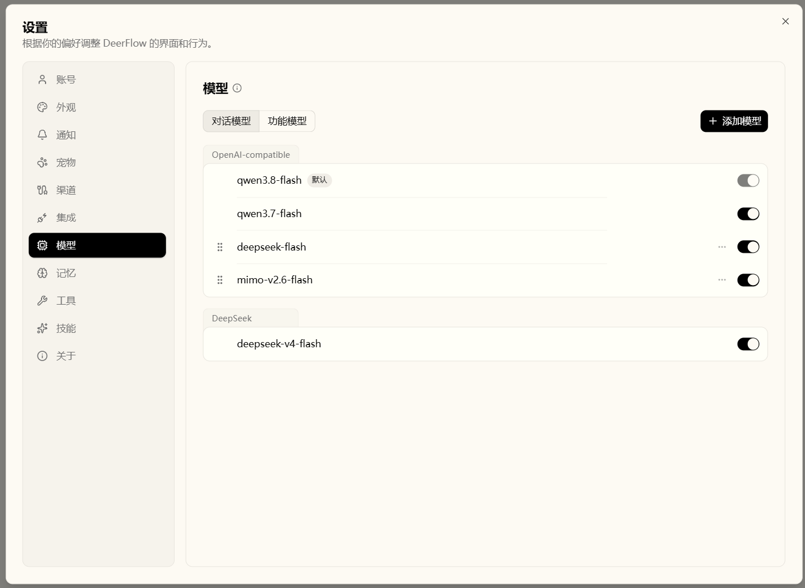
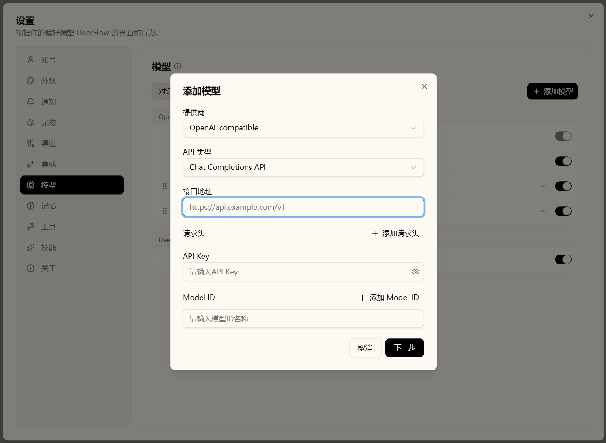
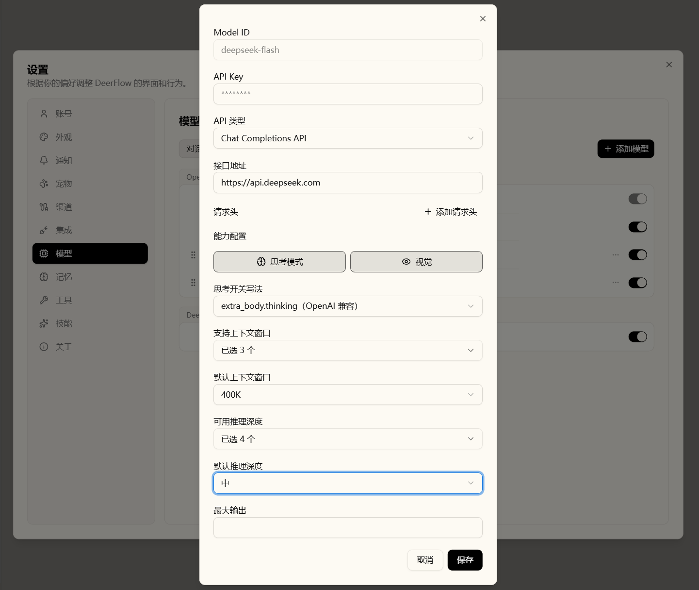
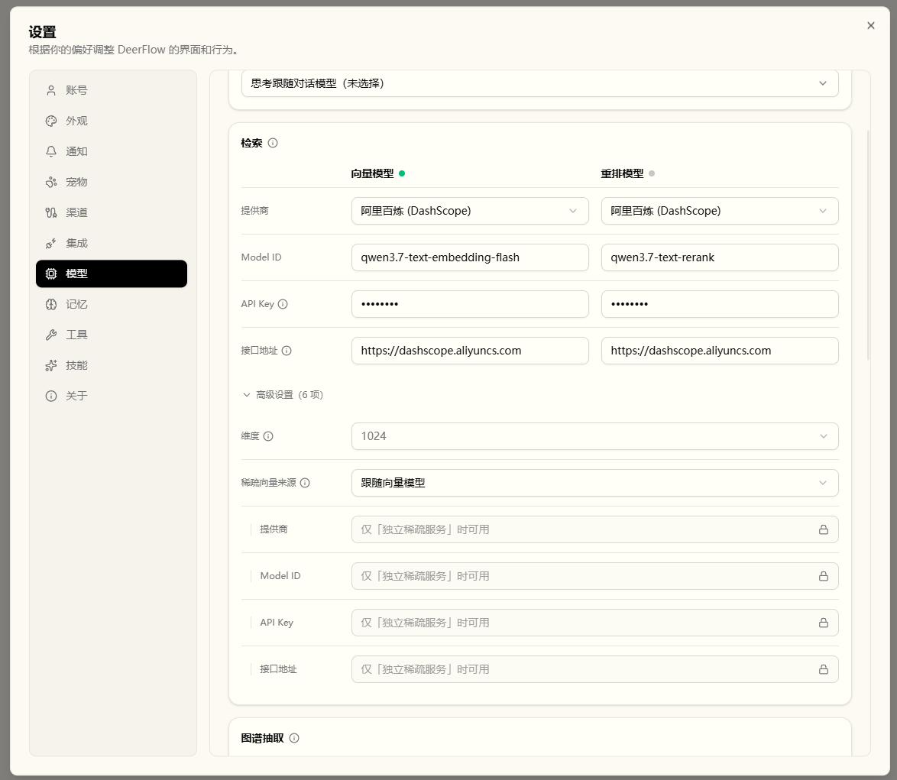
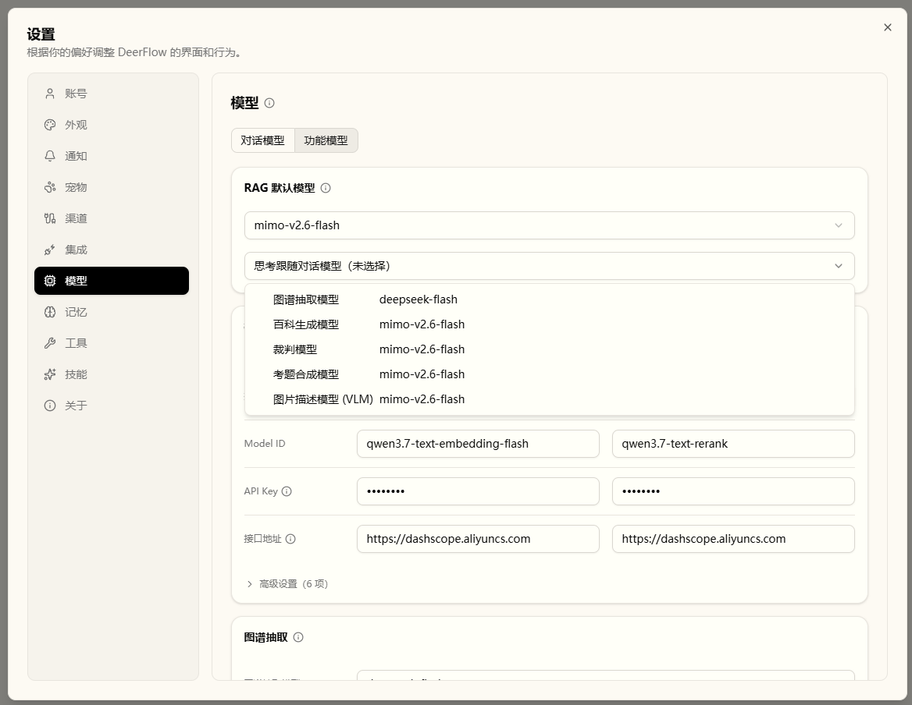
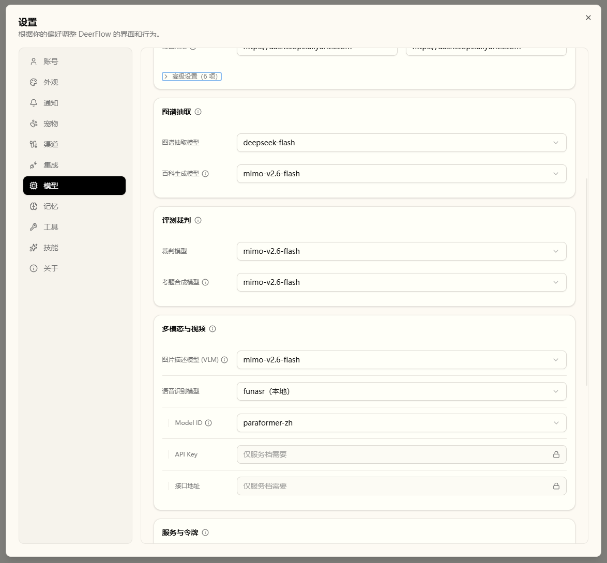
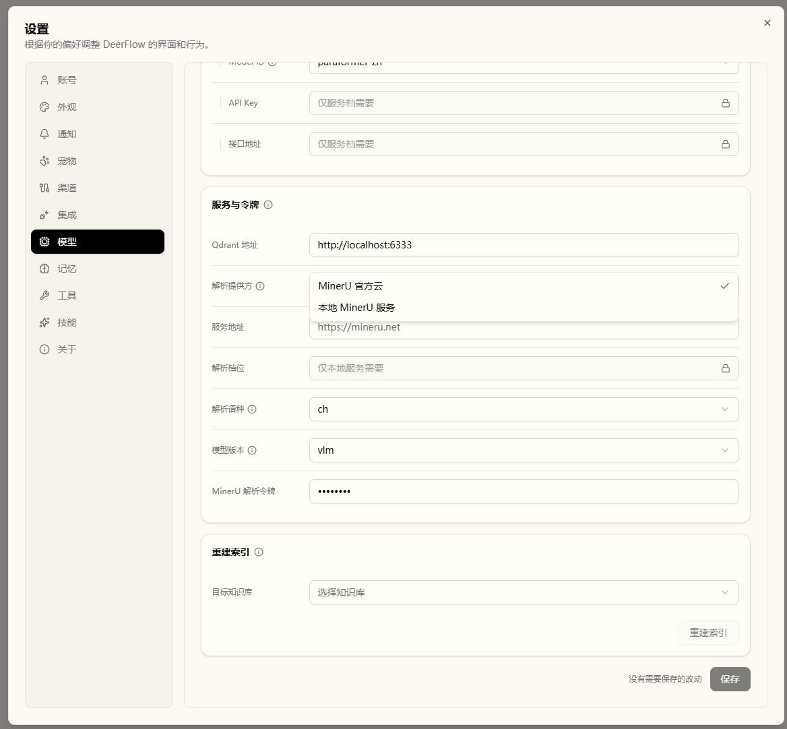

# DeepDuck · Harness RAG

> 一套**内置本地知识库（Harness RAG）**，是对 **DeerFlow**（[bytedance/deer-flow](https://github.com/bytedance/deer-flow)，MIT）**应用功能的拓展**：从文档 / 表格 / 视频的解析与切分，到实体图谱、百科条目、三路检索、文档感知（枚举 / 定位 / 读回）、工作区管理与检索质量评测。
>
> **为什么是 Harness RAG**：检索不是一条固定流水线——充分与否，由模型自行判断（问题点名的每个要素都有证据落点）；不足则自主定向补全：先换路（关系型问题改用图谱、概念型问题改用百科），再换问法（以更具体的实体名 / 术语重写检索问题、拆分复合问题），合计不超过两轮；三路各司其职——向量负责内容匹配、图谱负责信息关系、百科负责内容深度。「库里有哪些文档」「这篇还有什么」这类问题直接枚举与通读作答，不拿检索硬凑。作答因此可查可溯：每条结论句末标注 `[n]`，点击即可查看「参考来源」；补全后仍无证据则明确拒答，不以预训练知识拼凑。
>
> 本仓库是一个**通用 agent**——底座是来自 DeerFlow 的 harness agent 框架（lead agent 与子代理编排、中间件链、沙箱执行、工具 / MCP / 技能、记忆与持久化、网关运行时），其上叠加 Harness RAG 与本项目的其它自有能力（如「Agent 观测宠物」，见下文）。

## 📋 目录

- [两个组成部分](#两个组成部分)
- [harness RAG 提供什么](#harness-rag-提供什么)
- [效果展示](#效果展示)
- [Agent 观测宠物](#agent-观测宠物)
- [快速开始](#快速开始)
- [规模（实测）](#规模实测)
- [状态](#状态)
- [归属与许可](#归属与许可)

## 🧩 两个组成部分

### harness agent（底座框架）

一套用于构建与运行 agent 的框架：lead agent 与子代理编排、可插拔的中间件链、沙箱执行、工具注册（内建 / MCP / 社区）、技能系统、记忆与持久化，以及网关侧的 REST / SSE 运行时。

### harness RAG（本项目实现的部分）

构建在上述框架之上：知识库核心位于框架包内的 `deerflow/knowledge/`，检索与文档感知能力以框架内建工具注册，并可作为框架级能力被 agent 装配；不反向依赖网关层（`deerflow/knowledge/` 全量零 `app.*` import）。

**访问与安全边界**

- **默认不改变既有行为**：rag 工具组的五个工具（三路检索＋文档感知两件）都是 `opt_in`，只有显式声明 `rag` 工具组的 agent 才会装配；不配置就不影响现有 agent
- **知识库属主私有**：五个工具执行前都先做属主校验，非属主取不到任何内容；共享（`visibility`）为二期预留，当前不做团队共享
- **agent 只读**：不存在 agent 侧的写入工具——上传、删除、触发解析、生成百科都是人类操作

**工作分支**：`feat/rag-knowledge-base`（即默认分支；`main` 保持上游镜像，便于 `git merge upstream/main`）；本项目的设计与实施文档在 `docs/superpowers/`（specs / plans）

**上游对接分支**：向上游的工作在独立 fork（[chenzhiya77/deer-flow](https://github.com/chenzhiya77/deer-flow)）开展，[`slice/knowledge-local-vector-retrieval`](https://github.com/chenzhiya77/deer-flow/tree/slice/knowledge-local-vector-retrieval) 是紧跟上游最新改动的分支（基线随上游推进、差异保持最小）。

## 🔍 harness RAG 提供什么


### 摄取与解析

- **经 MinerU 解析**：`.pdf`、`.doc` / `.docx`、`.ppt` / `.pptx`、`.png` / `.jpg` / `.jpeg`。文档内的表格会归一为 GFM 表格；正文中抽出的图片由 VLM 生成说明，并保留在原文档位置就地渲染
- **本地直读**（不走网络）：`.md` / `.markdown` / `.txt`
- **表格**：`.csv` 始终可用；`.xlsx` / `.xls` / `.tsv` 由 `rag.table.enabled` 门控。统一归一为 GFM 表格——Excel 逐 sheet 一张表，`.csv` / `.tsv` 按分隔符解析；`.xlsx` 内嵌图片一并抽出（挂到锚点单元格、越界回退该 sheet 段尾），经 VLM 配文后随切片渲染
- **视频**：`.mp4` / `.mov` / `.mkv` / `.webm`，由 `rag.video.enabled` 门控。**ASR 默认在本地运行**（funasr / Paraformer，可切 whisper，均为进程内引擎、不依赖外部推理服务），也可改用转录服务档（`openai-audio` / `dashscope`）——服务档只处理 ≤5 分钟音频、更长自动回落本地引擎；镜头画面说明、关键帧屏幕文字与向量化走所配置的模型端点。ASR + 关键帧 + 分镜卡，产物以切片形式进入同一套检索
- **解析可接自建服务**：`rag.parse_provider` 默认 `mineru-cloud`（MinerU 官方 API）；改成 `mineru-local` 并填 `rag.parse_base_url` 即接**自建的 MinerU 服务**（对接上游 4.x 的 HTTP 契约，本仓按 4.0.7 验证：上传 → 建解析任务 → 轮询 → 取结果 zip；轻客户端形态，本机不跑模型推理；该服务本身不带鉴权，只应部署在内网）。**该地址云腿同样生效**：留空＝官方地址，填了就打到它。`rag.parse_tier` 可选 `flash` / `basic` / `standard` / `advanced` 指定解析档位，留空则由服务端决定（服务端自身默认 `standard`；`standard` / `advanced` 需要服务端装 torch）；云腿另有 `rag.parse_language`（文档语言包，缺省 `ch`，覆盖中英文）与 `rag.parse_model_version`（模型版本 `pipeline` / `vlm`，缺省 `vlm`）两个旋钮。换解析来源不影响表格归一化、图片落盘与就地渲染

全部开启时共支持 19 种后缀。

### 加工

- **结构感知切分**：`heading_path` 等结构元数据随切片落库；表格按表头锚定行组，一张表拆成多张卡片时每张都自带表头
- **归一化（两把尺子）**：别名表（大小写 / 空白折叠、英文复数折叠、「中文（English）」括号折叠）+ 嵌入相似度阈值；簇的代表名优先取括号全名
- **跨片重解析（五步幂等链）**：合并实体行 → 重写关系端点（去重、去自环）→ 删别名向量并按合并后的描述重嵌代表 → 双写切片标签（业务库列 + Qdrant payload）→ 相关百科条目标脏
- **Wiki 百科生成**：资格 = 卫生门槛 + 跨 ≥2 切片；物料打包（源切片重叠 Jaccard ≥ 0.5、≤7 个一组，一次 LLM 产出多个条目）→ 脏条目增量重生成，并回填新合格条目
- **不变量**：单腿失败不阻塞文档到达 ready；管线在飞时并发重抽 / 删除返回 409；重排故障降级为 RRF 序

### 全链路联动（改动 → 下游传播）

知识入库后不是静态的——上游任何改动都会沿图谱与百科向下传导：

| 上游动作 | 下游传播 |
| --- | --- |
| 编辑切片 | 就地重嵌入；实体保持不变——需重新理解内容时显式「重抽」 |
| 重抽切片 | 撤旧抽取 → 清孤实体 → 按当前文本重抽（不重解析源文件）→ 归一化 → 合格实体标脏 |
| 删除切片 | 级联：图谱贡献 → 孤实体向量 → 百科失格链 → 向量点 → 业务行 |
| 新增文档 | 图谱腿重解析触达实体 → 相关条目标脏 → 增量重生成（并回填新合格条目） |
| 删除文档 | 三存储级联（向量 → 图谱 → 百科生命周期 → 业务行）；高频实体标脏、跌阈实体失格 |

**全链路双向联通**：写侧改动向下传导（上表）；读侧沿同一条链上行——枚举文档、按篇 / 按片读回原文（见「文档感知」）。

### 检索（三路，共用一套连续引用编号）

- `hybrid_search`：**内容匹配**——混合召回（dense + sparse 单次调用）→ RRF 融合 → 重排；重排服务故障自动降级为 RRF 序
- `graph_search`：**信息关系**——实体关系多跳
- `wiki_search`：**内容深度**——百科条目，含用户自建的「我的条目」
- 回答侧纪律：引用编号由工具生成、模型只许照抄；作答前先自查（覆盖 / 支撑），不足则有界补检（换路 → 换问法，合计 ≤2 轮）；补检后仍无证据才拒答，或只答有证据的部分并声明缺口；前端按工具返回结构化渲染「参考来源」

### 文档感知（只读）

库里的文档不再只能靠检索「碰见」——两件只读工具把「文档」变成可直接使用的对象：**能枚举、能定位、能读回**。它们不是旁路：整条链本来就是通的（解析 → 切分 → 落库 → 图谱 / 百科），文档与切片的关系、切片的顺序与位置早已在其中，两件工具只是把既有关系以只读方式开放给 agent；与三路检索共用同一条知识库绑定。

- `list_knowledge_documents`：**文档清单**——列出绑定库内全部文档（`doc_id` / 名称 / 状态 / 切片数）与就绪 / 处理中 / 失败的诚实计数
- `read_knowledge_document`：**原文读取**——`doc_id` 分页通读整篇；给检索命中的 `chunk_id` 则返回以该片为中心的窗口（边界收拢，注明「第 K/共 N 片」）；单条超长截断并标 `truncated`
- 追问链：切片级命中自带 `chunk_id`（向量、图谱两路），可顺此读前后窗口；`hybrid_search` 结果另有 `doc_id` / `chunk_index`，并支持只在一篇内检索（可选 `doc_id`）
- 有界且诚实：读取限次（同篇续读 ≤4 窗口、单轮合计 ≤6 次，够答即止）；未就绪 / 跨库 / 不存在直接明确拒绝，不空返
- 与引用两分：事实性结论仍走三路检索并标 `[n]`；枚举 / 结构 / 定位类回答以文字出处（文档名 / 片序）作答——清单与读取不进编号体系

### 工作区（`/workspace/knowledge`）

三栏＝知识库列表 · 六个 tab · 绑定该知识库的对话面板（窄面板下 tab 条尾部折叠为下拉菜单）。对话面板与主会话同款交互——生成中输入框不锁定、发送键就地变为停止键；回答可「重新生成」或「编辑并重新运行」。与知识库绑定的会话只在所属库的历史里出现，不进入全局最近会话列表。文档管理带防呆：重复上传先提示（跳过 / 保留两份 / 替换），删除切片前先出影响预览（会波及的实体与关系）；界面中英双语。

### 全链路可视化

从摄取到评测，**每一层加工都有对应的可视化入口**：

| 链路层 | 看什么 |
| --- | --- |
| 摄取 / 解析 | 文档表：逐路径解析状态（向量 / 图谱 / 百科三条腿；视频文档另有「语音 / 分镜 / 配文」三条预处理腿），失败可就地重试 |
| 切分 | 切片抽屉：tick 轨 + 卡片列表；表格类文档转出的 GFM 表切片自带表头 |
| 归一化 / 实体图谱 | 知识图谱：力导向图、社区层上卷、悬停高亮一跳邻居 |
| Wiki 百科 | 百科（Wiki）tab：「生成条目」与「我的条目」两区，条目抽屉回看源切片 |
| 三路检索 | 检索测试：一条查询的三路命中并列（含跨路耗时排名） |
| 向量空间 | 切片 / 实体 / 百科 / 条目四类点的 2D / 3D 投影 |
| 评测 | 题库、指标总览、趋势图 |
| 检索轮次 | 命中实时叠加到向量空间与知识图谱（见「特别设计」） |

### 特别设计

- **会话联动可视化**：对话或检索测试的每一轮命中，实时叠加到**向量空间**（命中点与查询点落图）与**知识图谱**（种子 / 扩展 / 证据三层染色 + 邻居高亮）。两 tab 共享「跟随对话」开关（默认开，关闭即冻结供手动探索）；叠加以增量方式更新，**不重排布局**
- **百科全链路可维护、且可定向**：任何上游改动经脏链增量重生成；条目编辑内容会作为下一次生成的「方向」；生成粒度可选增量 / 全量 / 按条目
- **任意会话可导入知识库**：从导出菜单或最近会话右键菜单直接入库成为文档

### 质量闭环

- **两层评测**：Layer-1 为确定性 IR 指标（命中率 / 召回@k / MRR / 路径准确率，可复现）；Layer-2 为 LLM 评分（含 RAGAS 的忠实度、答案相关性、引用精度等）
- **题目可自动生成**：选一篇或多篇文档**联合出题**，一次产出 1–10 道候选（默认 5 道），必须逐条**采纳 / 忽略**后才进题库（入库先过锚定核验，锚不对会被拦下、确认后才入库；锚可事后修正，悬空 / 存疑直接标在题库里）；也可手工添加
- **门禁分工**：Layer-1 接入 CI（`.github/workflows/rag-eval.yml`，PR 触碰检索模块即运行并把摘要评回 PR）；Layer-2 只出报告、**不设门禁**（避免 judge 方差把回归判定带偏），在夜间任务里跑；报告预留人工校准位（每月抽样 ≥10% 回填 `human_sample_ratio` / `cohens_kappa`）
- **运行可见**：三阶段进度（检索评测 / 答题评测 / 质量评估）并可中止；趋势图按运行序数出图，缺一次运行不会把两个时段压成相邻点

### 模型配置（复用框架的 Settings → Models）

- 聊天模型：两步向导（先探活密钥与模型 ID，再声明能力），密钥落盘到 gitignored 的 `models_config.json`；列表按提供商分组、组内可拖动排序，行尾「在对话列表中展示」开关控制该模型是否出现在对话的模型下拉里（只是不展示，不影响使用）
- RAG 功能模型：图谱抽取 / 评测裁判 / 说明生成 VLM / 百科生成 / 考题合成 五个角色从已配置模型中选择（各自留空时逐级回落：RAG 默认模型 → 第一个已配置模型）；五个角色各有「思考跟随对话模型」勾选（勾上后该腿的思考随对话模型；默认全不勾）；另含嵌入、重排、ASR、Qdrant / MinerU 设置，落盘到 `rag_config.json`
- **三条外部依赖可选 provider**（与上面的聊天模型机制**互不相通**——不共享条目，也不继承其支持面）：嵌入可走百炼或火山方舟原生接口（两家都出稠密 + 稀疏），或任一 OpenAI 兼容的 `/v1/embeddings`（仅稠密）；重排可走百炼，或通用 `/rerank`（Cohere / Jina 形状），或自建 Text Embeddings Inference 的 `/rerank`；解析可走云，或自建的 MinerU 服务（上游 4.x，解析档位由 `rag.parse_tier` 指定，留空 = 服务端定）。**嵌入宽度是部署设置**（`rag.embedding_dimension`，留空 = 1024）：模型返回宽度与生效宽度不符会被拒绝启用；改宽度触发全库重建的维度迁移（入口：「设置 → 模型 → 功能模型 → 高级设置 → 维度」）。**每库另落一枚嵌入身份章**（provider / Model / 地址的指纹；全库重建完成或库内首篇处理完成时写下）：换提供商 / 模型 / 地址后，与章不符会被检索侧检出并提示——不拒查询，混用可查、质量无从保证；重建完成即重新落章。
- **稀疏来源三选一**（`rag.embedding_sparse_source`）：随嵌入模型同出（百炼）、另配一个专门的稀疏服务（`tei-sparse`，对接 Text Embeddings Inference 的 `/embed_sparse`）、或本地 BM25（零模型、确定性最好，中文按字符二元切分）。换成只出稠密向量的嵌入模型后，必须选后两者之一
- **外部依赖可就地体检**：向量 / 重排两条腿的标题可点出发起连通检测（连通正常 / 无法连通 / 无法提供所选维度）；维度在改提供商 / Model / 地址后自动探测模型支持的档位与原生宽度，无需手动发起；稀疏能力在选「跟随向量模型」时自动发一次真实只读嵌入调用验证，明确不支持会拦住保存；独立稀疏服务的地址栏内报告「连不上 / 没返回词项」（只报告、不拦）
- **重建索引**：「设置 → 模型 → 功能模型 → 重建索引」按库重新嵌入**全部向量**——切片、实体、百科条目与人工卡片一起换到新的向量空间。它只重嵌入、**不重解析**源文件，也**不重跑图谱抽取**——所以换 provider / 换维度之后原文件不在也照样能换

## 🖼️ 效果展示

### ① 文档与解析

上传后逐路径解析状态（向量 / 图谱 / 百科三条腿；视频文档另有「语音 / 分镜 / 配文」三条预处理腿），失败可就地重试；点开文档即进入切片抽屉。


<details>
<summary>展开截图：文档切片抽屉 / 视频切片抽屉 / 会话切片抽屉 / 类型展示 / 会话导入知识库（5 张）</summary>


</details>

### ② 百科：生成条目 / 我的条目

AI 按实体资格自动沉淀「生成条目」；用户自建的「我的条目」与 AI 完全隔离、永不自动更新，可一键「混入搜索」参与检索；条目编辑内容还会作为后续重生成的"生成方向"。


<details>
<summary>展开截图：wiki指定方向优化 / 用户自建wiki条目（2 张）</summary>


</details>

### ③ 检索测试：三路命中对比

一条查询同时跑向量 / 图谱 / 百科三路，命中并列展示（含跨路耗时排名），结果可一键存为评测题。


<details>
<summary>展开截图：测试实体切换（1 张）</summary>

</details>

### ④ 向量空间

切片 / 实体 / 百科 / 条目四类点的 2D / 3D 投影；检索命中实时叠加到图上，开「跟随对话」后每轮问答自动落点。


<details>
<summary>展开截图：向量空间跳转（1 张）</summary>

</details>

### ⑤ 知识图谱

实体关系力导向图，社区层可上卷看全局；检索路径按种子 / 扩展 / 证据三层染色，叠加不重排布局。


<details>
<summary>展开截图：图谱放大1 / 图谱放大2（2 张）</summary>


</details>

### ⑥ 评测

题库（可由 AI 从文档生成候选、人工采纳）+ 指标总览 + 趋势图；运行中可见三阶段进度，支持中止。


<details>
<summary>展开截图：考题生成 / 考题评审 / 评测详情 / 评测历史（4 张）</summary>


</details>

### ⑦ 对话引用回显

回答句末标 `[n]`，相邻编号自动合并为一枚安静胶囊（悬停逐条预览），点开即见「参考来源」；编号由检索工具生成、模型只许照抄，自查与补检后仍无证据宁可拒答。


### ⑧ 模型配置

聊天模型走两步向导：先探活密钥与模型 ID，再声明能力（思考 / 视觉 / 上下文窗口 / 推理深度）；对话模型列表按提供商分组，默认模型带「默认」标记、行尾为展示开关。RAG 功能模型按角色分组——图谱抽取、评测裁判、多模态与视频各自从已配置模型中选择；检索两列共享提供商 / Model / 密钥 / 地址四行，维度与稀疏来源收在高级设置里，腿标题上的点可发起连通检测。


<details>
<summary>展开截图：添加模型 / 参数配置 / 向量模型 / RAG 默认模型 / RAG 子功能模型 / MinerU 解析配置（6 张）</summary>






</details>

## 🦜 Agent 观测宠物

桌面上的一只鹦鹉，把 agent 的运行状态变成看得见的动作。它是**纯观察者**——只读线程状态，不发送、不修改内容，且点击穿透，可以理解成"app 的灯"。

五个**循环态**各有一套逐帧动画，随运行状态自动切换；另有两个**一次性态**——`greet` 在每次挂载时播一次，`done` 在每轮 run 跑完时播一次，播完即回落到 `idle`：

| 状态 | 动作 | 帧数 | 帧率 | 含义 |
| --- | --- | --- | --- | --- |
| `idle` |  | 31 | 8 | 空闲 |
| `think` |  | 31 | 8 | 思考中 |
| `wait` |  | 30 | 8 | 等待中 |
| `work` |  | 31 | 8 | 工具执行中 |
| `error` |  | 31 | 8 | 运行出错 |
| `greet` |  | 30 | 8 | 问候（一次性） |
| `done` |  | 31 | 8 | 完成（一次性） |

- 上表就是产品内的同一套精灵图；**7 个状态都已是真美术**（`greet` / `done` 两个一次性态的动图这里是**循环预览**，产品里只播一次）
- 美术与状态机分离：帧宽 / 帧率 / 显示尺寸由 manifest 声明，换一套图不需要改逻辑

## 🚀 快速开始

```bash
# 1) 交互式向导：生成 config.yaml 并检查依赖
make setup

# 2) 准备知识库所需的密钥（也可直接写进 config.yaml）
export DASHSCOPE_EMBEDDING_API_KEY=...   # 向量（dense + sparse 一次调用）
export DASHSCOPE_RERANK_API_KEY=...      # 重排
export MINERU_API_TOKEN=...              # 文档解析

# 3) 起一个 Qdrant（默认地址 http://localhost:6333，见 config.yaml 的 rag: 块）
docker run -d --name qdrant -p 6333:6333 qdrant/qdrant

# 4) 启动全部服务，浏览器打开 http://localhost:2026
make dev
```

知识库相关配置都在 `config.yaml` 的 `rag:` 块：

```yaml
rag:
  qdrant_url: http://localhost:6333
  embedding_model: qwen3.7-text-embedding
  rerank_model: qwen3-rerank
  vlm_model: qwen3.7-flash
  worker_concurrency: 2
```

表格与视频摄取默认关闭，分别由 `rag.table.enabled` 与 `rag.video.enabled` 打开。

Docker / Helm / 完整配置参考等文档：[UPSTREAM_README.md](UPSTREAM_README.md)。

## 📊 规模（实测）

| 项 | 数量 |
| --- | --- |
| harness RAG 核心 `backend/packages/harness/deerflow/knowledge/` | 70 个 Python 文件 |
| 测试 `backend/tests/knowledge/` | 98 个测试文件、1620 个测试用例 |
| 前端 | `components/workspace/knowledge/` 54 个文件（47 个组件） + `core/knowledge/` 22 个模块 |
| 数据库迁移 | 10 个（0011–0019 + 视频分镜表） |

## ✅ 状态

| 部分 | 状态 |
| --- | --- |
| harness RAG | 已实现，含上面列出的全部能力 |
| Agent 观测宠物 | 7 个状态（5 个循环态 + `greet` / `done` 两个一次性态）已交付 |
| Harness 可视化 / 组装画布与对外 MCP | 同一分支上在研 |

## ⚖️ 归属与许可

- 本仓库基于 **DeerFlow**（<https://github.com/bytedance/deer-flow>）构建。上游版权声明为 Copyright (c) 2025 Bytedance Ltd. and/or its affiliates，Copyright (c) 2025-2026 DeerFlow Authors。
- 上游的完整文档（安装 / Docker / Helm / 配置参考）：[UPSTREAM_README.md](UPSTREAM_README.md)；上游 README 的其它语言版本：[中文](README_zh.md) · [日本語](README_ja.md) · [Français](README_fr.md) · [Русский](README_ru.md)。
- 以上游的 [MIT 许可](LICENSE)发布；本仓库的新增部分同样以 MIT 发布。
- 本仓库为独立项目，非上游官方发布。
