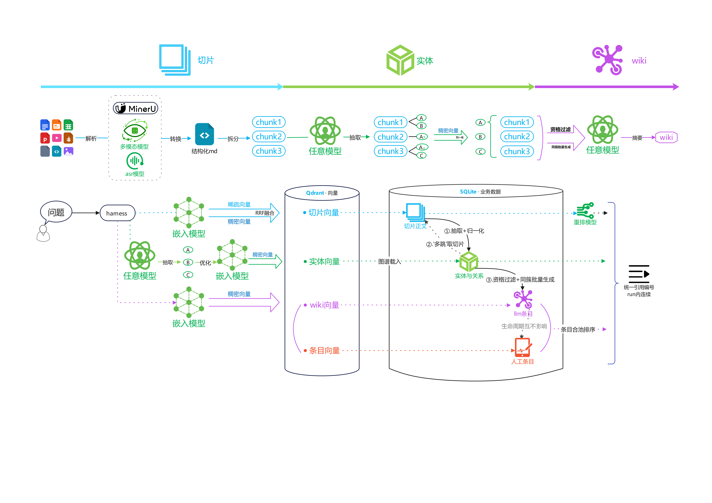
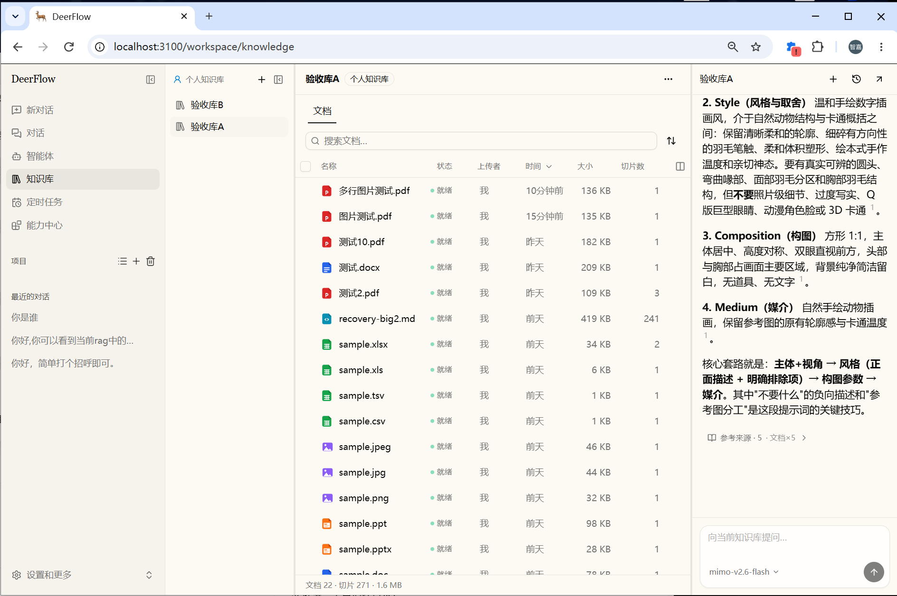
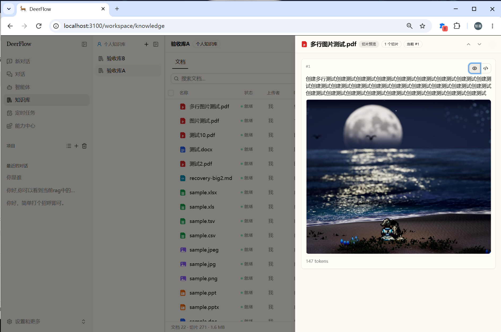
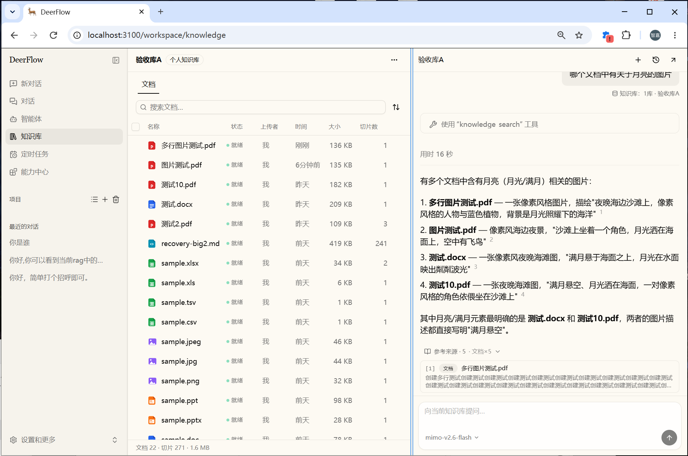
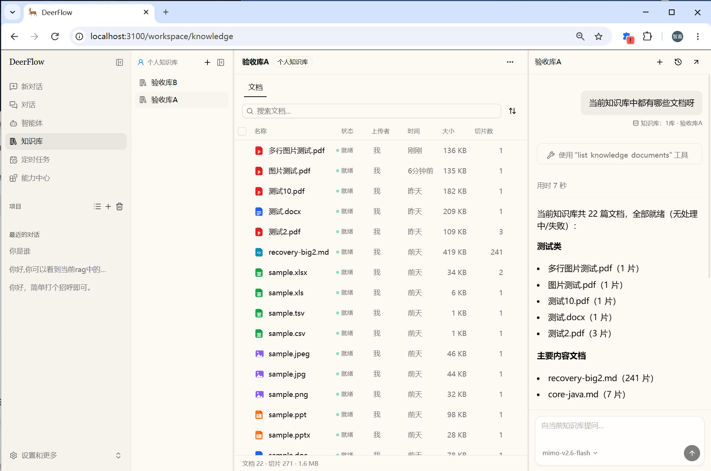
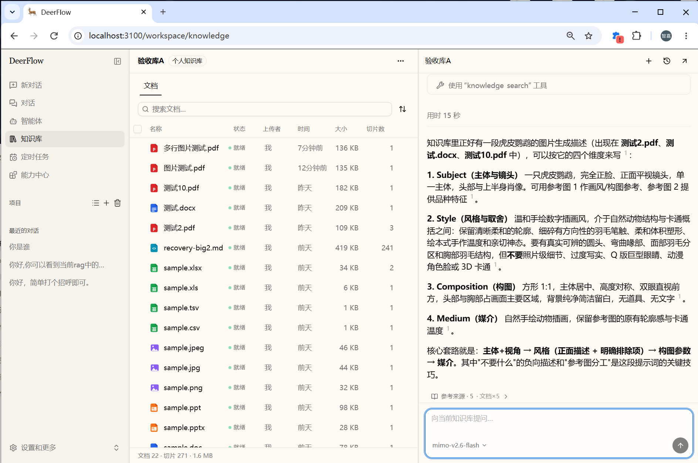
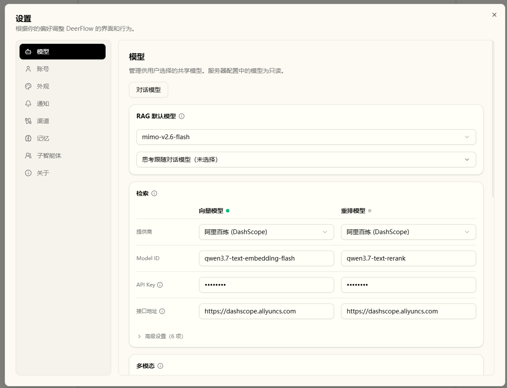
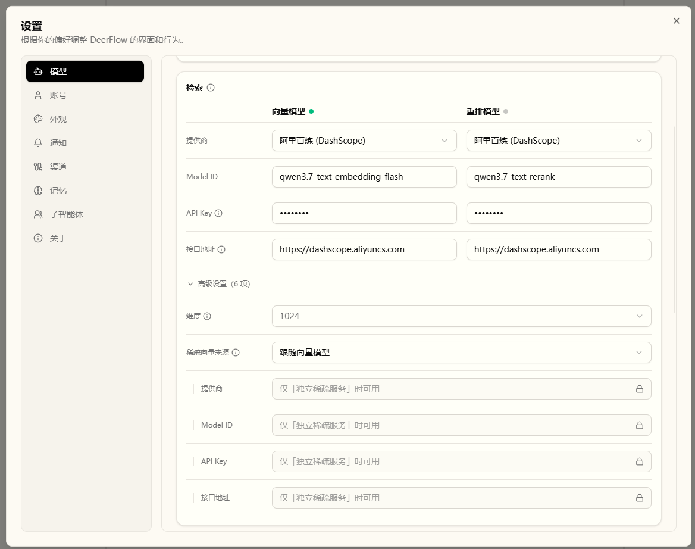
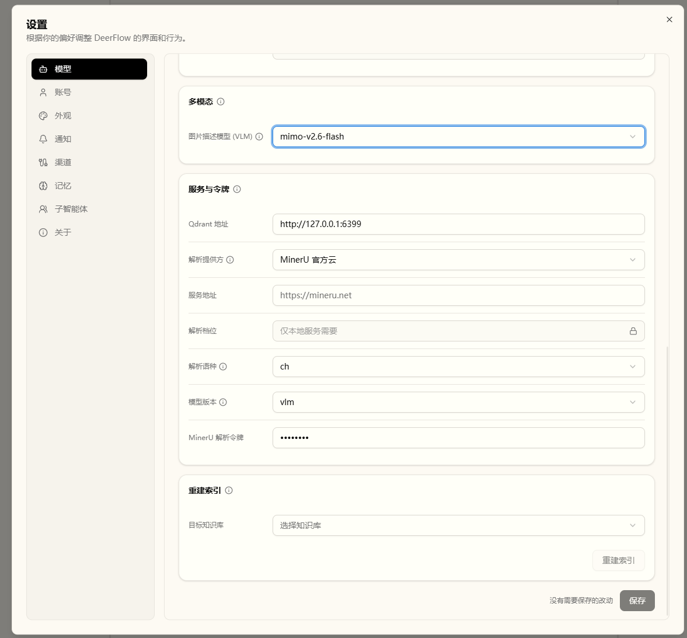

这是我在此前回复中提到的下一版 RFC，六点均已逐条写清，对应章节：

- ① 本地 / 离线的口径（本地＝本仓实现、本部署管理；离线＝各组件可指向环境内运行）、逐组件部署位置、离开部署环境的内容与资源 → §7；一处更正：界面一体化并不等于支持离线部署——您说得对。
- ② 与 #5238 的 scope 对齐、资源标识与配置归属 → §4
- ③ 陈旧与删除语义、分路状态、旧 worker 隔离 → §5
- ④ 工具之外的可选性（依赖 / 安装 / worker / 迁移 / 备份 / 降级） → §6
- ⑤ 分期：首期一个完整文档闭环，独立验收 → §2–3、§9、§10
- ⑥ 首期即包含基础检索评测（固定材料、基线、不调用云端模型与解析服务的 CI） → §8

---

# RFC：内置知识库（首期）——以仓内可选扩展交付完整文档检索闭环

**日期：** 2026-09-22；**本次修订：** 2026-10-09  
**状态：** 独立草案，按完整文档闭环修订。  
**议题：** #5391；依据[方向性评审](https://github.com/bytedance/deer-flow/issues/5391#issuecomment-5657810269)与本次首期范围讨论起草。  
**定义：** 首期最小闭环——上传 → 解析 → 切分 → 索引 → 一个检索工具与文档感知（只读：文档清单、原文读取）→ 可核验引用，同时覆盖所有权与删除。  
**开发分支：** 内部开发仓库的 `feat/rag-knowledge-base`——本提案完整实现的所在（含 §10 后置范围的各项能力；`main` 保持上游镜像）。  
**上游对接分支：** 向上游的工作在独立 fork（[chenzhiya77/deer-flow](https://github.com/chenzhiya77/deer-flow)）开展，[`slice/knowledge-local-vector-retrieval`](https://github.com/chenzhiya77/deer-flow/tree/slice/knowledge-local-vector-retrieval) 是紧跟上游最新改动的分支（基线随上游推进、差异保持最小）。

## 1. 提案摘要

首期让用户能够在 DeerFlow 中管理自己的知识库与文档，把正文与内嵌图片加工为可检索内容，在该知识库自己的对话栏中提问，并核验回答所用的来源。沿用**一库一对话范围**：每段对话只绑定并检索一个知识库，聊天记录按库隔离；一个库可以保留多段历史对话。

交付主线为：

> 向当前库上传文档（保存原件）→ 解析正文与图片 → 保存图片产物 → 图片说明与结构化切分 → 建立索引 → 当前库内混合检索与重排 → 库内对话回答及可核验引用。

下图为这条链的终态全景（摄取 → 加工 → 三路检索 → 引用回答）；**首期交付其中摄取 → 切分 → 索引 → 混合检索一段（即图中蓝色部分）**，图谱检索与百科两路（图中绿色、紫色部分）在后置范围内（见 §5、§10）。

首期同时交付这条链所需的管理 API、最小管理界面、模型与服务配置、所有权校验、失败重试、删除与中断恢复、基础评测。

实现方式为复用、移植并裁剪开发分支既有功能。后端采用**仓内可选扩展**：与上游同仓维护，但按需安装和启用，有自己的 worker、数据表和迁移。核心侧改动限于来源接入、范围映射、引用及前端适配四类。

本提案的价值在于文档管理与使用处于同一产品内，以及 DeerFlow 能直接编排解析、图片加工、切分和索引过程。

## 2. 首期范围

### 2.1 支持的输入

首期覆盖以下 **15 种非视频后缀**。图片文件按文档参与解析、索引与引用，不建设独立图片库或以图搜图。

首期的格式支持矩阵按处理方式与后缀逐项列出，**正文、表格、内嵌图片、来源定位**四种能力各有验证样例与结果。每个后缀至少有一条经验证的处理路径；本地转换、云解析、自托管解析均已列明。

| 处理方式 | 后缀 | 正文 | 表格 | 内嵌图片 | 来源定位 | 现状与缺口 |
| --- | --- | --- | --- | --- | --- | --- |
| 本地文本读取 | `.md` `.markdown` `.txt` | 已有读取实现 | 已有原子切分实现与用例；本地样例级验收已过 | 设计上不提取：图片引用指向文件外的资源，不按文档内容中的路径读取本机文件（任意文件读取风险）；引用保留为文本 | 标题与切片定位本地验收已过 | 文本读取已实现；图片不提取属设计取舍 |
| 本地分隔文本转换 | `.csv` `.tsv` | 单元格内容已有转换 | 已有 GFM 表转换 | 格式本身不携带内嵌图片，不适用 | 表格及行来源本地验收已过 | 转换已实现；表头与行内容样例本地验收已过 |
| 本地工作簿转换 | `.xls` `.xlsx` | 单元格内容已有读取 | 已有按工作表转换 | 已实现（.xlsx）：从工作簿 zip 内提取内嵌图片，按行列锚点并入所在单元格（无锚或越界回退工作表段尾）；.xls 不覆盖 | 工作表与行来源本地验收已过 | 单元格解析与 .xlsx 内嵌图片提取均已实现；.xls 图片不覆盖（矩阵已标注） |
| PDF/Office 解析服务 | `.pdf` `.doc` `.docx` `.ppt` `.pptx` | 按服务版本验证 | 按服务版本验证 | 已有接收、保存及说明的代码；提取完整性按服务验证 | 标题等以实际返回为准 | MinerU 客户端和图片链已实现；自托管与云端逐组合验收均已过（.pdf/.doc/.docx/.ppt/.pptx） |
| 图片文档解析服务 | `.png` `.jpg` `.jpeg` | 文字与视觉内容按服务验证 | 图片中的表格识别按服务验证 | 原件就是图片，不等同于从容器文档抽图 | 关联原件与实际切片 | 图片文档的完整检索与引用链验收已过（样本为图片文档本体）；云端解析同口径验收已过 |

### 2.2 管理界面

最小管理界面与 API 一起进入首期（百科、检索测试、向量空间、知识图谱和评测五个额外标签页在首期范围之外；“百科”即下文所称 wiki）：

- **库管理。** 创建、查看、重命名和删除知识库。
- **文档。** 上传文档，查看文档列表、处理进度及成功、降级或失败状态；对失败或降级文档发起整篇重试，保留文档 ID；删除文档，下载原件。
- **切片与来源。** 只读查看切片、关联图片与实际来源位置。
- **对话栏。** 保留每个知识库自己的对话栏（每库一个对话栏、历史按库筛选，均已实现），在当前库内新建对话、提问、查看该库的历史对话和核验引用；切换到另一个库时，进入该库的新对话或该库自己的历史对话；上一库的会话保持原绑定，两库的消息、引用与检索内容互相隔离。
- **设置界面。** 功能模型及服务配置的编辑、保存和校验。

**界面预览。** 实际界面如下：

**1. 知识库工作区。** 库列表、文档列表与处理状态、库内对话。

**2. 切片与来源。** 只读切片、关联图片与实际来源位置。

**3. 库内对话与引用。** 回答中的引用标记与展开的参考来源。

更多截图：库内对话 / 知识回答（2 张）

**4. 设置界面。** 功能模型、向量模型与服务配置。

更多截图：向量模型 / 服务与令牌（2 张）

### 2.3 模型与服务分工

| 角色 | 首期用途 | 配置边界 |
| --- | --- | --- |
| 回答模型 | 理解问题、调用工具、依据来源回答 | 上游模型配置与聊天能力的复用 |
| 文档解析服务 | 将复杂文档和图片转换为正文及图片产物 | 选择已支持的解析方式、服务地址和相应凭据 |
| 图片说明模型（VLM） | 描述文档中提取的图片，使图片信息进入文本检索链 | 引用具备视觉能力的模型条目，使用其协议、端点、模型 ID 和凭据 |
| 稠密嵌入模型 | 为文档切片和查询生成语义向量 | 模型与端点配置、宽度与批次约束校验 |
| 稀疏表示 | 支持关键词与术语匹配 | 跟随具有该能力的嵌入模型、独立稀疏服务，或本地 BM25 |
| 重排模型 | 根据问题对候选正文重新评分 | 已支持的重排接口及必要参数的配置 |
| 向量存储服务 | 保存文档切片索引并执行召回 | Qdrant 地址及连接参数的配置 |

表中各角色的配置约定如下：

- **条目与复用。** 模型条目是具名的调用配置，不是另一个运行中的服务；多个角色可以复用适合的服务，但每个角色的输入和能力要求分别成立。
- **配置位置。** 文档链的功能模型与对话模型分开呈现、不堆叠：模型设置页以「功能模型」入口做视图切换（不新增独立设置入口），对话模型一侧沿用上游既有模型界面、不改动其配置。开发分支自行实现的对话模型配置界面（列表与添加、编辑弹窗等）不随首期带入。图片说明从现有模型条目中选择一条；解析、嵌入、稀疏和重排使用各自的端点与凭据。
- **首期范围。** **VLM 属于文档链，不随视频功能后置。** 图谱抽取、wiki（百科）生成、评测 judge（即 LLM 评分）和视频 ASR 配置不进入首期。
- **配置作用域。** 文档链的功能模型、解析和向量存储配置为**全站共享的部署级（operator）配置**。该作用域覆盖本部署的内置知识库（与 RAGFlow 等外部来源相区别，见 §4.1），不改写既有外部来源的连接配置；回答模型的选择仍遵守上游规则。
- **使用形态。** 本部署按单用户个人 agent 形态使用，操作者即管理员；只有可选的多用户部署才区分 operator 与普通用户。
- **错误与密钥。** 可判定的配置错误必须给出明确提示；读接口响应与日志不得回显密钥。

配置保存后旧索引的处理规则如下：

- **兼容性判定。** 集合名随嵌入宽度区分；检索只访问与当前配置宽度对应的集合。
- **不兼容变更。** 宽度变更保存后不立即生效：先以目标宽度建立集合并完成重建，再原子切换配置、清理旧索引（清理失败由后台对账清扫回收）；重建期间部署继续使用旧索引；失败时已记录的宽度保持旧值。
- **库级重建。** 拥有者对自己库发起重建；重建按文档重新嵌入已存切片、不重新解析原件，单篇失败不影响该库其余文档；进度与最近一次运行结果可按库查询。
- **变更分类。** 单纯轮换密钥或改变重排参数不等于索引表示变化，不因此要求重新嵌入；更换嵌入模型、提供商或地址（宽度不变）属于索引表示变化，保存后自动重建全部知识库，完成前保持旧配置、完成后切换（稀疏来源的变更不触发自动重建，需要时经库级重建刷新）。解析/VLM 配置变化作用于后续处理或显式重试，不自动重写历史产物。

## 3. 文档链如何形成一个闭环

### 3.1 摄取与索引

1. **接收。** 校验用户对目标库的权限，以及输入的格式与按格式适用的大小限制；通过后保存原件、建立文档记录并持久化待处理状态。
2. **解析。** 文本和表格可在进程内转换；复杂文档使用配置的解析服务。记录实际可得的标题或其他定位信息，缺失项如实留空。
3. **图片加工。** 保存解析得到的图片，保留其与源文档、正文位置和切片的关联；内嵌图片处理以文档自身携带的图片为限。调用 VLM 生成说明，图片说明随正文参与后续切分与索引；说明失败时保留原图和仍可用的正文；失败比例超过 30% 时标记降级。
4. **切分。** 按正文结构生成切片，保留表格语义和来源标识。原件、解析内容与索引切片可相互追溯。
5. **索引。** 生成所配置的稠密与稀疏表示，写入文档切片索引。
6. **发布可用状态。** 解析、图片说明与索引各路径的实际结果（完成／降级／失败）如实反映在文档状态中；可索引正文缺失时明确报告失败。

### 3.2 检索与回答

回答侧（主 agent）只有**一个文档检索入口**，执行范围固定为当前对话绑定的知识库：

> 查询向量化 → 当前库内稠密与稀疏召回 → RRF 融合 → 从业务库取得当前库内有权访问的正文 → 重排 → 返回摘录与来源证据。

- **检索。** RRF（倒数排名融合）指按各路结果的排名融合候选；重排则是读取查询与候选正文，由重排模型重新打分。当前对话的库绑定和用户权限同时约束召回与正文读取；即使用户拥有其他库，本对话的读取范围仍以绑定库为限。重排调用失败可以回到 RRF 次序，但工具结果如实标注降级；缺少必需配置、向量服务不可用时明确报告失败，“知识库中未检索到与问题相关的内容”仅用于检索结果为空的情形。
- **回答。** 只以检索结果为事实依据：结论落到工具返回的摘录上，检索结果为空或证据不足以支撑回答时，明确说明“知识库中没有找到相关内容”；引用与真实来源记录的对应规则见 §4.2。

## 4. 与上游知识能力共同工作

上游逐消息检索范围（#5238）和可核验来源引用（#5551）已经合并。首期复用这些底层契约，将当前对话绑定的一个内置知识库表达为受限检索范围；库内对话的入口与历史归属沿用现有交互，引用协议与知识总开关（即上游 `knowledge_base` 体系的总开关）保持单一一套。

### 4.1 对话绑定与授权

**一段知识库对话只绑定一个库。** 打开 A 库的对话只检索 A 库，打开 B 库的对话只检索 B 库；用户同时拥有 A、B 时，各对话仍以各自绑定的库为限。绑定贯穿新建对话、后续提问和历史恢复，切换库后，已有对话保持原绑定。

有效范围由四层共同约束：

| 层 | 对范围的限制 |
| --- | --- |
| operator 策略 | 是否启用知识库扩展与绑定来源 |
| 用户所有权 | 当前认证用户是否有权访问绑定库、其中的文档和派生产物 |
| agent 权限 | 当前 agent 是否可使用该知识检索能力 |
| 对话绑定与消息范围 | 只允许当前对话绑定的一个库；消息范围以该绑定为准 |

本提案在这四层约束下的落地规则如下：

- **资源标识。** provider（来源提供方）用于区分内置知识库与 RAGFlow 等数据来源，与模型厂商分属两个维度；库内对话始终对应单一来源。内置库的标识带有可区分 provider 的信息；具体编码与共享契约一起确定。既有外部来源的对话与历史范围保持原有语义。
- **范围映射。** “当前库全部文档”是产品范围描述：单库范围以 `selected` 表达，`dataset_ids` 只包含当前绑定库的资源 ID。文档过滤缺省时，范围为该库内全部有权访问且可检索的文档；请求携带文档过滤时，只能进一步缩小到该库内的有效文档，显式空列表仍按上游契约处理。首期交付单库约束映射，范围选择控件维持现状，上游 `all` 的含义保持原样。
- **授权与拒绝。** `metadata.kb_id` 只承载对话的选择信息；授权由服务端按当前用户对目标库的所有权核对。请求中的库 ID、文档 ID 或来源超出目标库范围时明确拒绝，仅受理属于该目标库的资源。禁用知识检索时，检索工具保持停用；绑定缺失、库已删除、权限不足时明确报错，检索以本对话绑定的库为限。
- **校验与约束。** 管理 API 针对请求中指定的目标库，校验所有权和资源归属；对话检索还受单库绑定约束。批量切片、图片和原件的读取同样检查资源确属目标库，正文读取以资源归属为准。主 agent 保持在绑定范围之内；历史记录只显示并恢复当前库的对话。

### 4.2 来源证据

- **摘录与来源记录。** 工具返回实际摘录及其来源记录，包括当前绑定库内的文档标识、标题位置、截断标记等。回答中的引用只连接到本次对话的真实来源记录；其他库的引用与模型自写的文件名、编号、URL 等保持在来源证据之外。
- **核验与实时授权。** 来源记录经预算裁剪、消息持久化后仍保持可核验。原件和图片入口按实时检查判定授权与删除状态；检索时捕获的摘录只在当次回答内作为依据：访问权以实时检查为准，引用只用于来源核验。
- **适配范围。** 上游的部分来源清单（catalog）、来源产物（artifact）校验与转发代码仍针对既有 provider。首期包含所需适配：“已有共享契约”指约定层可复用，本地 provider 插入所需的核心适配已含在首期。

### 4.3 配置和记忆边界

- **配置归属。** 知识能力开关与范围选择沿用上游 `knowledge_base` 体系（该体系只含能力与选择开关；provider 连接与检索默认归 `tools[]` 条目）；解析、模型服务、存储和索引参数由知识库后端管理。开发分支的 `rag` 配置是复用来源，接入后由知识库扩展自管，不并入通用开关；知识总开关保持单一一套。
- **记忆边界。** 人工维护的来源文档与 agent 记忆保持独立生命周期，转移必须显式发生。以后若提供导入或沉淀，必须是明确的动作，带有授权与来源记录；会话导入入口保持在首期范围之外。

## 5. 数据所有权与生命周期

### 5.1 数据归属与责任

| 数据 | 归属与责任 |
| --- | --- |
| 知识库、文档、切片、处理和删除状态 | 本提案新增的知识库后端自带表结构和业务规则，并记录每个库与文档的归属；可以存进宿主在用的 SQLite/Postgres，但建表与迁移独立于宿主 |
| 原件与图片 | 知识库后端管理持久目录和资源归属，负责访问、清理与对账回收 |
| 文档切片向量及索引载荷 | 存入 Qdrant，由知识库后端管理集合与索引代次（按宽度区分）；向量库仅承载向量与检索、不作为权限依据，权限判定以业务库的归属记录为准 |
| 对话和已捕获的引用摘录 | 每段对话记录所属的一个库，历史按库隔离；沿用聊天生命周期，不因删除知识文档而隐式重写过去消息 |

文档链数据由知识库后端维护。即使使用宿主数据库，迁移、清理和用户隔离仍由知识库后端负责。

### 5.2 状态与重试

- **状态与就绪。** 处理状态区分解析、图片说明和索引结果，并能表达完整成功、明确降级及失败。图谱与 wiki 状态随各自的加工与检索成套交付；文档就绪以索引完整为前提，产生可索引切片且全部入库后，才标记 `ready`。

- **重试。** 库拥有者可通过同一 API/UI 入口对**失败或降级文档发起整篇重试**，保留文档 ID，复用已保存的原件和有效配置，产物为重新生成的正文、图片说明、切片及索引（覆盖原先未成功的图片说明）；局部图片重跑在首期范围之外。重试以本轮任务与产物为准：有效切片只保留一份、向量与切片同轮一致（受理期清理失败留下的残留由对账清扫回收）、文档状态以最新任务为准；处理中发生删除时以删除为准。重试受理后，各阶段的结果与检索行为如下：

| 重试阶段或结果 | 检索与可用性 |
| --- | --- |
| 重试已受理，处理未完成 | 受理时移除原有切片，新切片随写入逐步可被检索；其余未受影响文档照常可用，同一文档同时只运行一次重试 |
| 正文、图片说明和索引完整成功 | 发布新产物，恢复完整可用状态 |
| 图片说明降级，可用正文和索引完整 | 发布明确标记的降级结果，允许再次重试；未完成的图片说明如实标注 |
| 解析失败、无可索引内容或索引不完整 | 保持失败并允许再次重试；已写入的切片仍可被检索；结果以本次重试为准 |

### 5.3 删除和中断恢复

删除的顺序与约束：

1. **先使检索与读取不可达。** 删除受理后该文档不再出现在检索结果与来源读取中：切片读取、图片预览和原件下载明确失败；向量删除失败仅记录日志；访问阻断随业务数据删除生效，不依赖向量或文件的清理结果。
2. **再完成其余清理。** 同步删除派生数据、业务行与原件；各步幂等；向量与文件的清理失败仅记录日志、不中断级联，业务数据删除失败时请求报错、重试即可；遗留的孤儿向量由后台对账清扫回收。
3. **中断恢复。** 重启时未完成的文档（非终态）重新入队继续处理；文件保存、记录创建和任务入队之间的中断已有恢复处理：行创建失败即删除已写文件、中断留下的孤儿文件与目录由后台对账清扫回收；进程内队列只用于当次执行。
4. **隔离旧任务。** 删除或新一轮重试后，旧 worker 不再发布结果，其晚到写入（含外部存储）予以隔离并最终清理。
5. **边界。** 删除只作用于当前存储；已经交给用户或模型的内容、历史聊天中的引用摘录保持原样。再次打开原件或图片时显示不可用。该边界在产品说明中可查。

切片编辑、图谱与 wiki 在首期范围之外。

## 6. 可选交付与运维

### 6.1 交付形态的取舍

| 项目 | 核心内置（所有部署默认携带） | 可选扩展（同仓维护、按需安装启用；本提案） |
| --- | --- | --- |
| 安装依赖 | 解析、索引依赖随核心安装进入所有部署 | 依赖随可选包安装；不包含图谱、视频等后置依赖 |
| 运行 | 核心启动路径需要额外逐处区分是否启用 | 按扩展生命周期启动和停止 worker |
| 数据迁移 | 知识表进入主迁移链，所有部署承担升级 | 私有元数据、独立迁移链与版本表，仅启用时迁移 |
| 维护成本 | 初始移植成本低，长期扩大核心责任 | 代价是包边界与兼容性维护，以及额外的启停、升级和隔离测试 |
| 前端与共享契约 | 都在核心内 | 最小前端及来源契约仍需核心适配 |

采用可选扩展的目的，是让没有启用知识库的部署不承担这套摄取和索引服务。

### 6.2 安装、启停和迁移

- **接缝与注册。** 后端使用上游扩展机制（`deerflow_extension_api`）提供的 service/router 接缝：扩展以 `install(registry, config)` 注册，service 由宿主在基础设施就绪后启动，并在此刻绑定持久层会话工厂等运行依赖；扩展路由遵守宿主认证与 CSRF 规则，资源所有权校验由扩展的业务代码完成。
- **加载与启停。** 插件代码只经 operator 控制的 `plugins:` 加载；模型服务设置界面只管理配置值。启用、停用与配置变更均随宿主重启生效。
- **数据库表。** 扩展表使用私有 `MetaData`（扩展自有的 ORM 元数据）、声明统一表前缀（上游扩展加载已支持 `table_prefix`，宿主迁移据此把扩展表排除在外）并维护独立 Alembic 版本表（扩展自有的迁移工具链）；停用或卸载后保留表前缀登记，避免宿主迁移误处理遗留表。
- **迁移。** 并发升级按上游迁移约定处理；新迁移链自上游主迁移 head（`0030_notification_claim_tokens`，2026-10-05 核对）之后新建，已发布迁移的父级关系与执行条件保持不变。
- **可选性。** 未安装或未启用时，以下动作均不发生：创建扩展业务表、启动知识 worker、探测模型/解析/Qdrant 服务、开放前端操作入口与轮询扩展 API。基础部署在 Qdrant 缺席时仍可启动。
- **停用、卸载与再启用。** 停用或卸载扩展都保留数据；永久删除是独立的显式操作。再次启用时检查扩展与 `extension-api` 的版本兼容，并恢复未完成任务。
- **前端边界。** Next.js 整包产物的动态卸载、通用动态前端插件系统，均在交付范围之外（其中通用动态前端插件系统上游已有实验性实现，本提案不采用）。

### 6.3 故障与备份

| 故障 | 对文档功能的影响 | 隔离要求 |
| --- | --- | --- |
| 解析不可用 | 当前文档失败，记录原因，服务恢复后可重试 | 普通聊天和已建成文档的读取保持可用 |
| 图片说明失败 | 保留原图与可用正文，标记降级；无可索引内容则失败 | 不假报图片理解完成 |
| 嵌入失败或能力不匹配 | 不能发布完整索引，明确报出配置或处理错误 | 向量按宽度分集合写入；部分成功按整篇失败处理 |
| 重排调用失败 | 按 RRF 次序返回并标记降级 | 缺失即报配置错误 |
| Qdrant 不可用 | 索引和检索如实报告不可用；删除时向量清理失败即跳过（残留由对账清扫回收） | 已受理删除仍禁读；普通聊天和其他来源保持正常运行 |
| 扩展/worker 中断 | 扩展不可用状态可诊断；恢复后继续持久任务 | 旧任务不再发布结果；其他来源保持正常运行 |

- **责任分工。** 扩展负责数据迁移、任务恢复、清理及运维说明；operator 负责部署依赖、凭据管理、资源配额与备份执行。
- **备份内容。** 备份包含业务数据与所有权、原件与图片、索引配置/版本，以及 Qdrant 快照或明确的重建材料。使用宿主数据库时，数据库、文件和索引的一致时间点见部署说明；凭据单独安全管理。
- **备份边界。** 历史备份独立于在线删除：在线删除只清除当前业务存储与文件，历史快照按保留期限存续。operator 负责公布备份保留期限、限制备份访问并执行到期清理；期限与执行方式见部署说明。
- **恢复。** 从旧快照恢复会带回快照时点存在、其后已删除的内容；恢复由 operator 执行，并在开放知识读取与检索前核对、重新执行这些删除；无法确认时保持知识读取与检索关闭并报告原因。
- **恢复验收。** 恢复的通过条件包括：权限、查询与引用、未完成处理的恢复均经核对，并覆盖“先备份、再删除、最后恢复旧备份”的场景；选择重建向量时，重建耗时与模型调用成本有说明，且重建结果排除已删除数据。

## 7. 部署位置、离开部署环境的内容与资源

- **本地。** 知识库的文档链由本仓实现、由本部署管理（§4.1 中与 RAGFlow 等外部来源相区别的「内置知识库」）；多进程部署同样算本地，数据是否离开部署环境取决于各组件的指向。
- **离线。** 各组件均可指向部署环境内运行：本地模型、自托管解析与存储都在可选项里，见下表“指向本机”；分词缓存需预置（冷缓存首次需联网获取）。

下表说明各组件的部署位置、离开部署环境的内容与资源。

| 类别 | 组件 | 可部署位置 | 哪些内容会离开部署环境 | 资源与依赖 |
| --- | --- | --- | --- | --- |
| 处理 | 文本读取、表格转换、切分 | 扩展进程内 | 本步骤不离开部署环境 后续模型调用见对应行 | CPU、内存、文件读写、Excel 解析依赖；分词缓存需预置 |
| 数据 | 原件与图片 | 持久文件目录 | 本地保存不离开部署环境 授权下载会发给请求用户 | 持久磁盘、容量与备份空间 |
|  | 扩展业务数据 | 环境内 SQLite/Postgres | 环境内：不离开部署环境 远程数据库按实际边界判断 | 数据库、独立迁移与备份 |
|  | 切片索引 | 环境内 Qdrant | 环境内：不离开部署环境 环境外服务会收到向量及索引载荷 | Qdrant、持久卷、索引内存与磁盘 |
| 服务 | PDF/Office 与图片文档解析 | MinerU 云服务或自托管服务 | 指向云：是（原件，云流程含对象存储上传） 指向本机：否 | 服务凭据或自托管解析服务与模型资源 |
|  | 稠密嵌入 | 云端或兼容接口的自托管服务 | 指向云：是（切片正文和查询） 指向本机：否 | 模型端点、凭据、宽度和批次限制 |
|  | 稀疏表示 | 随嵌入服务、独立稀疏服务或扩展进程内（BM25） | 指向云：是（切片正文和查询） 指向本机或本地计算：否 | 模型能力、TEI（Text Embeddings Inference）稀疏接口或本地计算资源 |
|  | 重排 | 云端或兼容接口的自托管服务 | 指向云：是（查询及候选切片正文） 指向本机：否 | 重排服务、凭据和候选数限制 |
|  | 图片说明 | 云端或自托管视觉模型 | 指向云：是（图片及说明提示词） 指向本机：否 | 视觉模型及兼容调用协议 |
|  | 回答模型 | 云端或自托管对话模型 | 指向云：是（问题、随请求发送的对话上下文、检索摘录及来源信息） 指向本机：否 | 复用上游模型配置和相应服务 |

- **部署选择。** 解析、嵌入、稀疏、重排、图片说明与回答模型都有指向部署环境内的选项。自托管服务也可能位于部署边界之外。依赖、模型权重与部署资源由部署方提供，清单见上表。

- **接入路径。** 接入形状与现有实现一致：

  1. 自托管 MinerU 使用异步任务提交、轮询和结果获取；本客户端按 4.x 服务接入，可显式选择 `parse_tier`（flash / basic / standard / advanced），旧的 `parse_backend` 配置（`vlm`／`hybrid` 取值）不再支持。MinerU 服务自身其他后端的能力或硬件要求不代表本客户端已支持的范围。其服务不带鉴权，位于受控内网。
  2. 稠密嵌入可对接 OpenAI 嵌入形状；稀疏来源按模型能力选择：模型自带双路输出、独立 TEI 稀疏服务，或本地 BM25。
  3. 重排可对接已支持的 Cohere/Jina/TEI 形状；图片说明已有 OpenAI 与 Anthropic 调用形状。具体可选模型仍取决于能力及服务配置。
  4. 当前索引默认 1024 维；宽度可声明，变更后按新宽度重建全部知识库（部署级；策略见 §2.3）。

- **部署材料。** 上传链路经 nginx 反向代理，其默认的请求体上限是 1 MiB（即 nginx 默认的 1m）：超过上限的文档会在到达 Gateway 之前被拒绝。上游已对同类文档上传路由采用独立 location 的现成做法（放开请求体上限、流式转发）；首期的知识库上传路由沿用同样处理（Docker、本地开发与 Helm 三处配置一致）。

## 8. 基础评测随首期交付

首期评测只针对首期交付的一个文档检索工具：评分范围限于该工具的单独成绩；首期评测不接入图谱、wiki、judge 及评测历史与趋势平台。

### 8.1 固定材料与报告

- 可分发、许可清晰的源文档样本，覆盖文本、表格和含图文档，并与格式支持矩阵对应。
- 解析正文、图片产物、切分配置、稳定且可核对的来源/切片标识和索引输入指纹。
- 固定查询与相关来源标注、`top_k`、候选数量（融合后进入精排的候选上限，默认 20）、指标口径和初始基线。
- 解析/切分版本、嵌入模型及宽度、稀疏方式、重排模型/服务版本及影响结果的参数。
- Recall@k、Hit@k、MRR 等基础指标，失败与降级情况，以及同条件下的基线对比；回归阈值取初始值，首份基线验证后即为定值（本条指首期新建路径；现有评测的阈值维持现状，跑满两周后按实际抖动校准）。
- 在同一 CLI/CI 报告中新增按文字、表格与依赖图片的分组轴，分别列出问题组、样本数与结果，防止总分掩盖图片链失效；首期评测不提供评测界面，也不发起 judge 调用。

### 8.2 不调用云端模型与解析服务的 CI

这条不调用云端模型与解析服务的 CI 路径属首期新建；现有评测 CI 依赖云端凭据与预置种子库（缺凭据显式跳过）。

CI 从固定材料建立测试用数据库和向量索引。外部计算的输出在准备材料阶段生成并保存（解析产物、图片说明、文档和查询两侧向量、重排响应）；评测时按输入指纹与配置版本匹配取用。BM25 等本地计算正常执行。

真实执行的部分包括切分、索引写入、召回、RRF、重排结果应用、权限与范围、来源 artifact 和指标计算。命中列表由现场检索产生，文档索引在本环境建立；两侧向量取自同一批保存的输出。

测试环境负责提供 SQL/Qdrant；这条 CI 路径不需要云端模型与解析服务、也不需要凭据，完整执行。输入或配置发生变化时，保存的输出经重新核对后再取用。

### 8.3 真实服务验证

真栈冒烟以明确的格式、服务和模型组合为固定配置，覆盖实际解析协议、图片链和端到端结果。未配置依赖可以报告未执行，但不能当作通过。保存的输出验证的是固定条件下的管线行为，不能代替持续变化的外部模型质量评估。

基础评测以 CLI/CI 报告交付。LLM 评分（judge）配置不在首期评测内（开发分支已有该能力，后续接入）；首期门槛只取 CLI/CI 报告。

## 9. 独立验收标准

| 编号 | 验收对象 | 可判定的通过条件 |
| --- | --- | --- |
| A1 | 全链使用 | 新环境完成安装启用与全站部署级配置后（默认单人部署即库拥有者本人），即可完成建库、上传、提问与来源核验，不依赖手工改数据库或临时代码 |
| A2 | 格式支持 | 15 种后缀逐项有样例和已验证路径；矩阵覆盖正文、表格、内嵌图片与定位四项能力，工作簿含图等样例不能用正文成功替代；损坏、空文件及不支持的组合得到明确结果 |
| A3 | 文档图片 | 含图文档能保存图片、生成说明、切分索引，并由相关问题命中对应内容；VLM 故障降级可见，服务恢复后可保留文档 ID 整篇重试，图片内容随之完整 |
| A4 | 最小 UI | 库管理、上传/列表/状态、失败/降级重试、删除、原件下载和只读核验均可在浏览器完成；每库对话栏可提问并查看本库历史，切库不复用上一库的会话；索引重建可按目标库在设置界面发起并查看进度；全站模型/服务配置是部署级（operator）入口，非 operator 不能修改全站配置 |
| A5 | 配置安全 | 非 operator（即不具备宿主 admin 角色的用户）写全站配置被拒绝；缺项、协议、宽度及稀疏能力问题有可理解的提示；宽度变更保存后不立即生效，全库重建完成后才切换；期间检索继续使用旧索引，中途失败则宽度保持旧值；密钥不在读接口、日志或评测产物中暴露 |
| A6 | 对话范围与权限 | 同一用户拥有 A、B 两库时，A 库对话仍只查 A，B 库同理；新建、续聊、历史恢复保持同一绑定；伪造其他库/文档 ID 或扩大范围被拒绝，禁用后不检索；两用户场景下，库、切片、图片和原件的越权访问均被拒绝，既有外部来源范围不被改写 |
| A7 | 引用真实性 | 每条可识别来源对应当前绑定库内真实工具摘录和实际定位信息；预算裁剪后仍成立，切换库不会混入上一库的引用，模型自造来源不被采信 |
| A8 | 完整性与重试 | 失败/降级均可重试且 ID 不变；重试受理时移除旧切片，新切片随写入逐步可被检索，产物以本轮重试为准；再次降级与失败符合 §5.2 |
| A9 | 删除 | 删除受理后新检索及源内容读取立即阻断；Qdrant 故障不恢复访问（残留向量由后台对账清扫回收）；在线清理、历史聊天和历史备份的边界有说明 |
| A10 | 中断恢复 | 在处理、重试和索引重建中断后，重启可继续或安全重做；旧任务及晚到写入不能复活文档 |
| A11 | 可选性与运维 | 未启用不建扩展表、不启动 worker、不探测外部依赖；普通聊天及其他来源不受影响，停用保留数据，重新启用可恢复；备份保留期与恢复核对步骤在部署说明中可查 |
| A12 | 评测 | 不需要云端模型与解析服务和凭据的 CI 完整运行检索管线及同条件基线对比，报告文字、表格与依赖图片问题的分组结果；真栈冒烟单独报告组合与结果，未执行不得计为通过 |

## 10. 后置范围与实现设计

### 10.1 明确后置

- 图谱加工与检索、wiki 加工与检索；各自的生成、查询、陈旧处理和删除传播随该能力成套交付，其失效时机、重建期间可查与分路可用状态随该能力一并定义。
- 视频及其 ASR、关键帧/OCR、分镜处理和配置。
- 人工知识卡片、切片编辑与重抽、复杂删除影响预览。
- 自动出题、LLM 评分、评测历史与趋势；基础检索评测不后置。
- 向量空间、知识图谱等可视化，以及文档管理与库内对话之外的多标签工作区功能；每库对话栏本身属于首期范围。
- 会话或 agent 记忆的显式导入。

以上能力在开发分支均已实现，首期不带，后续整体接入。

本期也不包含每库独立的功能模型与服务端点配置（嵌入/稀疏/重排/解析/VLM 为全站共享，见 §2.3）与局部图片重跑这两项明确不做；每库对话各自选择回答模型是现有交互（§2.3），保留在首期。整篇重试期间旧切片即被移除、新切片随写入逐步可被检索，与不兼容配置的全库重建（期间检索继续使用旧索引）是已说明的使用代价。

### 10.2 范围内的实现设计

已确认的三项边界就此定案：15 种非视频后缀、最小管理及功能模型配置 UI、仓内可选扩展。交互沿用每库自己的对话栏，每段对话只检索绑定库，历史记录按库隔离。

以下行为均已明确：
- 失败/降级整篇重试
- 全站部署级（operator）配置与不兼容变更的全库重建
- 单库对话绑定
- 按正文/表格/内嵌图片/定位验收

以下为范围内的设计结论。

| 项目 | 设计结论 |
| --- | --- |
| 共享契约 | 单库范围到上游 `selected` 的映射、带可区分 provider 信息的资源 ID 编码、配置命名及来源 artifact 适配方式；不改变既有外部来源的范围语义 |
| 持久机制 | 最小表结构、幂等写入与防重入机制、重建状态与切换 |
| 服务组合 | 按正文/表格/内嵌图片/来源定位四种能力的格式支持矩阵、服务版本、资源和文件/并发限制、重建操作 |
| 评测材料 | 语料许可、保存输出的格式与指纹、分组样本、首份基线、回归阈值及 CI 服务准备 |
| 打包运维 | 可选包与依赖清单、表前缀、独立迁移、安装/启停/升级、备份保留期、恢复核对步骤 |

## 11. 与评审意见的对应关系

| 评审项 | 本提案的落点 |
| --- | --- |
| ① 本地/离线、部署位置、离开部署环境的内容与资源 | §1 明确本提案的价值；§7 定义本地 / 离线口径（本地＝本仓实现、本部署管理；离线＝各组件可指向环境内运行），按组件列部署位置、离开部署环境的内容与资源 |
| ② scope、资源标识与配置归属 | §4 将对话绑定的单库范围映射到上游契约，以四层交集授权，保留库内对话栏，避免重复总开关并适配真实来源证据 |
| ③ 陈旧、分路状态、删除与旧 worker | §5 明确首期状态及删除恢复；编辑/图谱/wiki 后置，失效策略按能力成套定义 |
| ④ 工具之外的可选性与迁移 | §6 比较交付形态，选定仓内可选扩展，说明依赖、启停、独立迁移、故障与备份 |
| ⑤ 每期独立可用 | §2–3 定义完整文档链，最小管理界面与库内对话栏一并纳入首期；§9 给出独立验收，§10 后置其他业务分支 |
| ⑥ 基础评测前移 | §8 固定材料、索引输入指纹、模型配置和基线，不调用云端模型与解析服务的 CI、真实服务验证分开 |
