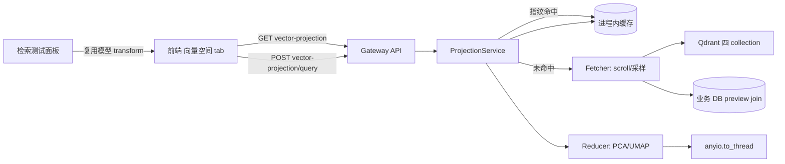

# RAG 向量空间可视化设计（知识库向量投影 tab）

> 状态：✅ 已定稿（待实施） · 日期：2026-08-15 · 范围：知识库详情中栏新增「向量空间」tab —— 将 Qdrant 中四个 collection 的 dense 向量降维投影为 2D/3D 交互散点图，并与检索测试联动 · 关联：主 spec `2026-08-07-rag-knowledge-base-design.md` §3.3–§3.5（四 collection 结构）；三期 spec `2026-08-15-rag-phase3-editing-design.md`（人工卡片 collection）

## 1. 背景

当前知识库的向量数据对用户完全不可见：文档入库后质量如何、聚类是否合理、检索为何命中/漏掉某些切片，都没有直观的观察手段。用户提出在知识库详情栏加入可视化向量 tab，将向量数据库中的数据立体展示出来。

**主流产品调研结论（2026-08-15）**：

| 产品 | 降维 | 维度 | 交互要点 |
|---|---|---|---|
| Qdrant Dashboard（最贴切参照） | WASM 端侧 UMAP/PCA | 2D/3D 切换 | payload 字段着色、hover 预览、点选详情 |
| TensorFlow Embedding Projector（鼻祖） | PCA/t-SNE/UMAP | 3D 为主 | 旋转探索、搜索某点高亮 k-NN 连线 |
| Nomic Atlas（天花板） | 自研分层投影 | 2D 地图式 | 语义缩放、主题自动标注、百万级点 |
| Milvus Attu / Weaviate Console / Pinecone | — | — | 无投影可视化 |

设计共识：**UMAP/PCA 为主流算法；2D 是默认视图、3D 是探索切换项；着色 + hover 预览 + 点击详情是交互三件套**。本项目在此之上补一个主流产品都没做好的差异化能力：**检索时把 query 向量实时投影进同一张图并高亮命中切片**（RAG 调试神器），且同时覆盖「检索测试」与「正常 RAG 对话」双通道。

**架构事实核查（本 spec 的设计基础，2026-08-15 代码核查）**：

1. **四 collection 共享同一 1024 维 dense 空间**（同一 DashScope embedding 模型，`vector_store.py` 构造参数 `dense_size: int = 1024`）——`kb_chunks` / `kb_entities` / `kb_wiki_entries` / `kb_manual_cards` 可以**投在同一张图上按来源着色**，这是本设计的核心亮点；
2. **payload 自带 kb_id 与着色维度**：chunks（`doc_id`/`doc_name`/`entities`）、entities（`name`/`type`/`description`）、wiki（`title`）、cards（`title`），按 `kb_id` 过滤的 scroll 模式与现有检索代码一致；
3. **chunks payload 无正文**（只有 `chunk_id` 指针）——hover 预览需按 `chunk_id` 回业务 DB join `chunks.text` 前缀 + `heading_path`；
4. **harness 核心依赖无 numpy/scikit-learn/umap**（`pyproject.toml` 核查；numpy 仅由 qdrant-client 传递引入，不应依赖传递依赖）——降维引擎的依赖策略是本项目最重要的架构决策（§4）；
5. **sparse 向量不可投影**（超高维稀疏倒排表示，无稠密几何结构），本功能只画 dense；
6. **PCA 的 SVD 是 CPU 密集计算**（万级点 ×1024 维约 0.1–2s），必须放 `anyio.to_thread` 执行，不得阻塞事件循环（对齐 backend blockbuster 防阻塞纪律）；
7. **query 向量投影不需要重新拟合**：PCA 是线性变换，缓存 `components_`（2×1024 矩阵，KB 级大小）后即可对 query 向量做 transform —— 检索联动的技术基础；
8. **前端零图表库**（`package.json` 仅 canvas-confetti）——渲染库是新增依赖，需过 `performance-budgets.json` 预算评审。

## 2. 交付项与建议顺序

| # | 交付项 | 依赖与理由 |
|---|---|---|
| P1 | 降维引擎（PCA 内置 + UMAP 可选 extra，纯函数） | 无前置；纯计算层，不碰 Qdrant/DB，TDD 最干净 |
| P2 | 数据获取与采样层（scroll + ID 子采样 + preview join） | 依赖 P1 的输入契约；mock client 可测 |
| P3 | 投影缓存与失效（进程内缓存 + 内容指纹 + 强制刷新） | 依赖 P2 的指纹输入 |
| P4 | API 契约（投影端点 + query 投影端点） | 依赖 P1–P3 |
| P5 | 前端向量空间 tab（2D 散点 + 着色 + hover/点击详情 + 3D 切换） | 依赖 P4；渲染库选型见 §8 |
| P6 | 检索联动（query 投影叠加 + 命中高亮连线，检索测试 + RAG 对话双通道） | 依赖 P5；差异化杀手级交互 |

## 3. 总体架构



数据流：前端请求投影 → 服务端算内容指纹 → 命中缓存直接返回 → 未命中则 scroll 取向量（超阈值先 ID 采样）→ DB join 预览文本 → 线程池降维 → 缓存（含 PCA 模型参数）→ 返回坐标+元数据。检索联动时前端额外调 query 端点，服务端用缓存的 PCA 模型 transform query 向量返回坐标。

## 4. P1：降维引擎（依赖策略是核心决策）

**依赖决策（2026-08-15 拍板：PCA 内置零新依赖，UMAP 可选 extra）**：

| 方案 | 依赖体积 | 效果 | 结论 |
|---|---|---|---|
| 纯 numpy PCA（自实现 SVD，~30 行） | 零新增（numpy 显式声明为 harness 依赖，摆脱传递依赖现状） | 全局线性结构，看聚类/离群够用（OpenAI cookbook 同款做法） | ✅ **内置默认** |
| `umap-learn` | +numba/llvmlite ~100MB | 局部结构保持最好 | ✅ **可选 extra** `deerflow-harness[umap]` |
| scikit-learn PCA | +~30MB | 同 numpy PCA | ❌ 为单个 SVD 引全库不值 |

- `knowledge/projection/reducer.py`（新文件，纯函数）：
  - `pca_reduce(vectors: np.ndarray, dims: int) -> tuple[np.ndarray, PCAModel]` —— 中心化 + SVD，返回坐标与模型（`components_` + `mean_`）；
  - `PCAModel.transform(vector) -> coords` —— query 投影联动（P6）的唯一通道；
  - `umap_reduce(...)` —— 延迟 import，未装 extra 时抛 `UmapUnavailableError`（API 层转 400 带安装提示）；
  - 输入统一 L2 归一化（cosine 空间对齐，对齐 Embedding Projector 的 sphereize 实践）；
  - 不硬编码维度（`dense_size` 是构造参数）。
- 算法选择参数：`algo=pca`（默认）| `umap`。
- 模型序列化：PCA 模型（components 2×1024 float32 ≈ 8KB）随缓存一起存，供 query transform 复用；UMAP 模型不持久化（transform 不稳定，query 联动仅支持 PCA —— 写进 API 文档与前端提示）。

## 5. P2：数据获取与采样层

- `knowledge/projection/fetcher.py`（新文件）：
  - **四 collection 合并拉取**：`chunks`（默认全量主体）+ `entities`/`wiki`/`cards`（点少，全量），统一标注 `source_type: chunk|entity|wiki|card`；
  - **采样策略**（对齐主流产品）：单 KB chunks 点数 > `sample_size`（默认 5000，上限 10000）时——先 scroll 全量 ID（`with_vectors=False`，快）→ numpy 随机子选 → `retrieve` 子集向量（对齐 `get_chunk_vectors` 的批量 retrieve 模式）；响应带 `sampled: true, total_points, shown_points`；
  - **preview join**：chunks 按 `chunk_id` 批量查业务 DB 取 `text[:120]` + `heading_path` + `doc_name`；entities/wiki/cards 直接用 payload 的 name/title/description；
  - 过滤：仅 `kb_id` 匹配的点；sparse 向量忽略。
- 边界：空 KB 返回 `points: []` + `total_points: 0`（前端渲染空态，不报错）。

## 6. P3：投影缓存与失效

- **进程内缓存**（Gateway 单进程模型，对齐现有 service 层无共享缓存现状）：`{(kb_id, algo, dims, sample_size): CachedProjection(coords, model, fingerprint, created_at)}` + `asyncio.Lock` 防并发重算；
- **内容指纹**（廉价的失效信号，避免每次重算）：
  - chunks：`count(*)` + `max(last_edited_at)`（该表无 created_at 列，仅有 Phase-3 P2 引入的 nullable 编辑时间戳；未编辑过的 KB 退化为 count-only —— 已足够：入库/删除改 count，编辑改 last_edited_at，三类变更全覆盖）；
  - wiki/cards：各自表 `count(*)` + `max(updated_at)`；
  - entities：`graph_entities count(*)`（无时间戳列，接受 count-only 的边缘 stale：实体合并/精简不改行数时缓存可能滞后 —— 用 `?refresh=true` 强制重算兜底，前端提供「重新计算」按钮）；
- 指纹不一致 → 重算并替换缓存；`refresh=true` 跳过指纹比对直接重算；
- **不做持久化**（重启后首次请求重算，万级点秒级，可接受；避免引入新表迁移）。

## 7. P4：API 契约

挂在既有 `knowledge_bases` 路由（对齐 chunks/wiki 端点的 service 分层）：

```
GET /api/knowledge-bases/{kb_id}/vector-projection
    ?collections=chunks,entities,wiki,cards   （默认全部）
    &algo=pca                                  （pca|umap）
    &dims=2                                    （2|3）
    &sample_size=5000
    &refresh=false
→ 200 {
    kb_id, algo, dims, model_version: "pca-v1",
    fingerprint: "sha1:…", cached: bool, computed_ms: int,
    total_points: int, shown_points: int, sampled: bool,
    points: [{
      id: string,                # chunk_id / entity name / entry_id / card_id
      source_type: "chunk"|"entity"|"wiki"|"card",
      x: float, y: float, z?: float,
      label: string,             # doc_name / entity name / title
      color_key: string,         # 着色键（chunks=doc_id, entities=type, 其余=source_type）
      preview: string,           # ≤120 字符 hover 预览
      heading_path?: string,     # chunks 专属
      entity_type?: string       # entities 专属
    }]
  }
→ 400 algo=umap 未装 extra / dims 非法；404 kb 不存在

POST /api/knowledge-bases/{kb_id}/vector-projection/query
  body: { "text": string }       # 服务端走既有 embedder 得 query 向量
→ 200 { x, y, z?, model_version, fingerprint }
→ 409 投影缓存不存在（前端应先 GET 投影）/ 缓存模型非 PCA
```

- 权限与现有 GET 端点同级（`can_access`）；embedder key 复用检索测试的解析链（KB 配置 → 全局默认）；
- query 端点**不触发投影计算**（只消费缓存模型），保证检索联动零额外延迟（embed 一次 + 矩阵乘法 <1ms）。

## 8. P5：前端向量空间 tab

**挂载**：[middle-tabs.tsx](frontend/src/components/workspace/knowledge/middle-tabs.tsx) 现有 `documents|wiki|recall` 三 tab 后新增第四个 `vectors`（`KnowledgeMiddleTab` 联合类型扩展 + i18n `tk.tabs.vectors`「向量空间」+ `forceMount` keep-alive 对齐现有行为）。

**渲染库选型（2026-08-15 拍板：echarts + echarts-gl 按需引入）**：

| 方案 | gzip 体积 | 2D/3D | 结论 |
|---|---|---|---|
| echarts(core)+scatterGL + echarts-gl(scatter3D) | ~160KB | 同库双维度，内置 tooltip/legend/dataZoom | ✅ **推荐** |
| regl-scatterplot + react-three-fiber | ~180KB 两栈 | 2D 极致性能，3D 生态最好 | 备选（两渲染栈维护成本高） |
| deck.gl ScatterplotLayer | ~200KB | 双维度 | 备选 |
| plotly.js | ~1MB | 双维度 | ❌ 体积否决 |

- echarts 在 jsdom 不可运行 → **渲染适配层隔离**：`vector-canvas.tsx`（echarts 封装，DOM 测试中整体 mock）+ `vector-tab.tsx`（数据/交互逻辑，纯 React 可测）；`performance-budgets.json` 新增 echarts 异步 chunk 预算条目（`next/dynamic` 懒加载，不进首屏）。
- **布局**：工具栏（collection 多选 chips / 2D·3D 切换 / 算法选择 / 「重新计算」/ 采样提示徽标「已抽样 5000/12345 点」）+ 画布 + 右侧点击详情卡（复用现有 chunk 抽屉 / wiki 条目视图 / 卡片抽屉的打开链路，不新建详情组件）。
- **着色**：chunk 按文档、entity 按类型、wiki/card 各一色；图例可点击开关显隐。
- **交互三件套**（对齐主流共识）：hover tooltip（label + preview ≤120 字符）→ 点击右侧详情 → 框选缩放（echarts dataZoom 内置）。
- 空态：KB 无向量时展示引导文案（先上传文档）；索引进行中展示「N 个文档索引中，投影可能不完整」提示（复用文档列表状态）。

## 9. P6：检索联动（差异化能力，双通道）

两个通道共用同一叠加渲染层（query 菱形标记 + 命中点高亮 + 连线 + score 颜色深度，对齐 Embedding Projector 的 k-NN 连线实践）：

**通道一：检索测试（recall tab）**
- recall 与向量 tab 同驻中栏、互斥显示 → 检索结果区提供「在向量空间查看」按钮：一键切换到向量 tab 并完成叠加（query 点 + 命中高亮），避免手动来回找；
- 检索结果（`RecallVectorHit.chunk_id` + score）已存在于 recall 面板状态，提升到父组件（page 层）共享 state，向量 tab 订阅。

**通道二：正常 RAG 对话（右栏 chat）** ⭐ 更有价值的日常通道
- 事实基础（2026-08-15 核查）：`KnowledgeCitation.chunk_id` 已存在，`sourcesForAssistantMessage`（citations.ts）已把每轮助手回答的引用 chunks 解析完毕——对话联动**无需新增后端取数**，只需把右栏最新一轮「用户提问文本 + 引用 chunk_id 列表」提升到 page 层共享；
- 交互：对话每完成一轮（含引用时），向量 tab 自动叠加该轮 query 点与命中高亮；用户随时切到向量 tab 即可看到「刚才那轮问答落在知识库哪个区域、命中了哪些切片」；
- 开关：向量 tab 工具栏提供「跟随对话」开关（默认开），关闭后叠加层冻结供手动探索。

**公共边界**：algo=umap 时联动禁用并提示「query 投影仅支持 PCA 模型」（§4）；缓存过期（指纹变化）后叠加层静默丢弃，提示重新加载投影。

## 10. 非目标

- ❌ sparse 向量 / 混合检索得分的可视化（无稠密几何结构）；
- ❌ 向量编辑 / 拖拽改簇（只读视图）；
- ❌ 跨 KB 对比投影、时间轴演化动画（W&B 式训练对比）；
- ❌ Atlas 级语义自动标注 / 百万级分层缩放（单 KB 万级规模用不到）；
- ❌ t-SNE（已被 UMAP 全面取代，不引入第三算法）；
- ❌ 投影结果持久化表（§6 权衡）。

## 11. 风险与权衡

| 风险 | 缓解 |
|---|---|
| 万级点 ×1024 维 scroll 传输 ~40MB | 本地 Qdrant 无压力；采样上限 10000 硬顶；远程 Qdrant 场景靠 sample_size 收敛 |
| PCA 效果不如 UMAP 聚集好看 | 算法可切换；query 联动刚需 PCA（线性 transform），PCA 始终是一等公民 |
| entities 指纹 count-only 存在边缘 stale | `refresh=true` + 前端「重新计算」按钮兜底，spec 明示该权衡 |
| echarts 进首屏预算 | `next/dynamic` 懒加载 + 预算文件新增条目，CI 把关 |
| UMAP extra 拉 numba 重依赖 | 严格可选；CI 不装（测试用 fake reducer 注桩），live 冒烟手动验证 |
| query 投影坐标漂移（缓存重算后坐标系变化） | 响应带 `fingerprint`，前端比对不一致即丢弃旧 query 点 |

## 12. TDD 实施任务拆分建议（供 Plan 参考）

1. **Task 1**：`reducer.py` PCA 纯函数 + transform（合成数据断言主方向/方差占比/transform 线性一致性）；
2. **Task 2**：`fetcher.py` scroll/采样/preview join（mock vector store + 内存 DB）；
3. **Task 3**：缓存层（指纹命中/失效/refresh 跳过比对）；
4. **Task 4**：API 双端点契约测试（对齐 `test_chunk_edit_api.py` 基建）；
5. **Task 5**：前端 api client + types + tab 挂载（i18n + forceMount）；
6. **Task 6**：2D 散点 + 着色 + hover + 详情联动（mock 渲染适配层）；
7. **Task 7**：3D 切换 + 采样徽标 + 重新计算；
8. **Task 8**：检索联动双通道（recall 一键跳转叠加 + RAG 对话跟随 + 指纹漂移处理）；
9. **Task 9**：文档（backend/AGENTS.md RAG 小节 + 本 spec 状态翻转）+ 全量回归 + Live 冒烟（真实 Qdrant 投影 JVM 知识库 + 检索联动截图）。

## 13. 验收基线

- 后端：`pytest tests/knowledge/projection` 新套件全绿 + 既有 `tests/knowledge` 无回归；ruff 双净；
- 前端：向量 tab DOM 测试（tab 切换/着色图例/详情联动/采样徽标/检索叠加）全绿；`pnpm check` 双净；echarts chunk 在性能预算内；
- Live：真实 KB（千级 chunk）投影 <3s（冷）/ <200ms（缓存命中）；检索联动端到端可见 query 落点与命中连线；RAG 对话一轮后切换向量 tab 可见该轮叠加。
