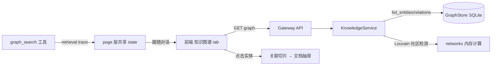

# RAG 知识图谱可视化设计（实体关系图 tab）

> 状态：✅ 已定稿（待实施） · 日期：2026-08-19 · 范围：知识库详情中栏新增「知识图谱」tab —— 将 graph_entities / graph_relations 渲染为交互式力导向图，并与 graph_search 检索路径联动高亮 · 关联：主 spec `2026-08-07-rag-knowledge-base-design.md` §3.4（图谱路）；向量空间 spec `2026-08-15-rag-vector-space-visualization-design.md`（姊妹能力，交互范式对齐）

## 1. 背景

向量空间 tab 回答「语义上谁和谁近」（embedding 距离），但回答不了「显式关系是什么」——实体间的「包含/分为/解释」等断言是图谱路检索的基石，目前完全不可见。用户在调试「graph_search 为什么命中/漏掉某切片」时没有观察手段。

**与向量空间的分工（互补不重复）**：

| 问题 | 向量空间 | 知识图谱 |
|---|---|---|
| 语义距离 | ✅ 点间距离 | ❌ |
| 显式关系（有向断言） | ❌ | ✅ 边 |
| 检索调试视角 | query 落点+命中连线 | **检索路径高亮**（P4 杀手锏） |

**主流产品调研结论（2026-08-19）**：

| 产品 | 布局 | 视觉编码 | 交互要点 |
|---|---|---|---|
| Neo4j Bloom（标杆） | 力导向 2D | label 着色 + 大小映射度数 | 搜索驱动探索、逐跳展开 |
| Obsidian Graph | 力导向 2D 物理模拟 | 文件夹/标签着色 | 全局图 + **局部图**（当前节点邻居） |
| Memgraph Lab / Neptune Explorer | 力导向 2D | 类型着色 | 查询结果直接上图 |
| 微软 GraphRAG 可视化 | 力导向 + 层次 | **Leiden 社区检测着色** | 社区=主题聚类，「结构即语义」 |
| AntV G6 | 十余种布局 | 自由映射 | WebGL 大图优化 |

设计共识：**力导向布局是绝对主流；节点大小映射重要度；着色按类型或社区；hover 详情 + 点击钻取是标配**。本项目的差异化机会：**把 graph_search 的检索过程（种子→扩展→证据选择）在图上画出来**——主流产品都没有检索路径可解释性，而我们的 retrieval trace 数据结构是现成的。

**架构事实核查（本 spec 的设计基础，2026-08-19 代码核查）**：

1. **数据出口现成**：`GraphStore.list_entities(kb_id)` / `list_relations(kb_id)` 直接返回全量 dict 列表，零新查询层；
2. **实体表无 mention_count 列**，但 `source_chunk_ids`（JSON 数组）的长度即提及数——`mention_count = len(source_chunk_ids)`，零迁移；
3. **关系是有向的**：`graph_relations(source, target, relation, description)`——渲染必须带箭头；
4. **networkx>=3.6.1 已是 harness 显式依赖**——`nx.community.louvain_communities`（内置 Louvain 社区检测）零新依赖可用；
5. **检索轨迹现成**：`graph/retrieval.py::ExpansionResult` 携带 `seen`（扩展节点集合）/ `entity_scores` / hop 信息——P4 路径高亮只需把 trace 透传到 API 响应，不动检索逻辑；
6. **实体名即节点 id**（KB 内唯一，`uq_graph_entities_kb_name`）；关系的端点是实体名字符串；
7. **前端图表基建已有**：echarts 5.6 + echarts-gl 2.1 已随向量空间引入；echarts `graph` 系列（force layout）是 2D 力导向开箱方案，**无需新依赖**；规模上千后迁移 `graphGL`（echarts-gl 内置）；
8. **中栏 tab 已有四处先例**：`KnowledgeMiddleTab = "documents" | "wiki" | "recall" | "vectors"`，扩第五值 `"graph"` 是纯增量；
9. **图数据量小**：实体/关系通常百级（测试库 286 实体）；万级图才需要采样/聚合，P1 不做；
10. **孤儿防护现成**：删除级联保证实体至少有一个来源切片——图上不会出现无证据节点。

## 2. 交付项与建议顺序

| # | 交付项 | 依赖与理由 |
|---|---|---|
| P1 | 图数据端点（GET graph，含社区着色计算） | 无前置；纯读 + NetworkX 内存计算，TDD 最干净 |
| P2 | 前端知识图谱 tab（力导向图 + 编码 + hover/点击钻取） | 依赖 P1；复用向量空间的适配层模式 |
| P3 | 搜索定位 + 局部图模式 + 类型/社区着色切换 | 依赖 P2；Obsidian 式探索体验 |
| P4 | graph_search 路径高亮联动（种子/扩展/证据三层染色） | 依赖 P2；差异化杀手锏，跟随对话机制复用向量空间先例 |

## 3. 总体架构



数据流：前端请求图数据 → 服务端读实体/关系全量 → 内存建 NetworkX 图跑 Louvain 社区检测 → 返回 nodes/edges/communities。检索联动复用向量空间的 page 层状态提升模式：graph_search 完成一轮 → trace 提升为 overlay → 图上三层染色。

**不做缓存**：百级图的读取+社区检测是毫秒级（Louvain 百节点 <10ms），直接每次现算，内容永远最新——与向量空间「重计算需缓存」的处境不同。

## 4. P1：图数据端点

挂既有 `knowledge_bases` 路由（service 分层对齐投影端点先例）：

```
GET /api/knowledge-bases/{kb_id}/graph
→ 200 {
    kb_id,
    nodes: [{
      id: string,            # 实体名（KB 内唯一）
      type: string,          # 实体类型（可空串）
      description: string,   # hover 详情
      mention_count: int,    # len(source_chunk_ids)
      community: int,        # Louvain 社区 id（0-based，按社区大小排序）
    }],
    edges: [{
      source: string,        # 实体名
      target: string,
      relation: string,      # 关系类型标签
      description: string,   # hover 详情
    }],
    stats: { node_count, edge_count, community_count },
  }
```

- **社区检测**：`nx.community.louvain_communities(G, seed=42)`（**固定随机种子**保证同数据同结果——前端着色稳定）；孤立节点（无关系实体）各成社区；社区 id 按规模降序重编号（0 = 最大社区，视觉主色稳定）；
- **空图**：`nodes: [], edges: []` + `stats` 零值（前端空态）；
- **无采样/分页**：P1 假设百级；`stats` 为未来规模闸口预留观察位；
- 性能：全量读 + 内存计算，纯 async SQLAlchemy + CPU 轻计算，**无需 to_thread**（Louvain 百节点 <10ms；万级时再议，届时加闸）。

## 5. P2：前端知识图谱 tab（力导向图）

**新组件**（对齐向量空间的双文件模式）：

- `graph-tab.tsx`：数据/状态/工具栏（搜索框、着色切换 P3、图例）；
- `graph-canvas.tsx`：echarts 适配层（`next/dynamic ssr:false`，对齐 vector-canvas 先例）。

**渲染配置**：

- echarts `graph` 系列 + `layout: "force"`（力导向）；`force: { repulsion, edgeLength, gravity }` 调参后钉死；
- `roam: true`（缩放平移）；`draggable: true`（节点可拖拽固定）；
- 启动动画用 force 的物理模拟（对齐 Obsidian 的有机感），`force.layoutAnimation: true`。

**视觉编码规范（与向量空间同套设计语言）**：

| 元素 | 编码 |
|---|---|
| 节点大小 | `mention_count` 开方映射（√count → symbolSize 10–28，抑制长尾） |
| 节点颜色 | P2 按实体 type（FNV-1a 稳定哈希调色板，复用向量空间函数）；P3 可切社区着色 |
| 边 | 灰色细线 + 末端箭头（有向！）；hover 加粗并显示 relation 标签 |
| hover | tooltip：实体名 + type + description 截断（复用 `buildTooltipHtml`，label/preview 各 20 字） |
| 点击 | 右侧抽屉：实体详情 + 关联切片列表（`source_chunk_ids` → chunks 查询）→ 跳文档抽屉（复用向量空间的 drill-down 链路） |
| 图例 | 底部胶囊（对齐向量空间图例样式），按 type/社区列项 |

**暗色主题**：复用向量空间的 `isDarkTheme()` / `ink()` 辅助（抽到共享模块或复制小函数，遵循仓库惯例）。

## 6. P3：搜索定位 + 局部图 + 着色切换

- **搜索定位**：工具栏搜索框输入实体名（模糊匹配，复用向量空间搜索框模式）→ 命中节点脉冲高亮 + 相机居中（echarts `focusNodeAdjacency` / 手动 center 调整）；
- **局部图模式**（对齐 Obsidian）：点击节点后切换「邻居模式」——只显示该节点 + N 跳邻居（默认 1 跳，可调 2 跳），面包屑返回全局图；
- **着色切换**：ToggleGroup「按类型 | 按社区」（type 色板 vs 社区色板），默认按社区（结构洞察优先）；
- **邻居高亮**：hover 节点时一跳邻居保持原色、其余淡化（复用向量空间的淡化透明度档位 `DIMMED_OPACITY` 语义）。

## 7. P4：graph_search 路径高亮联动（差异化杀手锏）

**机制复用**向量空间的「跟随对话」：page 层已有 `vectorOverlay` 状态提升链路，图侧加平行通道 `graphOverlay`。

**数据源**：graph_search 完成一轮后，前端从工具结果取 retrieval trace（`seed_entities`、`expanded_nodes`、`evidence_entities` + hop 信息）。后端需要在 graph_search 工具的响应里**透传 trace**（当前 trace 在 `ExpansionResult` 内部，需在 tool 层序列化输出——这是 P4 唯一的后端改动）。

`evidence_entities` 定义为**证据锚点**（2026-08-20 修正）：每条选中切片归因于最强单一来源实体（hop 最小 → 实体分最高 → 名字典序），有界于证据条数。不可退化为「提及证据切片的全部实体」——稠密图谱中一切片可被 8–29 个实体共同提及（286 实体库实测 median 16），并集会让命中层洪泛、整个 seen 子图全红。

**两层染色（Overlay 渲染规范，2026-08-20 两层合并重设计）**：

总原则：叠加层是诊断镜头，**不破坏底图编码**——所有节点保留原类型/社区填充色，层语义由描边 + 发光 + 尺寸承载；非命中节点原样保留（不灰化，空间上下文不丢）。视觉只分两层：种子与证据在数据上高度重叠（hop-0 保底使种子几乎必然产出证据）、hop 层数对调试指导意义低，故合并——徽标仍保留「种子 m · 扩展 n · 证据 k」三层数字分解（视觉两层、数字三层）。

| 层 | 数据 | 视觉 |
|---|---|---|
| 命中节点 | trace.seed_entities ∪ trace.evidence_entities（证据锚点，有界） | 原填充 + 红色发光描边 `#f5222d`（borderWidth 3 + shadowBlur 12）；其中种子额外放大 1.35×（尺寸通道保留源头信号） |
| 路径节点 | trace.expanded_nodes（hop-1 ∪ hop-2 合并） | 原填充 + 金色细边 `#ffd700`（borderWidth 2，无发光） |
| 命中路径边 | 两端均在 trace 并集（≡ seen 关系子图） | 荧光金 `#ffd700` + width 2 + shadowBlur 8（与路径节点同色，路径层一体化） |
| 其余节点/边 | — | 原样（不淡化、不灰化） |

角色优先级：命中 > 路径（扩展节点同为证据时显示红发光）。金色织出检索路径网络，红色标出路径上的命中要点；双主题通用。

- 徽标与清除：复用向量空间的叠加徽标组件模式（query 文本 + 「种子 m / 扩展 n / 证据 k」+ × 清除）；
- 「跟随对话」开关状态与向量空间共享（同一开关语义，两处生效）；
- 图谱 tab 的叠加同样遵守「指纹漂移即清除」——图数据的指纹 = `node_count + edge_count`（廉价，端点 stats 现成）。

## 8. 规模与降级策略

| 规模 | 策略 |
|---|---|
| ≤500 节点（P1 目标） | 力导向全量直出 |
| 500–2000 | force 布局关闭启动动画（`layoutAnimation: false`）+ 边默认弱化 |
| 2000–10000 | 迁移 `graphGL`（WebGL）；端点加 `max_nodes` 闸口 + 按 mention_count 截断（重要度优先） |
| >10000 | 社区聚合视图（社区为超节点，展开下钻）——另立 spec |

P1 实现时端点响应带 `stats`，前端超 2000 节点弹 toast 提示「图规模较大，已截断至 Top 2000 重要实体」（闸口常数集中定义）。

## 9. 测试策略

**后端 TDD**（对齐向量空间 `test_vector_projection_api.py` 基建）：

- 端点契约：nodes/edges schema、mention_count=len(source_chunk_ids)、空图 200、未知 kb 404；
- 社区检测：固定种子确定性（同数据两次调用社区 id 一致）、孤立节点独立社区、社区 id 按规模降序；
- P4 trace 透传：tool 响应含 seed/expanded/evidence 三层字段。

**前端 DOM 测试**（rstest + jsdom，canvas mock 对齐 vector-tab 先例）：

- tab 挂载（第五 trigger + keep-alive）；
- 编码映射：mention_count→symbolSize 开方档位、type/社区着色切换；
- 点击钻取：实体 → 切片列表 → 文档抽屉链路；
- P4 overlay：三层染色断言 + 徽标计数 + 清除 + 指纹漂移清除。

**Live 冒烟**：出图 / 搜索定位 / 邻居模式 / 对话一轮后路径高亮（对齐向量空间冒烟表格式）。

## 10. 风险与边界

- **力导向布局不稳定**（同数据每次布局略不同）：echarts force 接受 `layoutAnimation` 与初始随机性——接受抖动（主流产品皆然）；若需稳定可在 P3 后引入坐标缓存（localStorage per kb，非本期）；
- **大图卡死**：P1 靠闸口提示 + 截断，不做虚拟化；
- **trace 透传的 token 成本**：graph_search 响应增大（三层名单，百级实体名，<2KB）——可忽略；
- **实体名即 id 的中文安全**：echarts 对中文 id 无限制；URL/JSON 传输已 UTF-8；
- **与向量空间的状态一致性**：两 tab 各自持有 overlay，互不清除（切换 tab 不丢叠加——keep-alive 已保证）。
