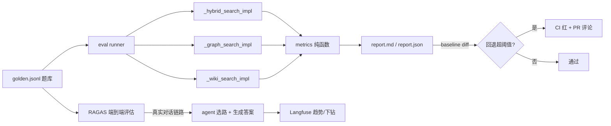

# RAG 检索质量评估体系设计（Golden Dataset + IR 指标门禁 + RAGAS）

> 状态：ready-for-agent（plan `../plans/2026-08-24-rag-retrieval-evaluation.md` 已就绪） · 日期：2026-08-23 · 范围：为三路检索（向量 hybrid_search / 图谱 graph_search / 百科 wiki_search）建设系统性质量评估——Golden Dataset + 确定性 IR 指标 CI 门禁 + RAGAS 定期报告，二期前端评测 Tab 仅冻结契约 · 关联：主 spec `2026-08-07-rag-knowledge-base-design.md`（三路检索架构与 §4.7 二期检索质量闭环）

## 1. 背景

DeerFlow 的 RAG 子系统拥有三路检索架构和大量可调旋钮（`entity_merge_similarity`、`graph_neighbor_min_score`、`hub_degree_threshold`、chunk 尺寸等），但**没有任何系统性检索质量评估**：

- 唯一的评估手段是前端「召回测试面板」——人工输入单条 query、肉眼对比三路结果，无标准答案、无指标、无批量、无历史对比。
- 每次调参或改动检索代码后，效果变好还是变坏只能靠手感，没有回归护栏。
- 对外（团队/社区/决策层）拿不出任何可量化的检索质量证据。

**架构事实核查（本 spec 的设计基础，2026-08-24 代码核查）**：

1. **测试 seam 现成且唯一**：三个在线检索 impl——`backend/packages/harness/deerflow/tools/builtins/hybrid_search_tool.py::_hybrid_search_impl`、`graph_search_tool.py::_graph_search_impl`、`wiki_search_tool.py::_wiki_search_impl`——直接调用即可复现线上检索，不走 HTTP、不走 LLM 答案合成，可在无 gateway 的 CI 容器内运行；
2. **降级契约范式现成**：`backend/app/gateway/services/knowledge_service.py::recall_test` 已验证「单路异常 → 该路空 hits + failure note，不拖垮整体」的扇出模式，graph 路 config 驱动参数（`graph_per_entity_cap` / `graph_neighbor_min_score` / `graph_hub_degree_threshold` 等）的镜像读取方式也在其中——评估 runner 照抄即可与线上同源；
3. **测试基建现成**：纯函数测试风格参照 `backend/tests/knowledge/graph/test_retrieval.py`，fake/stub 模式参照 `backend/tests/knowledge/test_recall_test_api.py`，stub-LLM 模式参照 extractor 测试；`backend/tests/fixtures/` 目录现成可放题库；
4. **CI 现状**：`.github/workflows/` 有 `backend-unit-tests.yml`、`nightly.yaml` 等，无任何检索评估 workflow——`rag-eval.yml` 为纯新增，Layer 2 定时任务挂 `nightly.yaml`；
5. **规模限制已知**：图谱为 NetworkX 全量加载（主 spec 既有边界），评估体系不解决也不加剧该限制——三路 impl 单 query 扇出，成本与召回测试面板同量级；
6. **引用机制可依赖**：统一 citation_no 机制已落地（`backend/tests/knowledge/tools/test_citation_numbering.py` 守护），Layer 2 的引用准确率指标建立在其上，同时反哺为其回归护栏。

## 2. 交付项与建议顺序

| # | 交付项 | 依赖与理由 |
|---|---|---|
| P1 | Golden Dataset（题库 JSONL + schema 校验 + 守护测试） | 无前置；一切评估的输入契约，先标 20 题跑通再扩充 |
| P2 | 批量确定性评估（指标纯函数 + runner + CLI + 双份报告） | 依赖 P1；纯函数先行，TDD 最干净 |
| P3 | CI 门禁（`rag-eval.yml`：PR 触发 + bot 评论 + 阈值红） | 依赖 P2 的 CLI 与报告格式 |
| P4 | RAGAS 定期评估 + Langfuse 趋势（Layer 2，只报告不门禁） | 依赖 P1 题库与 P2 报告骨架；judge 指标永不进硬门禁 |
| P5 | （二期）前端评测 Tab + 召回面板「存为考题」 | 依赖 P2 报告与运行模型；本 spec 仅冻结 API 契约意图 |

建设顺序纪律：**先终端 + 报告文件 + CI 门禁，再 RAGAS + Langfuse，最后前端**——前端是放大器不是前提。

## 3. 总体架构



数据流分两层：**Layer 1** 逐题扇出三路 impl → 计算确定性 IR 指标 → 与 baseline diff → CI 门禁；**Layer 2** 复用同一题库走真实对话链路 → RAGAS + 三个架构专属指标 → 推 Langfuse 只做趋势报告。两层共用题库与报告骨架，门禁信号只来自 Layer 1。

## 4. 分层与门禁策略

- **Layer 1（确定性 IR 指标）进 CI 硬门禁**；**Layer 2（RAGAS / LLM-as-judge）只做定期报告，永不进硬门禁**——judge 方差会污染门禁信号（「没改代码 CI 却红了」的噪音不可接受）。
- 所有阈值（回退 3% 等）都是初始拍值，跑两周后按实际抖动幅度校准，报告头部注明。

## 5. P1：Golden Dataset（题库）

- **存储**：单一 JSONL 文件 `backend/tests/fixtures/rag_eval/golden.jsonl`，git 版本化；题目与代码同 PR 演进——改检索行为的 PR 必须同步审视题库。
- **Schema（决策性约定）**：

```json
{
  "id": "q001",
  "query": "gateway 和 provisioner 之间是怎么通信的",
  "expected_path": "graph",
  "relevant_chunk_ids": ["<doc_id>#0007"],
  "relevant_entities": ["Gateway", "Provisioner"],
  "reference_answer": "……（可选，RAGAS 用）",
  "category": "relation"
}
```

- `category` 枚举：`fact` / `relation` / `concept` / `global`；`expected_path` 枚举：`vector` / `graph` / `wiki`；`relevant_chunk_ids` 格式 `<doc_id>#NNNN`。
- **规模目标 50–100 题**，从真实已入库文档人工标注；标注入口是召回测试面板（先人工操作，二期加「存为考题」按钮）。
- **冷启动纪律**：先标 20 题跑通全链路再扩充；宁可题少而标注准，不可题多而标注糙（垃圾题库比没有题库更危险）。

## 6. P2：批量确定性评估（Layer 1）

- **形态**：`backend/scripts/run_rag_eval.py` 独立脚本 + pytest 集成入口；CLI 参数 `--golden` / `--out` / `--baseline` / `--top-k` / `--fail-threshold`；核心逻辑在 `backend/packages/harness/deerflow/knowledge/eval/`（dataset / metrics / runner）。
- **指标**（逐题计算后按 category 聚合）：
  - **Hit Rate**：标注 chunk 是否出现在 top-k；
  - **Recall@k**：标注 chunk 进入 top-k 的比例；
  - **MRR**：首个正确结果排名倒数；
  - **路径选择准确率**：标注 `expected_path` 与实际最高分路径是否一致（三路结果取各自 top-1 分数比较）。
- **Baseline diff**：`--baseline` 传入上一次 report.json，输出逐指标 Δ 与回退题目清单；任一 category 的 Recall@k 下降超过阈值（默认 3%）时进程以非零码退出。
- **降级契约与 recall_test 一致**：单路异常记为该路空 hits + failure note，不中断整体运行，一次运行总能产出完整报告。
- **报告**：终端汇总表 + 落盘 `report.md` / `report.json`（可归档对比）；回退题目附详情（预期命中 vs 实际命中、各路分数），直接定位问题而非只看汇总数字；global 类题目单独分区呈现（见 §10）。

## 7. P3：CI 集成

- 新增 workflow `.github/workflows/rag-eval.yml`：当 PR 触及检索相关模块（knowledge 包、检索工具、相关配置）时触发，运行 Layer 1 并以 bot 评论把汇总表贴到 PR——评审者无需本地复现即可看到质量影响；失败阈值与脚本 `--fail-threshold` 同源，回退超阈值 CI 直接红。
- 评测所需的 embedding/rerank/LLM key 走 CI secrets；**缺 key 时跳过评测并显式标注 skipped（不伪绿）**，该 skip 行为有单元测试覆盖。
- `nightly.yaml` 增加 Layer 2 定时任务（每周/每发版）。

## 8. P4：RAGAS 定期评估（Layer 2，只报告不门禁）

- **数据集**：复用 golden JSONL（`reference_answer` 字段供 reference-based 指标；缺失时退化为 reference-free 指标）。
- **执行路径**：走真实对话链路（agent 实际选工具、生成答案），而非直接调检索 impl——Layer 2 评的是端到端。
- **Judge**：使用 config 中主模型；judge prompt 固化在评测模块内，禁止从运行环境漂移。
- **标准指标**：faithfulness / answer_relevancy / context_precision / context_recall。
- **架构专属指标**（自定义实现，随 RAGAS 报告一并输出）：
  - **路径选择准确率**：trace 中提取实际调用的检索工具序列，与 `expected_path` 比对；
  - **引用准确率**：答案中的 `[n]` 标注与工具返回 citation_no 的对应切片做支撑性判定（precision/recall）——同时是统一 citation_no 机制的回归护栏；
  - **图谱落点准确率**：对 graph 类题目，query 实体落点结果与 `relevant_entities` 的命中率，为实体落点阈值调参提供依据。
- **结果推送 Langfuse**（复用现有 trace 集成），失败样本可一键跳完整 trace 排查。
- **人工校准**：每月抽样 ≥10% 人工评分，计算 judge 一致率（Cohen's κ）写入报告头部，保证对外报告有说服力。
- `ragas` 为可选依赖，不进默认安装，避免污染 gateway 镜像。

## 9. P5（二期，仅冻结契约）：前端评测 Tab

- 知识库页新增「评测」Tab（在 documents / wiki / recall / vectors / graph 五个既有 Tab 之后）：题库 CRUD、运行评测（202 + 轮询，复用 wiki 生成的 in-flight/轮询模式）、历史运行列表、趋势图、按题下钻、跳转召回测试面板。
- 召回测试面板新增「存为考题」按钮：把当前 query + 用户勾选的正确 chunk 写入 golden 集（走 API 追加 JSONL 行），造题成本趋近于零、题库随使用自然生长。
- 需要新增的 API 契约（仅列意图，具体路由设计留到二期）：
  - 评测题 CRUD（读/增/删 golden 集）；
  - 触发评测运行（幂等，in-flight 返回 already_running——与 wiki 生成同一模式）；
  - 查询运行状态/历史/单题详情。

## 10. 风险与边界

**不做的事（Out of Scope）**：

- 不改动任何检索算法本身（本 spec 只建评估，不调优）。
- 不做 Layer 2 指标进 CI 硬门禁。
- 不做公开基准（RGB 中文版 / MultiHop-RAG）跑分的自动化——有余力时首版手动跑、手动归档，获取社区可比的横向证据。
- 二期前端 Tab 的详细 UI/交互设计不在本 spec 内，仅冻结 API 契约意图。
- 不引入新的向量库/图存储依赖；评估不解决 NetworkX 全量加载等既有规模限制。
- 不做多副本部署化的评估任务队列（沿用单进程内存态现状，与 wiki `_IN_FLIGHT` 同边界）。

**设计意图与运维备注**：

- **global 类题目首版预期大面积失败——这是设计意图**：用数据证明「主题级综述检索路（GraphRAG community summary）」的能力缺口，为未来建设提供需求证据；报告中单独分区避免干扰门禁信号解读。
- 题库冷启动建议：先标 20 题跑通全链路，再扩充；宁少而准（见 §5）。
- 引用准确率依赖统一 citation_no 机制，评估结果同时是引用机制的回归护栏（见 §1 事实 6）。
- 评估阈值（回退 3% 等）为初始拍值，跑两周后按实际抖动幅度校准（见 §4）。

## 11. 测试策略

只测外部可观察行为：给定 golden 题目与可 stub 的三路 impl，断言产出的指标数值与退出码；不测内部排序细节、不测对 Qdrant/LLM 的真实调用。

- **指标计算纯函数**（hit rate / recall@k / MRR / 路径判定 / diff 与阈值判定）：纯单元测试，无 IO——与图谱证据选择纯函数（retrieval.py）的测试同套路，参照 `backend/tests/knowledge/graph/test_retrieval.py` 的既有风格。
- **批量评估 runner**：stub 三个检索 impl + 内存 store，验证降级契约（单路异常不中断）、报告 schema、baseline diff 退出码。参照知识库 worker/service 层测试的 fake 模式。
- **golden JSONL schema 校验**：一个守护测试保证题库文件本身永远合法（字段齐全、枚举合法、chunk_id 格式正确），防止脏题目静默污染指标。
- **CI workflow**：不入 pytest；通过 PR 实跑验证。脚本在缺 key 环境下的 skip 行为用一个单元测试覆盖。
- **RAGAS judge 输出解析、引用准确率判定**：stub judge LLM 的单元测试（与 extractor 的 stub-LLM 测试同模式）。

## 附录 A：User Stories（验收视角）

| 角色 | 诉求 | 对应章节 |
|---|---|---|
| 平台开发者 | 改完检索代码跑一次命令即知各指标涨跌 | §6 |
| 平台开发者 | 调 `graph_neighbor_min_score` 等参数前后能量化对比，摆脱拍脑袋调参 | §6 |
| PR 提交者 | 改动 `knowledge/**` 时 CI 自动跑评估并把结果表贴到 PR 评论 | §7 |
| PR 评审者 | 指标回退超阈值时 CI 直接失败，挡住质量回退的合并 | §7 |
| 题库维护者 | golden 数据集是 git 版本化 JSONL 纯文本，可 review、可追溯 | §5 |
| 题库维护者 | 每题标注预期路径与预期命中 chunk，同时考核「选对路」和「召回到」 | §5 |
| 题库维护者 | 题目按 fact/relation/concept/global 分类，按类别定位薄弱环节 | §5 |
| 开发者 | 评估脚本不依赖启动中的 gateway（直接调检索 impl），可在 CI 容器运行 | §1 事实 1 / §6 |
| 开发者 | 单条 path 失败不拖垮整个评估运行（与 recall_test 同样的降级契约） | §6 |
| 开发者 | 报告同时有终端汇总表和落盘 markdown/json，即看即用、可归档 | §6 |
| 开发者 | 报告列出每道回退题目详情（预期 vs 实际命中、各路分数），直接定位问题 | §6 |
| 质量负责人 | 每周自动跑一次 RAGAS 端到端评估，掌握 faithfulness 等生成侧趋势 | §8 |
| 质量负责人 | RAGAS 结果推入 Langfuse，失败样本一键跳完整 trace | §8 |
| 质量负责人 | LLM judge 指标只做报告不进 CI 门禁，避免 judge 抖动噪音 | §4 |
| 质量负责人 | 定期抽样人工评分并计算 judge 一致率（Cohen's κ），对外报告有说服力 | §8 |
| 质量负责人 | 评估答案引用编号是否真实支撑对应句子（引用准确率） | §8 |
| 质量负责人 | 评估 query 实体在图谱上的落点是否正确（图谱落点准确率） | §8 |
| 产品成员（二期） | 前端知识库页直接管理题库、一键运行、看趋势图 | §9 |
| 产品成员（二期） | 召回测试面板一键「存为考题」，题库随使用自然生长 | §9 |
| 产品成员（二期） | 失败考题一键跳转召回测试面板复现，发现到定位不切心智 | §9 |
| 技术决策者 | 有余力时在 RGB 中文版 / MultiHop-RAG 公开基准跑分，获社区可比证据 | §10 |
| 平台开发者 | global 类问题评测结果量化当前架构能力缺口，为 community summary 检索路提供需求证据 | §10 |
