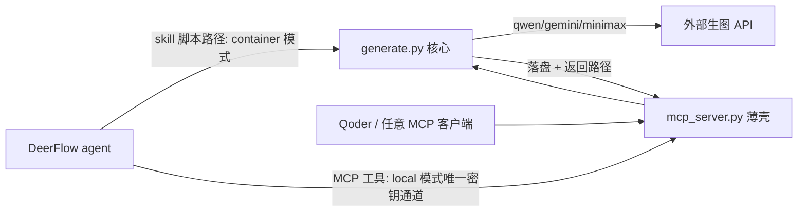

# qwen-image-3.0 适配器 + image-generation MCP stdio 薄壳 — 设计文档

- 日期:2026-09-08
- 分支:实施时定(沿用当前分支或新切,听用户指令)
- 参考:DashScope qwen-image-3.0 API(https://help.aliyun.com/zh/model-studio/qwen-image-generation-and-editing-api-reference);先例 spec `2026-06-08-minimax-generation-providers-design.md`;plan `../plans/2026-09-08-image-gen-qwen-mcp.md`

## 1. 目标

1. 在现有 `skills/public/image-generation/` 中接入 **qwen-image-3.0(DashScope)** 作为第三 provider,与 Gemini / MiniMax 并存(用户唯一持有的生图 Key 即 DashScope)。
2. 同目录新增 **MCP stdio 薄壳** `scripts/mcp_server.py`,使 DeerFlow agent(local sandbox 模式)与外部 agent(Qoder 等)消费同一份核心——一份核心、两个执行上下文(沙箱内 CLI / 主机 MCP 进程)。
3. 顺手修复两个既有缺陷:F1 Gemini `requests.post` 无 timeout;F2 Gemini inlineData mimeType 硬编码 `image/jpeg`。

## 2. 背景与现状

触发点:Qoder 内置 ImageGen 被套餐配额封锁(403/112);用户唯一持有 DashScope(qwen-image-3.0)Key。

现状 provider(沿用先例 spec 的表并扩展):

| Skill | provider | 端点 | 凭证 | 响应形态 |
|---|---|---|---|---|
| image-generation | Gemini | `generativelanguage.googleapis.com/.../gemini-3-pro-image-preview:generateContent` | `GEMINI_API_KEY` | base64 内联 |
| image-generation | MiniMax | `api.minimaxi.com/v1/image_generation` | `MINIMAX_API_KEY` | base64 |
| image-generation | **qwen(本 spec)** | `{host}/api/v1/services/aigc/multimodal-generation/generation` | `DASHSCOPE_API_KEY` | **URL(24h 有效)→ 二次下载** |

**密钥通道事实核查(本 spec 的设计基础,2026-09-08 代码核查)**:

1. 用户 `config.yaml` 为 **local sandbox 模式**:`sandbox/env_policy.py::build_sandbox_env` 剥离所有 `*KEY*`/`*SECRET*`/`*TOKEN*`/`*PASS*`/`*CREDENTIAL*`/`*DSN*` 类环境变量,且 `sandbox.environment` 对 `LocalSandboxProvider` **不生效**(无消费者)→ skill 脚本在 local 模式**拿不到任何 Key**;`required-secrets` 按请求供键,Web UI 不提供;
2. **container sandbox 模式**密钥经 `config.yaml -> sandbox.environment` 注入(`sandbox_config.py:163-166`,`$VAR` 从主机 env 解析,示例 `config.example.yaml:1321-1327`)→ 该模式下 skill 脚本路径正常;
3. **MCP stdio 通道**:`extensions_config.json` 的 `mcpServers.<name>.env` 中 `$VAR` 在 Gateway 加载期解析(`extensions_config.py:272,279-311`;`.env` 已被 `scripts/serve.sh` source);stdio 子进程 env = mcp SDK 最小 allowlist + 配置 env(`mcp/client/stdio/__init__.py:127`)+ DeerFlow 的 cwd/TMPDIR pin(`mcp/tools.py` 约 500-516:cwd 钉线程 workspace、TMPDIR 钉 `workspace/.mcp/tmp/`)→ **local 模式下唯一可行的密钥通道**,同时也是 Qoder 的消费通道;
4. stdio 注册只能**直接改配置文件**:HTTP API 的 stdio 命令 allowlist 仅 `{npx, uvx}`(`app/gateway/routers/mcp.py:33`);
5. DeerFlow 对 MCP 返回路径的翻译(`mcp/tools.py:56` 的 `_LOCAL_PATH_IN_TEXT_RE`)只认**正斜杠相对 token 或 user-data 树内路径**;Windows 下反斜杠/盘符绝对路径不被翻译;`present_files` 只认 `/mnt/user-data/outputs`;
6. SkillScan 门禁:`skills/skillscan/orchestrator.py` 的 `secret-env-assignment`(HIGH,正则 `\bapi[_-]?key\b\s*[:=]`)在现 `generate.py:109/170` 已触发;HIGH=error(`review/models.py:26-28`),CI `skill-review-ci.yml` 以 `--fail-on error` 跑 → **动这个 skill 必须先重命名**;另有 `python-env-dump-exfil`(CRITICAL,`os.environ` 属性访问 + 同文件网络 sink)、`python-dynamic-import`(HIGH)、`declaration-sensitive-capability`(HIGH 短语)、`resource.unreferenced`(warning);
7. `mcp` SDK 1.28.1 为**传递依赖**(经 `langchain-mcp-adapters`,`harness/pyproject.toml:24`;`uv.lock:2877-2879`),`from mcp.server.fastmcp import FastMCP` 在 backend venv 可用;`@mcp.tool()` 需带括号调用;`mcp.run()` 默认 stdio 同步;str 返回包装为 structured output + TextContent。

## 3. Provider 选择机制(扩展先例 spec §3,语义不变)

`_resolve_provider()` 判定顺序:

1. **显式覆盖**:`IMAGE_GENERATION_PROVIDER`(取值增补 `qwen`/`dashscope`);
2. **现有 provider 优先**:有 `GEMINI_API_KEY` → gemini;否则有 `MINIMAX_API_KEY` → minimax;
3. **回退 qwen**:否则有 `DASHSCOPE_API_KEY` → qwen;
4. 都不满足 → 抛清晰错误(错误串增补 qwen 说明)。

> 设计含义:现有键组合的解析结果**逐一不变**(gemini > minimax 顺序保持,qwen 仅追加链尾);仅配 DashScope 的用户自动走 qwen。dispatch 接受 `("qwen", "dashscope")`;unknown-provider 错误串列全三家。

## 4. qwen-image-3.0 接口对接细节

通用:

- Host 默认 `https://dashscope.aliyuncs.com`,可用 `DASHSCOPE_API_HOST` 覆盖(2026 文档展示 workspace 前缀 maas host `https://{WorkspaceId}.cn-beijing.maas.aliyuncs.com` 等;经典 host 对 3.0 的支持以 live smoke 裁决,override 是逃生舱);
- Header:`Authorization: Bearer $DASHSCOPE_API_KEY`、`Content-Type: application/json`;
- 本期只用**同步**端点 `POST {host}/api/v1/services/aigc/multimodal-generation/generation`(异步三步式 X-DashScope-Async + 轮询不采用,YAGNI);
- 模型 `qwen-image-3.0`,可用 `QWEN_IMAGE_MODEL` 覆盖(备选 `qwen-image-3.0-pro`)。

请求体(T2I):

```json
{
  "model": "qwen-image-3.0",
  "input": { "messages": [ { "role": "user", "content": [ { "text": "<prompt>" } ] } ] },
  "parameters": { "size": "1664*928", "negative_prompt": "<可选>", "prompt_extend": false, "watermark": false, "n": 1 }
}
```

请求体(I2I,参考图 1-3 张):`content` = `[{"image": "<data url 或公网 url>"}...] + [{"text": "<prompt>"}]`;参考图先过现有 `validate_image`,有效数 >3 → 返回错误串、**不调 API**;data URL 复用现有 `_to_data_url`(mime 按扩展名推断)。

parameters 决策:

- `size`:由 `--aspect-ratio` 经表映射——1:1→`1024*1024`、16:9→`1664*928`、9:16→`928*1664`、4:3→`1248*936`、3:4→`936*1248`、3:2→`1248*832`、2:3→`832*1248`;形如 `^\d{3,4}\*\d{3,4}$` 的入参透传但先校验面积 512²–2048² 与比例 1:8–8:1,越界回退 `1024*1024`(API 约束:面积 512*512–2048*2048、比例 1:8–8:1);
- `prompt_extend: false`——**编排 LLM 即压缩器**,服务端再改写会漂移意图(与 MiniMax 开 `prompt_optimizer` 的取舍相反,理由:本仓库的 prompt 已由 agent 结构化压缩);`enable_thinking` 因此不设(它要求 prompt_extend=true);
- `watermark: false`、`n: 1`;JSON prompt 含 `negative_prompt` 字段时映射进 parameters;
- 不暴露 seed(复现需求随二期工作台复议)。

响应与落盘:

- 取 `output.choices[0].message.content[*]` 中首个 `image` 条目 → **URL(24h 有效)** → `requests.get(url, timeout=120)` → `_ensure_output_dir` → 写字节(区别于 Gemini/MiniMax 的 base64 内联,多一次下载与一类失败模式);
- 错误处理:`raise_for_status()` + API 错误信息原样带出;无 image 条目 → 抛异常;
- 限额:text 推荐 ≤4500 tokens;参考图 JPG/JPEG/PNG/BMP/TIFF/WEBP/GIF、最佳 384–2048px、≤10MB;I2I data-URL payload 上限未文档化 → 错误串原样带出。

## 5. MCP stdio 薄壳契约(`scripts/mcp_server.py`,新文件)

启动与注册:

- 命令:`uv run --project <ABS>/backend python <ABS>/skills/public/image-generation/scripts/mcp_server.py`;env `{"DASHSCOPE_API_KEY": "$DASHSCOPE_API_KEY"}`、`tool_call_timeout: 300`(POST 120 + GET 120 余量);
- 注册只能直接改 `extensions_config.json`(见 §2.4);示例项进 `extensions_config.example.json`(disabled);Qoder 侧同片段(Qoder 未必展开 `$VAR`,贴字面 Key)。

工具与 schema:

- `FastMCP("image-generation")`,单工具 `generate_image(prompt: str, output_path: str = "", reference_images: list[str] | None = None, aspect_ratio: str = "16:9") -> str`;DeerFlow 前缀后可见名 `image-generation_generate_image`;
- schema 只含**执行参数**,语义永远由调用方 LLM 的 prompt 给全(不变量)。

内部接线:

- `sys.path.insert(0, str(Path(__file__).resolve().parent))` + 普通 `import generate`(禁 importlib 动态导入,避 SkillScan HIGH);
- prompt 写进 `tempfile.TemporaryDirectory()`(尊重 TMPDIR pin、自清理,不污染 workspace 快照)→ 调 `generate.generate_image`;
- `_resolve_output_dir()`:`Path.cwd().name == "workspace"` 且 `../outputs` 存在 → 用之(DeerFlow stdio cwd 钉定恒真);否则 cwd;
- `_remap_mnt(arg)`:`reference_images` 各项与 `output_path` 以 `/mnt/user-data/` 开头时反映射为 `Path.cwd().parent / 相对部分`(DeerFlow agent 只认识 /mnt 视角,壳跑在主机不认识);非 /mnt 入参原样透传(Qoder 主机路径);
- **返回契约**:DeerFlow 布局 → 正斜杠相对 token `../outputs/<name>.png`(经 §2.5 翻译为 `/mnt/user-data/outputs/...`,`present_files` 可交付);非 DeerFlow 布局 → 绝对路径;翻译失败退化裸文件名(snapshot 唯一名重写路径 Windows 安全);
- **协议卫生**:`contextlib.redirect_stdout(sys.stderr)` 包裹(generate.py 的 print 会毁 stdio JSON-RPC 流);工具 `async def` + `anyio.to_thread.run_sync`(同步工具会阻塞 anyio 协议循环);`except Exception` → 错误串返回,不炸会话;
- 本文件**不出现** `requests`/URL/`os.environ` 访问(避 CRITICAL `python-env-dump-exfil` 组合规则)。



## 6. 各组件改动清单

1. `skills/public/image-generation/scripts/generate.py`:重命名 `api_key`→`minimax_api_key`(l.109)/`gemini_api_key`(l.170)(SkillScan 门票);`_minimax_prompt`→`_single_text_prompt`;新增 `_generate_image_qwen`、`_dashscope_host`、`QWEN_SIZE_TABLE`、`_qwen_size`;resolve 链尾追加 qwen;F1 Gemini POST 补 `timeout=120`;F2 Gemini inlineData mimeType 改 `_guess_mime`;CLI 与 `generate_image` 签名不变;
2. `skills/public/image-generation/scripts/mcp_server.py`:新增(§5);
3. ~~`backend/packages/harness/pyproject.toml` 加 `"mcp>=1.28"`~~ **实施时回退(2026-09-08)**:`tenki-sandbox` 已从 PyPI 下架(JSON API 404,lock 里是下架前上传的包),任何 pyproject 改动都会触发注定失败的 universal 重解析,故 mcp 直接钉回退;`uv.lock` 已锁 `mcp==1.28.1` 精确版本,安装保证等价。**仓库级遗留问题:tenki extra 指向死注册表条目,另案处理,不在本变更范围**;
4. `.env.example`:加 `# DASHSCOPE_API_KEY=...`;`extensions_config.example.json`:加 disabled 示例项;
5. `SKILL.md`:Providers 节加 qwen 行(env 三变量、refs ≤3、prompt_extend 默认关)+ local sandbox 剥键说明 + 注册 snippet + 提及 `scripts/mcp_server.py`(避 `resource.unreferenced`);**frontmatter 不动**(`test_skills_bundled` 门禁)、避 HIGH 声明短语;
6. `backend/docs/MCP_SERVER.md`:薄壳短节(local 密钥通道理由、cwd/TMPDIR pin、路径返回契约);
7. 仓库 spec+plan 文档对:本文件 + `../plans/2026-09-08-image-gen-qwen-mcp.md`。

## 7. 测试(TDD)

- 载体:扩 `tests/skills/test_image_generation.py`(先扩 `clean_env`:del `DASHSCOPE_API_KEY`/`DASHSCOPE_API_HOST`/`QWEN_IMAGE_MODEL`——本机环境因 RAG 持有 DashScope 键,会污染 resolve 测试);新增 `tests/skills/test_image_generation_mcp_server.py`(`pytest.importorskip("mcp")`);
- 打桩:沿用 `tests/skills/skill_loader.py` 的 `FakeResp` + `monkeypatch.setattr(img.requests, "post"/"get", fake)`,**不打真实 API**;
- 覆盖:resolve(qwen 居链尾/override/仅 DashScope/缺键串/unknown 串)、qwen payload(model、messages 形态、size 映射+透传+越界回退、prompt_extend/watermark/n、negative_prompt 映射)、refs data URL、>3 refs 不调 API、URL 二次下载写盘(断言字节与嵌套目录)、F1(timeout kwarg)、F2(PNG 参考图 → inlineData mimeType=image/png)、壳(`_run` 默认命名、sibling-outputs 启发式、相对 token 形态、`_remap_mnt` 反映射与透传、异常→错误串、temp 自清理);
- 运行:根 `uv run --no-project --with pytest --with requests --with Pillow pytest tests/skills/ -v`;壳测试 `cd backend && uv run pytest ../tests/skills/test_image_generation_mcp_server.py -v`;
- 门禁:`scan_skill_dir` 零 finding;`tests/test_skills_bundled.py`;`scripts/review_changed_public_skills.py` 对齐 CI。

## 8. 向后兼容与既有逻辑影响面

- 重命名:模块内局部变量与下划线私有函数,无外部调用者 → **零行为变化**;
- resolve 链:现有键组合解析逐一不变(§3);仅错误串文本增补;
- F1/F2:本计划对既有路径**仅有的两处行为变化**,均为缺陷修复,测试钉住;
- 运行时默认态无感:qwen 分支仅在有 `DASHSCOPE_API_KEY` 时激活;MCP server 默认未注册(示例项 disabled);live 配置(gitignored)不被代码变更触碰;
- SKILL.md 正文是 agent 运行时输入(多 qwen 行与 local 说明),frontmatter/allowed-tools 不动 → 策略面不变;
- 不碰:前端、Gateway 路由、中间件链、`env_policy`、MCP 客户端核心、DB/migration、`config.yaml` schema(无需 bump config_version)、其他 skill 与 community 工具。

## 9. 新增环境变量汇总

| 变量 | 用途 | 默认 |
|---|---|---|
| `DASHSCOPE_API_KEY` | qwen 凭证 | 必填(走 qwen 时) |
| `DASHSCOPE_API_HOST` | DashScope base url | `https://dashscope.aliyuncs.com` |
| `QWEN_IMAGE_MODEL` | 生图模型 | `qwen-image-3.0` |
| `IMAGE_GENERATION_PROVIDER` | 强制 provider(取值增补 qwen/dashscope) | 不设(自动判断) |

## 10. 否决备选

- **原生 harness 工具(community/image_gen)**:skill 已覆盖 DeerFlow 侧,provider 逻辑不写第二遍;
- **Qoder 会话拆分(调度会话 + 生图会话)**:层间接口必须是结构化工具调用;会话只值回并行与长期上下文隔离,以磁盘文件交接;
- **每节点一个 MCP server 进程**:进程爆炸 + 生命周期/延迟地狱;DAG 缓存要求引擎直控调用(二期校准);
- **包/桥接 ComfyUI 作引擎**:其前提是本地 GPU,与用户只有 API Key 的现状错位;
- **HTTP 传输**:stdio 双消费者原生支持、零常驻进程;
- **返回 base64**:多模态编排器需要 Read 落盘图闭环,base64 塞工具结果反而不可读。

## 11. 非目标与路线图(YAGNI)

- 本期不做:seed/n/prompt_extend 进 schema(默认 `prompt_extend=False`、`n=1`、不暴露 seed,随二期复议);异步三步式 qwen 端点;DAG 引擎、类型化端口、图持久化、画布前端、Gateway 执行端点;
- **二期:画布工作台 = 消费者 #3**。自建薄 DAG 引擎(抄 ComfyUI:输入 hash 记忆化、只重跑下游、workflow JSON 持久化;前端先例 React Flow);**MCP 是边界协议不是内部连线**:节点来源三种(原生核心直调 / 外部 MCP 工具 / 已发布图引用),导出粒度两种(单节点工具 / 整图复合工具,打包同一 server 进程),自由输入 = 工具 schema 参数;四个坑:输入 pin、版本钉定、Key 留服务端 env、长运行图 async task;立项前提:核心先经 DeerFlow + Qoder 双端 e2e 验证;立项时另开 spec+plan 文档对;
- 反向出口(核心打包成 ComfyUI custom node)缓议,不进路线图。

## 12. 风险与开放项

- ~~经典 host 对 qwen-image-3.0 的支持未验证~~ **已裁决(2026-09-08 live smoke 一次通过)**:账号级 Key + 经典 host 出图成功并闭环看图验收;`sk-ws-` 前缀 workspace 键若报错仍用 `DASHSCOPE_API_HOST` 逃生舱;
- I2I data-URL payload 上限未文档化 → 错误串原样带出;
- size 是否强制 32 倍数未知(936 条目)→ 被拒回退 `1280*960`/`960*1280`;
- ~~Windows 下相对 token 翻译系推断~~ **已裁决(2026-09-08 DeerFlow e2e)**:相对 token 正向翻译与 `_remap_mnt` 反映射均实证生效(产物卡片/下载链/磁盘文件三证),未触发裸文件名退化;
- stdio 子进程内首次 `uv run` 可能触发 sync → 实施预跑 `uv sync`,受 `session_init_timeout` 60s 约束。
