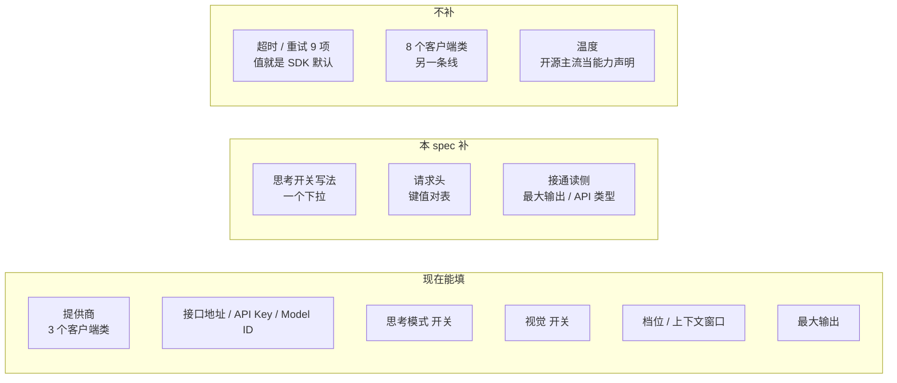

# 界面模型条目：补齐被丢弃的字段 —— 设计

**Status:** 📝 **起草（2026-09-21）** —— 未开工。本 spec 覆盖**界面能写的字段集**（补 3 个 + **接通 2 个既有 write-only 字段的读路径**）；配套 plan：[2026-09-21-model-entry-field-parity.md](../plans/2026-09-21-model-entry-field-parity.md)（Task 0–4，每步 RED / neuter / 真栈口径）。**修订记录见下方 blockquote 串**（当前：必改×3 · 应改×4 · 缺口×2 · 可选×2 · **范围×1（甲）** 已全部落进两份文档，验收编号 1–19）。

> **2026-09-21 修订**：字段从 **4 个降到 3 个** —— `temperature` 撤下（核过两家开源后，主流把它当"能力声明"而非"用户设的值"，见 §6 第 4 条）。控件从 3 个降到 2 个。
>
> **2026-09-21 审查后修正 4 处**（对着代码逐条核出）：① `models-edit-dialog.tsx` **不是"不变"** —— 它也有「接口地址」那一组，`default_headers` **两个弹窗都要加**；② §4 验收编号断号（原 9 被删后未重排）；③ 三处行号错（`factory.py:362→363`、`348-360→357-370`、`models-edit-dialog.tsx:163→162`）；④ 类名大小写（`PatchedChatMinimax→PatchedChatMiniMax`）。
>
> **同日另补 §6 第 7 条**：本 spec 补的字段对 **caption（VLM）腿无效** —— 那条腿是裸 HTTP，只读条目的 4 个键。
>
> **同日收掉两处"应改"**：⑤ §1.2 B 档（超时/重试）**整档降为 🟢** —— 唯一偏离 SDK 默认的那几条**只出现在 MindIE 预设里**，而那个类界面选不出；⑦ §1.0 的 ASCII 图重排成**三段独立列表**（原来三栏并排会让人按行误读对应关系）。
>
> **同日收掉两处"可选"**：⑩ §1.2 的项数 **22 → 23**（按字段名数，`use:` 那一格含 8 个类按 1 项计）并写明计数口径；⑪ `models-add-dialog.tsx:219`（注释行）**→ `:220`**（真正的 gate）。
>
> **同日终审后改 5 处**（按"设计级两类新错"查）：① **D3 与 D2 的冲突** —— 补一段说明两句管的是不同格子（D2 反对"猜着预填"、D3 是"算得出来才写"）；② **D3 的自动推落在前端**（明确了它不进后端派生）；③ **已裁：那两格没有「不设置」**（选甲）+ 三个后果写明 + **为什么不做勾选框**（"取消"无法持久化）；④ **§5 的"不填就不写"理由修正**（对 anthropic / deepseek 不成立）；⑤ **§4 补两条**（`budget_tokens` 点名 `4096`；新增"编辑既有 anthropic 条目会写入配方"的用例）。验收 8 条加了范围限定，编号重排为 1–14。
>
> **同日"必改三条"改完（又对代码核了一轮）**：① **新增 D6 —— 三个字段必须走读路径**（§1.1 也补了指针）：`ManagedModelResponse` 不返回它们、前端 `toManagedInput` 是"只带 GET 给得起的字段"的白名单、保存又是**整集合 PUT** ⇒ 今天"配了头的条目，下次任何一次界面保存（哪怕动的是**别的**条目）就会丢头"（既有同类：`max_tokens` / `use_responses_api` 已被抹）；② **§1.0 / §D4 / §D5 的"改一个组件就够"更正** —— 形状下拉要 `provider`，而 `ModelCapabilityEditor` 不收它（props 只有 `value`/`onChange`/`suggested`）⇒ 落点是"组件 + **两个弹窗的调用点**"；③ **§D3 后果表补第四行** —— 自动推配方**不碰** `supports_thinking` chip（向导的两个常量是把 `"supports_thinking": True` 与配方**一起**给的），并给真栈那条核心验收补"条目要勾思考"的前提。验收编号随之重排为 **1–17**。
>
> **2026-09-21 晚，四条"应改"也补完**：(a) §6 第 7 条的行号 `knowledge/vlm_target.py:47-51` → **`:45-49`**（`VlmTarget` 的五个字段真正在哪）；(b) **§1.2 的项数 23 → 24** —— 按本节自己写的口径（按字段名数）逐格数就是 24（3+9+2+4+6），上面那轮"22 → 23"少算了一项；(c) §1.2 E 行 `stream_usage` 的行号 `:409`（判断行）→ **`:411`**（赋值行，与本 spec 别处 `:266` / `:363` 的点法一致）；(d) **§1.3 现场核对重新读盘**：`models_config.json` 现在是 **4 条**（多出 `minimax-m3`，而它是本机唯一既有的 `anthropic` 条目 ⇒ D3 第 2 行有真实样本）；`deepseek-v4.1-flash` 的 `supports_thinking` 是 **`false`**（原文"那三条都勾了"今天只对其余两条成立）。
>
> **同日两条"缺口"也补完**：⑧ **i18n 三个文件进落点清单** —— 三个新控件的文案要同时加在 `locales/types.ts`（手写 interface）与 `en-US.ts` / `zhCN.ts`（各自 `: Translations`），**缺一 `pnpm check` 就红、`pnpm test` 拦不住**（§5 表 + plan Task 2 / Task 3 的文件清单）；⑨ **真栈把 `minimax-m3` 点名成"编辑既有 `anthropic` 条目"的样本**（plan Task 4 第 4 项，**在 scratch 根里复刻形态、不许动他本机那条**），并把**本对验不了的那半**（代理端点收不收形状 ③）登记为 §6 第 8 条 —— 落脚是"D3 信的是类、不是端点真协议，而 `anthropic` 那格没有「不设置」⇒ 撞上就只能在界面外改文件"。
>
> **同日两条"可选"也收掉**：⑩ **Task 2 的 UI 用例改成直接 `render(<ModelCapabilityEditor provider=… />)`**（环比 `functional-models-view.dom.test.tsx` —— 仓内 settings 的两个 dom 用例都是渲染组件本身、注释写明"instead of driving the Radix dropdown"；断言只钉"行在不在"，i18n 照先例 mock）⇒ 它**不再依赖**"Radix `Dialog` 在 happy-dom 能不能渲染"这个未知（那个未知只留给 plan 的 Task 3）；⑪ **验收 13 / 14 的措辞统一成"四个模式收敛成两个请求体"**，并补上它的**前置条件** —— 样本**不勾档位能力**（`supports_reasoning_effort` 关）：不关它时 `modeHeuristicEffort` 给 flash `undefined` / thinking `low` / pro `medium` / ultra `high`，四个请求体根本不会收敛；关掉后 `factory.py:373-375` 把 `reasoning_effort` 整个 pop 掉，模式轴上只剩思考一个变量（`offeredModes` 只看思考 chip，四个模式照样能选）。
>
> **同日**范围扩一次（他裁**甲**）**：`max_tokens` / `use_responses_api` **从"既有受害者"升为本对交付项** —— 这两个**写侧早已完整**（`ManagedModelInput:206-207`、`entry:652-653`、前端 `types.ts:83-84`、编辑弹窗真有 `max_tokens` 那格），缺的**只有读侧** ⇒ 归 D6 一并接上（响应 +2 键、`toManagedInput` +2、编辑弹窗补「API 类型」+ `max_tokens` 预填）。⇒ **受害字段一类清零**（5 个一起治），验收与 plan 的 Task 1 / 3 / 4 同步扩到这 2 个字段，编号重排为 **1–19**。⚠️ **代价要说清**：编辑弹窗**多一个控件**（「API 类型」—— 它今天只在添加弹窗有，所以用 Responses 建的条目编辑一次就静默回落成 chat，这是"读侧缺失"里最狠的一例）；且 `use_responses_api` 有**假值归一**规则（见 D6）。

**Parent:**
- [2026-09-10-web-model-provider-config-design.md](2026-09-10-web-model-provider-config-design.md)（界面模型管理，Task 1–5 已交付）——本 spec 是它的**字段集**增量。
- [2026-09-10-model-capability-config-design.md](2026-09-10-model-capability-config-design.md)（能力声明层）——「能力」那一组字段的出处。
- [2026-09-19-model-effort-fallback-and-record-design.md](2026-09-19-model-effort-fallback-and-record-design.md)（档位：回退 + 记录）——本 spec **不动**它，但 §1.2 的"思考开关无效"正是它留下的下游。

## 1. 问题

### 1.0 一眼看懂

**界面现在能填 6 类东西，缺 5 类；本 spec 补 2 个控件（3 个新字段），并把 2 个既有字段的读路径接通。**



```
现在能填（6 类）            本 spec 补（2 个控件 + 2 个字段接通读侧）
──────────────             ──────────────────────────────
提供商（3 个类）             思考开关写法（下拉）
接口地址 / 密钥 / Model ID   请求头（键值对表）
思考模式 开关                ★ 接通读侧（既有字段）：
视觉 开关                      最大输出（max_tokens）
档位 / 上下文窗口              API 类型（use_responses_api）
最大输出  ← 有控件、读不回

不补（3 类）
──────────────
· 超时 / 重试 9 项（值 = SDK 默认）
· 8 个客户端类（另一条线）
· 温度（见 §6 第 4 条）
```

**控件落在哪**（都在已有分组里，不新开组）：

```
添加弹窗 · 第一步（身份与连接）
  提供商 / API 类型 / 接口地址 / API Key / Model ID
  ★ 补：请求头（表）

编辑弹窗（连接）
  显示名称 / API Key / 接口地址 / 最大输出
  ★ 补：请求头（表）      ← 与上面同一组，两处都要有
  ★ 补：「API 类型」（Chat / Responses；添加弹窗已有、编辑弹窗没有）
  ★ 补：最大输出打开时预填（今天每次打开都清空）

添加弹窗第二步 ／ 编辑弹窗（能力，共用组件）
  思考模式 / 视觉 / 支持的档位 / 上下文窗口
  ★ 补：思考开关写法（下拉）
```

⚠️ **`default_headers` 要加两次** —— 「接口地址」那一组**两个弹窗各有一份**（添加弹窗第一步 + 编辑弹窗），所以请求头也要两边都有，否则已存在的条目改不了头。**「API 类型」同理**（它今天只在添加弹窗第一步，编辑弹窗没有）⇒ 编辑弹窗也要补一格。**「能力」那一组相反**：两个弹窗共用 `ModelCapabilityEditor`，**控件只写一次** —— ⚠️ 但它要新增一个 **`provider` prop**（形状下拉按提供商显隐，见 D3 / §3.4），所以两个弹窗的**调用点**仍要各改一行。

⚠️ **这是"在现有结构里加几行"，不是"改结构"** —— 客户端类、工厂、`merge_ui_models` 一条都不动；字段集只是从 16 变 19、`entry` 从 15 键变 18 键（**写侧**），而**读侧响应从 17 个键变 22 个**（3 个新增 + 2 个既有字段的读侧）。

### 1.1 丢的不是"被过滤掉的字段"，是"从来没进过门"

`models_config.json` 里的字段集由**三处写死的同一份 16 字段清单**决定，任何一处不在清单里的键都进不去：

| 关卡 | 位置 | 行为 |
| --- | --- | --- |
| ① 前端控件 | `models-add/edit-dialog.tsx` + `model-capability-editor.tsx` | 没渲染 ⇒ 用户没地方填 |
| ② HTTP 入参 | `gateway/routers/models.py::ManagedModelInput`（`extra="forbid"`） | 未知键 ⇒ **422** |
| ③ 写盘前重建 | 同文件 `entry: dict = {...}`（15 键 + 条件 `endpoint`） | **只从 `entry` 取值** ⇒ 清单外的一律不进文件 |

⚠️ **`merge_ui_models` 不丢字段** —— 它拿到什么写什么，只做「同名整条替换」。**字段的丢失全部发生在上面三处**，性质是"集合定义窄"，不是"某一步过滤"。

⚠️ **还有第四条通路，方向相反（在"读"侧，见 D6）** —— 上面三处管的是"**写不进去**"；`ManagedModelResponse`（`routers/models.py:216-235`）**不返回** `when_thinking_*` / `default_headers`，**也不返回** `max_tokens` / `use_responses_api`（这两个**写侧早已完整** —— `ManagedModelInput:206-207`、`entry:652-653`、前端 `types.ts:83-84` 都有，编辑弹窗甚至已经有 `max_tokens` 那一格 —— **缺的只有读侧**）；而 `models-settings-page.tsx:40-57` 的 `toManagedInput` 是"只带 GET 给得起的字段"的白名单、`:93/:98/:105` 三个动作都把它套在**其余条目**上再整集合 PUT ⇒ **已经写进文件的字段，会在下一次任意界面保存时被抹掉**。**5 个字段一起治**（D6 甲）。

**对照组**：向导走 `writer.py:218` 的 `model_entry.update(extra_model_fields)` —— **直接 update，没有入参校验也没有固定键重建** ⇒ 任意键都能进。

### 1.2 完整丢弃清单（24 项，按"不加会怎样"分三档；**两个 write-only 字段**在末尾单列）

> 计数口径：**按字段名数**（`use:` 那一格含 8 个类，**按 1 项计**）。

| 档 | 含义 |
| --- | --- |
| 🔴 **阻塞** | 不加，界面上**某个功能完全不工作**（开关无效 / 连不上 / 配不出正确形态） |
| 🟡 **增益** | 不加能跑，只是少了可调性（走默认值） |
| 🟢 **无影响** | 不加完全等价（值就是默认 / 工厂会补 / 换个字段能表达） |

**A · 思考配方**

| 字段 | 是什么 | 不加会怎样 | 档 |
| --- | --- | --- | --- |
| `when_thinking_enabled` | **开**思考时往请求体塞什么 | 思考这一维在四个模式上完全一样（`extra_body` 里一个 thinking 键都不发） | 🔴 |
| `when_thinking_disabled` | **关**思考时塞什么 | 同上（flash 关不掉任何东西） | 🔴 |
| `thinking` | 上面第一条的快捷写法 | 无（`when_thinking_enabled` 能表达） | 🟢 |

**B · 超时 / 重试（9 项）**

| 字段 | 向导给的值 | 不加会怎样 | 档 |
| --- | --- | --- | --- |
| `timeout` / `request_timeout` / `default_request_timeout` | `600.0` | SDK 默认 `read/write/pool = 600` ⇒ **无差** | 🟢 |
| `connect_timeout` | `30.0`（仅 MindIE） | SDK 默认 `5.0` —— **但 MindIE 类界面选不出**（§6 第 1 条）⇒ 对界面无关 | 🟢 |
| `read_timeout` | `900.0`（仅 MindIE） | SDK 默认 `600`；同上 | 🟢 |
| `write_timeout` / `pool_timeout` | `60.0` / `30.0`（仅 MindIE） | SDK 默认 `600`；同上 | 🟢 |
| `stream_chunk_timeout` | 未用 | **工厂注入 `240.0`**（`models/factory.py:266`） | 🟢 |
| `max_retries` | `2`（17 处）/ `1`（MindIE） | SDK 默认 `2` | 🟢 |

⚠️ **这一整档对界面全是 🟢**：值本来就等于 SDK 默认，**唯一偏离的那几条（`connect_timeout` / `read_timeout` / `write_timeout` / `pool_timeout` / `max_retries:1`）都只出现在 MindIE 预设里**，而 MindIE 那个类**界面根本选不出**（§6 第 1 条）⇒ 对界面而言**连"有差"的机会都没有**。

⚠️ **实测依据**（本机 `openai 2.32.0`）：`DEFAULT_TIMEOUT = Timeout(connect=5.0, read=600, write=600, pool=600)`、`DEFAULT_MAX_RETRIES = 2`。⇒ 向导那批超时/重试**大多是把默认值显式写出来**，丢了没有差别。

**C · 采样**

| 字段 | 向导给的值 | 不加会怎样 | 档 |
| --- | --- | --- | --- |
| `temperature` | `0.7`（OpenAI 系）/ `1.0`（MiniMax）/ `0`（MindIE） | 走端点默认 ⇒ **官方值 ≠ 端点默认时有差** | 🟡 → **本 spec 不补**，理由见 §6 第 4 条 |
| `num_predict` | `8192`（Ollama） | Ollama 对 `max_tokens` 的叫法；且 Ollama 类本身界面选不出 | 🟢 |

**D · 请求体原样**

| 字段 | 不加会怎样 | 档 |
| --- | --- | --- |
| `default_headers` | **需要特定头的端点完全连不上**（opencode 的 `x-opencode-session` ⇒ 400） | 🔴 |
| `default_query` | 同类端点的鉴权/路由参数传不进去 | 🔴 |
| `extra_body` | 非标准参数进不去 —— **但见 D2/D3：结构化配方会替用户生成它** | 🔴→由 D2 覆盖 |
| `model_kwargs` | 是"通道"不是功能 | 🟢 |

**E · 其他**

| 字段 | 不加会怎样 | 档 |
| --- | --- | --- |
| `use:`（8 个本仓适配类） | 前 5 个多轮 400 / 后 3 个连不上 | 🔴（**本 spec 不含**，见 §6） |
| `output_version` | 走默认版本 | 🟡 |
| `pricing` | console 成本显示 `null` | 🟡 |
| `stream_usage` | 工厂默认设 `True`（`factory.py:411`） | 🟢 |
| `env_var` / `api_key_field` | 模板自己的字段，不是模型字段 | 🟢 |

⚠️ **上面 24 项里不含两个字段，它们属于另一类** —— `max_tokens` / `use_responses_api` **不在"界面写不进去"的清单里，而是"写进了也留不住"**：

| 字段 | 写侧 | 读侧 | 症状 |
| --- | --- | --- | --- |
| `max_tokens` | ✅ 入参（`routers/models.py:206`）· `entry`（`:652`）· 前端类型（`types.ts:83`）· **编辑弹窗真有那一格**（`models-edit-dialog.tsx:168-173`） | ❌ 响应 / `ManagedModel` / `toManagedInput` 都没有 | 每次打开那一格都是空的（`:73` 的 `setMaxTokens("")`）⇒ 一保存就被 `stored_entry` 的 `is not None` 丢掉 |
| `use_responses_api` | ✅ 入参（`:207`）· `entry`（`:653`）· 前端类型（`types.ts:84`）· 添加弹窗的「API 类型」写入 | ❌ 同上 | 更狠：**编辑弹窗压根没有「API 类型」控件**（也不发这个键）⇒ 一个用 Responses 建的条目，**编辑一次就静默回落成 chat** |

⇒ **本 spec 一并接通这两个的读路径**（D6 甲），所以净增的是 **3 个字段** + **2 个既有字段的读侧**；差分口径**不含**它们 ⇒ §1.2 的 "24 项" 计数不变。

### 1.3 现场核对（2026-09-21 晚复核）

本机 `config.yaml` 3 条、`models_config.json` **4 条**，**名字全不重复** ⇒ 今天没有踩「同名整条替换」的坑：

| `config.yaml`（3） | `models_config.json`（4） |
| --- | --- |
| `qwen3.8-flash` / `deepseek-v4-flash` / `qwen3.7-flash` | `deepseek-flash` / `ZHIPU/GLM-5.3-Flash` / `deepseek-v4.1-flash` / `minimax-m3` |

界面那四条**都没有配方** ⇒ 它们的思考开关翻了不产生任何请求差异（§2 D2 要治的正是这个）；其中 `deepseek-v4.1-flash` 的 `supports_thinking` 是 **`false`**（另三条是 `true`）。

⚠️ **`minimax-m3` 要单独说一句** —— 它是本机**唯一既有的 `anthropic` 条目**（`use: langchain_anthropic:ChatAnthropic`，端点 `opencode.ai/zen/go`）⇒ D3 第 2 行的后果（"**编辑一个既有 `anthropic` 条目 ⇒ 它自动获得配方**，哪怕只改显示名"）今天就有真实样本，不是假想路径。⚠️ **但它同时是最容易踩错的一条** —— 类说"原生 Anthropic"、端点是第三方代理，D3 会据此自动写形状 ③（见 §6 第 8 条）。

⚠️ **本节是会漂的快照**（两本文件都可能被手改；上面那张"3 + 3 条"的历史版本就两度过期）⇒ 只当"当时状态"用，拿它当论据前先重读一遍盘。

## 2. 决定

### D1 —— 补 3 个字段 + 接通 2 个既有字段的读路径，不补其余的

| # | 字段 | 档 | 落点分组 |
| --- | --- | --- | --- |
| 1 | `when_thinking_enabled` | 🔴 | 能力 |
| 2 | `when_thinking_disabled` | 🔴 | 能力 |
| 3 | `default_headers` | 🔴 | 连接 |
| 4 | `max_tokens`（**既有**，只缺读侧） | 🔴 | 连接（编辑弹窗已有那格，补预填） |
| 5 | `use_responses_api`（**既有**，只缺读侧） | 🔴 | 连接（编辑弹窗**补「API 类型」控件**） |

⚠️ **第 4 / 5 条与第 1–3 条的差别**：前三个是"**从无到有**"（写侧 + 读侧都要加），后两个是"**接上断掉的读侧**"（写侧早已完整，见 §1.2 末尾）⇒ 落点集中在 D6，不需要动 `ManagedModelInput` / `entry`。

**不补**（理由见 §1.2）：超时/重试 9 项、`stream_chunk_timeout`、`thinking`、`stream_usage`、`num_predict`、`model_kwargs`、`default_query`、`output_version`、`pricing`。

⚠️ **`temperature` 也归入"不补"** —— 它原本在 🟡 档、是本对最早列的第 4 个字段，**2026-09-21 核过两家开源后撤下**，理由见 §6 第 4 条。

⚠️ **`extra_body` 不单独补** —— 见 D2：结构化配方生成的正是 `extra_body.thinking` / `extra_body.chat_template_kwargs`，用户不需要直接写这个容器。

#### 为什么第 2 个（`when_thinking_disabled`）也要写

⚠️ **不是为了"必须"，是为了"不靠工厂的隐式合成"。**

工厂在条目**没有** `when_thinking_disabled` 时，会按已有的 `when_thinking_enabled` 的**形状**自己造一个关闭配方（`models/factory.py:357-370`）。探针实测（`supports_reasoning_effort=True`、条目默认档 `medium`）：

| 条目 | 按 flash 时的 `extra_body` | `reasoning_effort` |
| --- | --- | --- |
| 只有"开" | `thinking.type = disabled`（**工厂造**） | **`minimal`** ← 形状① 的合成**多压一次档位** |
| 两个都写 | `thinking.type = disabled`（**用户写**） | `medium`（**不碰**） |

⇒ **两个做法的 `extra_body` 结果完全一样**，差别只在"只写一个"会被多塞一个 `minimal`。

⚠️ 而那个 `minimal` 会引入一条**"记录 ≠ 实发"**的路径（见 §6 第 6 条）：`lead_agent` 记的是 `None`，线上发的是 `minimal`。**写上第二个字段，这条路径就不存在。**

⚠️ **前提必须说清**：工厂合成的前提是**条目已经有"开"配方** —— `has_thinking_settings` 只看 `when_thinking_enabled`，**不看关**。**两个都没有 ⇒ 工厂什么都不造**（探针实测 `extra_body = None`：**思考这一维**在四个模式上完全一样）。这正是今天界面条目的状态。

### D2 —— 思考配方用**结构化形状**，不用 JSON 文本框

三个字段里有两个（`when_thinking_enabled` / `when_thinking_disabled`）是**任意嵌套 dict**。界面上两种填法：

| 落法 | 形态 | 代价 |
| --- | --- | --- |
| 甲 · JSON 文本框 | 一个多行框 | 用户要懂 JSON、**无校验**、填错到运行时才炸 |
| **乙 · 结构化形状**（选定） | 一个「形状」下拉，系统生成 dict | 覆盖不到没预料的形状 |

**选乙的理由**：仓库的 22 个预设**只用过三个形状**，结构化能全覆盖，而且**有校验**。

⚠️ **这三个形状不是向导发明的** —— 它们分别是 **Anthropic 官方协议**（`thinking.budget_tokens`）、**vLLM 官方参数**（透传 Jinja 模板变量）、**OpenAI 兼容网关的约定**。向导只是**第一个把它们写下来的地方**。

⇒ **界面自己写三个字面量即可**（约 5 行），**不需要依赖、也不需要搬迁 `scripts/wizard/`**。工厂侧本来就认得这三个形状（`models/factory.py:357-370` 三段 `elif` 就是"形状 → 处理"的识别表）。

**三个形状与工厂的对应**（`models/factory.py:357-370` 三段 `elif` 逐个匹配的正是它们）：

| 形状 | 生成的 dict | 谁用 | 向导里的常量 |
| --- | --- | --- | --- |
| ① OpenAI 兼容网关 | `{extra_body: {thinking: {type: enabled\|disabled}}}` | 火山 / DeepSeek / Kimi / MiMo / OpenRouter… | `OPENAI_COMPAT_THINKING_CONFIG` |
| ② vLLM / SGLang | `{extra_body: {chat_template_kwargs: {enable_thinking: bool}}}` | 自部署 vLLM / SGLang | vLLM 预设内联（`scripts/wizard/providers.py:470`） |
| ③ 原生 Anthropic | `{thinking: {type: enabled, budget_tokens: N}}` / `{thinking: {type: disabled}}` | Anthropic 官方 | `ANTHROPIC_THINKING_CONFIG` |

⚠️ **默认值是"不设置"，不是"预填一份配方"** —— 形状填错比不填更糟（给 Anthropic 条目预填 OpenAI 形状 ⇒ 直接 400）。今天"没配方"只是开关无效，**预填错是连不上**。

⚠️ **`budget_tokens` 用 `4096`**（与向导一致），v1 不暴露控件。

### D3 —— 形状**按 `use:` 类自动推**，只有 `openai-compatible` 要用户选

| 界面那一格 | 实际类 | 形状 |
| --- | --- | --- |
| `anthropic` | `langchain_anthropic:ChatAnthropic` | ✅ **自动** ⇒ 形状 ③ |
| `deepseek` | `deerflow.models.patched_deepseek:PatchedChatDeepSeek` | ✅ **自动** ⇒ 形状 ① |
| `openai-compatible` | `langchain_openai:ChatOpenAI` | ❌ **推不出** ⇒ **用户选** |

**推导规则**（写成一张表，不散在代码里）：`ChatAnthropic` 系（含 `ClaudeChatModel`）⇒ ③；`VllmChatModel` ⇒ ②；**其余** ⇒ ①。

⚠️ **自动推落在前端** —— 用户选完提供商，前端直接把两个配方字段放进 payload；后端（`ManagedModelInput`）只是**收下它们**，不按 provider 补。⇒ D5 的第 ② 处仍然要加这两个字段（它们是前端传来的值，不是后端派生的）。

⚠️ **它和 D2 的"不预填"不冲突** —— 两句管的是**不同的格子**：

| | D2 的"不设置" | D3 的"自动推" |
| --- | --- | --- |
| 管哪格 | `openai-compatible` | `anthropic` / `deepseek` |
| 依据 | **推不出** ⇒ 只能问用户 | **类决定了协议** ⇒ 可以放心写 |
| 用户操作 | 从下拉选 | 不用操作 |

**D2 反对的是"猜着预填"**（不知道后面是什么就替用户选一个）；**D3 是"算得出来才写"**。两者规则一致：**只在该写的时候写。**

⚠️ **已裁：那两格没有「不设置」**（2026-09-21 选甲）。⇒ **这是有意为之**，三个后果要写明：

| 后果 | 说明 |
| --- | --- |
| 用户**无法**让一个 `anthropic` / `deepseek` 条目"不带配方" | 那两格没有"不设置"这个选项 |
| **编辑一个既有条目 ⇒ 它自动获得配方**（哪怕只改显示名） | 今天它可能本来没有配方 |
| 手工写的**别的形状会被覆盖** | 若有人手编过 `models_config.json` 给 anthropic 条目配了形状 ①，编辑一次就被推成 ③（**本机现实样本**：`minimax-m3` 的端点其实是第三方代理 —— 见 §6 第 8 条） |
| **配方与「思考模式」chip 脱钩** | 自动写的配方**不改** `supports_thinking`。chip 关 ⇒ 开思考那条在界面上不可达（composer 对 `supports_thinking=false` 只给 Flash），而 flash 仍会多带一个关闭参数；工厂在 `thinking_enabled=true` + chip 关时会 `raise ValueError`（`models/factory.py:348-350`）—— 界面到不了那条路，但它存在 |

⚠️ **向导是把两者一起给的** —— `OPENAI_COMPAT_THINKING_CONFIG` / `ANTHROPIC_THINKING_CONFIG` 两个常量里都带着 `"supports_thinking": True`（`scripts/wizard/providers.py:67` / `:85`），而**本 spec 只取配方那一半**：**能力声明归用户**（「思考模式」chip）、**形状归类**。⇒ 不要顺手把 chip 打开，那是替用户声明能力，正是 D2 反对的"猜着预填"。

⚠️ **`openai-compatible` 那格没有第四行这个问题** —— 它默认「不设置」，chip 与配方都由用户各管一半，且不勾 chip 时那条目本来就只有 Flash 可跑。

⚠️ **为什么不做那个"勾选框"**：文件里"**没有键**"区分不了"用户拒绝"和"从没配过" ⇒ 一个默认勾上的开关**取消不掉**（下次打开又默认勾上）。而默认不勾等于把便利丢掉（用户不知道要勾 ⇒ 回到今天的"开关是假的"）。⇒ **甲是唯一自洽的形态。**

**`openai-compatible` 为什么推不出**：它是**唯一一个"背后可能是任何东西"的格子** —— 可以是普通网关（形状 ①），也可以是自部署的 vLLM / SGLang（形状 ②）。两者**端点分辨不出**（都是 `/v1/chat/completions`）。

**下拉内容**（只在 `openai-compatible` 出现）：

```
思考开关写法  [ 不设置 ▼ ]
               不设置
               OpenAI 兼容网关
               vLLM / SGLang
```

⚠️ **`Anthropic` 那一格不在下拉里出现** —— 它的形状由类决定，用户选不了也不该选。

### D4 —— 字段按**语义**归组，不是全塞进 `ModelCapabilityEditor`

界面已经有三组分界：

| 组 | 现在在哪 | 新字段归位 |
| --- | --- | --- |
| 身份 + 连接 | 添加弹窗**第一步**（`identity`）+ **编辑弹窗**（两处各一份） | **`default_headers`**（紧挨「接口地址」，**两处都要加**） |
| 能力 | `ModelCapabilityEditor`（两弹窗共用） | **`when_thinking_enabled` / `when_thinking_disabled`**（紧挨「思考模式」） |
| 参数 | **只在编辑弹窗** | （本 spec 不加字段） |

⚠️ **落点分布**：3 个字段里**两个落在 `ModelCapabilityEditor`**（控件写一次、两弹窗自动都有；**但组件要新增 `provider` prop**，两个调用点各补一行 —— `models-add-dialog.tsx:334` / `models-edit-dialog.tsx:162`），**一个要改两个弹窗**（「接口地址」那一组在两个弹窗各有一份 —— 已核：`models-edit-dialog.tsx` 的 `M.endpoint` 在 `:149`、`M.apiKey` 在 `:137`）。

### D5 —— 落点固定三处（**写侧**），缺一处字段就进不去

每加一个字段，都要动这三处（§1.1 的三道门）：

| # | 位置 | 改什么 |
| --- | --- | --- |
| ① | `models-add-dialog.tsx` / `models-edit-dialog.tsx` / `model-capability-editor.tsx` | 一个控件 |
| ② | `ManagedModelInput`（`gateway/routers/models.py`） | 一个字段声明 |
| ③ | 同文件 `entry: dict = {...}` | 一行 |

⚠️ **落点集中在 `ModelCapabilityEditor` 的字段（D4 的能力组）只改这一个组件** —— 它被两个弹窗共用（`models-add-dialog.tsx:334` / `models-edit-dialog.tsx:162`）；**但要给它加一个 `provider` prop**（形状下拉按提供商显隐）⇒ 两个调用点各补一行。**`default_headers` 相反：控件本身要分别加在两个弹窗**（添加弹窗第一步 + 编辑弹窗各一份）。

⚠️ **第 1–3 条还都要走第四处：读路径**（D6）—— 漏了它，字段会在文件里存在一次、然后被下一次保存抹掉。（**第 4 / 5 条只需要这第四处** —— 它们的前三处早就通了。）

### D6 —— 5 个字段必须走**读路径**，否则"保存任意一条 = 抹掉它们"

**已核的机制**（三处合起来才成立）：

| # | 位置 | 事实 |
| --- | --- | --- |
| ① | `routers/models.py:216-235` `ManagedModelResponse` | **不返回** `when_thinking_*` / `default_headers`，**也不返回** `max_tokens` / `use_responses_api` |
| ② | `models-settings-page.tsx:40-57` `toManagedInput` | 是"**只带 GET 给得起的字段**"的白名单 —— 它自己的注释写着「a field dropped here is erased from the stored model on the next save of any other model」 |
| ③ | 同文件 `:93/:98/:105` | 增 / 删 / 改**三个动作**都把其余条目过一遍 `toManagedInput`，然后**整集合 PUT**；后端 `stored_entry` 的 `is not None` 过滤把"没传"读成"删除" |

⇒ **后果**：给某个条目配好请求头（或让 `anthropic` 条目自动拿到配方）之后，**只要在设置页做任何一次保存**，这些键就从**所有**条目的文件里消失。编辑弹窗更直接：它读不到当前值 ⇒ 打开就是空表 / 「不设置」/ `max_tokens` 空白 / `use_responses_api` 静默回落 chat ⇒ 一保存就删。

⚠️ **`max_tokens` / `use_responses_api` 这两个不是本 spec 引入的**（今天已经被同一机制抹掉）—— **但它们在本 spec 一起治掉**（他裁甲）：响应 +2 键、`ManagedModel` +2、`toManagedInput` +2、编辑弹窗补「API 类型」+ `max_tokens` 预填 ⇒ **"界面配的字段被保存抹掉"这一类清零**（5 个一起）。

| 落法 | 做什么 | 代价 |
| --- | --- | --- |
| **甲 · 扩读路径**（选定） | `ManagedModelResponse` + `_managed_response` + `ManagedModel` 类型 + `toManagedInput` 各带上**这 5 个字段**；编辑弹窗用它们**预填**（配方与两个既有字段都要）+ 补「API 类型」控件 | 动 4 个文件 + 编辑弹窗**多一个控件**；**把 2 个既有 write-only 字段一起治** |
| 乙 · PUT 缺省即保留 | 后端像 `preserve_api_key` 那样，字段缺省时保留盘上已有值 | 后端小改，但"**想删掉这个头**"就没有表达方式（要再造一个哨兵） |

⇒ **选甲**：能读才能编辑；乙会让"删除"变成不可表达的状态。

**读回来了怎么显示**：

| 字段 | 回显方式 |
| --- | --- |
| `default_headers` | 直接进键值表 |
| 两个配方字段（`openai-compatible`） | **反推**成下拉的当前值：与 §3.3 的三个字面量逐一比对 |
| 两个配方字段（`anthropic` / `deepseek`） | 不需要反推 —— 形状由类决定，读回来的值只用于**校验**（形状对不上时以类为准，与 D3 第 3 行一致） |
| `max_tokens` | 直接预填编辑弹窗那一格（今天每次打开都被 `setMaxTokens("")` 清掉，`:73`） |
| `use_responses_api` | 进**新增的「API 类型」下拉**：`True` ⇒ Responses；缺键或 `False` ⇒ Chat |

⚠️ **反推未命中时不许静默改写**：文件里若是三个字面量之外的手写配方，下拉落「不设置」，但**保存时必须原样带回去**（把原 dict 传回 PUT）。这是 D3 第 3 行在 `openai-compatible` 格子上的对应物 —— 那格**有**「不设置」，所以它不能被读成"删除"。

⚠️ **`use_responses_api` 的"假值归一"（唯一需要新定的规则）**：`ManagedModelInput` 的布尔默认是 `False`，而 `False is not None` 会被**真写进文件**（同款坑在 `supports_vision` 上已有先例）⇒ 定为：

| 用户在下拉里选 | 发出去的 `use_responses_api` | 文件里 |
| --- | --- | --- |
| Responses | `True` | 有该键、值为 `true` |
| Chat | **不写这个键**（`undefined`） | **没有该键**（与今天 `expandBatchToEntries` 只给 responses 写的约定一致） |

⇒ 副作用一条，**已裁、须写进用例**：文件里若是显式 `false`，下一次保存会把它**归一成缺键**（行为等价，但文件不再逐字节稳定）；**没有任何界面动作会把"缺键"变成 `false`**（防呆用例钉住这条）。

## 3. 接口契约

### 3.1 `ManagedModelInput` 新增字段

```python
when_thinking_enabled: dict | None = None      # 与 ModelConfig 的声明类型一致
when_thinking_disabled: dict | None = None
default_headers: dict[str, str] | None = None
```

⚠️ **`max_tokens`（`:206`）与 `use_responses_api`（`:207`）本就在这个模型里** —— 第 4 / 5 个字段**不动入参**，只补读侧。

### 3.2 路由 `entry` 新增键

```python
entry: dict = {
    ...,
    "when_thinking_enabled": item.when_thinking_enabled,
    "when_thinking_disabled": item.when_thinking_disabled,
    "default_headers": item.default_headers,
}
```

`stored_entry = {k: v for k, v in entry.items() if v is not None}` 保持不动 ⇒ **不填就不写**，与今天一致。

⚠️ **`max_tokens` / `use_responses_api` 那两行（`:652` / `:653`）已经在 `entry` 里** ⇒ 第 4 / 5 个字段**不动这里**（它们的值今天就会落盘，丢在读侧）。

### 3.3 前端生成规则（形状 → dict）

| 用户选的形状 | 生成的 `when_thinking_enabled` | 生成的 `when_thinking_disabled` |
| --- | --- | --- |
| 不设置 | 不写 | 不写 |
| OpenAI 兼容网关 | `{"extra_body": {"thinking": {"type": "enabled"}}}` | `{"extra_body": {"thinking": {"type": "disabled"}}}` |
| vLLM / SGLang | `{"extra_body": {"chat_template_kwargs": {"enable_thinking": True}}}` | `{"extra_body": {"chat_template_kwargs": {"enable_thinking": False}}}` |
| （`anthropic` 自动） | `{"thinking": {"type": "enabled", "budget_tokens": 4096}}` | `{"thinking": {"type": "disabled"}}` |
| （`deepseek` 自动） | 同「OpenAI 兼容网关」 | 同「OpenAI 兼容网关」 |

### 3.4 控件形态

| 控件 | 形态 | 复用先例 | 读回来（D6） |
| --- | --- | --- | --- |
| 思考开关写法 | 下拉，只在 `provider === "openai-compatible"` 渲染 | **`API 类型`**（`models-add-dialog.tsx:220`，同样只在那一格出现、同样映射一个后端字段） | 反推（三个字面量比对；未命中 ⇒ 落「不设置」且原样保留） |
| `default_headers` | 键/值两列的重复行（+ 增/删） | 新增 | 直接来自 GET |
| **「API 类型」（编辑弹窗新增）** | 下拉 Chat / Responses | **添加弹窗第一步那个**（`models-add-dialog.tsx:219-237`）—— 文案 key 直接复用 `M.apiType` / `M.apiTypeChat` / `M.apiTypeResponses`，**不新增 i18n key** | `use_responses_api === true` ⇒ Responses；否则 Chat（假值归一见 D6） |
| **最大输出（编辑弹窗已有）** | 数值输入框，**本 spec 只补打开时预填** | 它自己（`models-edit-dialog.tsx:168-173`） | 直接来自 GET（`model.max_tokens`） |

### 3.5 读路径新增字段（D6）

```python
class ManagedModelResponse(BaseModel):
    ...,
    when_thinking_enabled: dict | None = None
    when_thinking_disabled: dict | None = None
    default_headers: dict[str, str] | None = None
    max_tokens: int | None = None            # 既有字段，只补读侧
    use_responses_api: bool | None = None    # 同上
```

`_managed_response(...)` 与 `get_models_config` / `put_models_config` 的响应各自补上（**GET 那侧从 `dumped = model.model_dump()` 取**，两个既有字段就在 `dumped` 里）；前端 `ManagedModel` 类型同步（`+5`）。⚠️ **`models-settings-page.tsx` 的 `toManagedInput` 必须一起补满 5 个** —— 它是"其余条目"的投影器，漏了它等于只修了一半（D6 ③）。

## 4. 验收

**后端**

1. **三个字段进得来**：`PUT /api/models/config` 带这 3 个字段 ⇒ `models_config.json` 里逐字出现。
2. **不填就不写**：只填其中一个 ⇒ 另外两个**键不存在**（不是 `null`）。
3. **未知键仍被拒**：带一个清单外的键 ⇒ **422**（`extra="forbid"` 未被放宽）。
4. **读得回来（D6 的读侧）**：`GET /api/models/config`（以及 `PUT` 的响应）对带这三个字段的条目**原样返回**；只做写路径时这条仍红。
5. **两个既有字段也读得回来**（D6 甲扩的那两个）：一个带 `max_tokens`（与 `use_responses_api: true`）的条目 ⇒ `GET` 响应里**有这两个键**，且值原样（`max_tokens` = 数字、`use_responses_api` = `true`）；**没设过的条目** ⇒ 两个键都是 `null`（不是 `false` / `0`）。
6. **工厂收得到**：一个带配方的条目 + `thinking_enabled=false` ⇒ `create_chat_model` **构造出的 kwargs** 里出现 `extra_body.thinking.type == "disabled"`（用现有 `test_model_factory.py` 的 `_patch_factory` 桩法从捕获的构造参数断言）。
7. **形状生成的 dict 工厂认**：三种形状各生成一次，喂给工厂 ⇒ 三段 `elif` 各自命中。

**前端**

8. **下拉只在 `openai-compatible` 出现**：切到 `anthropic` / `deepseek` 时它消失（**用例按假设各渲一次** —— 直接渲染 `ModelCapabilityEditor`，不驱动 Radix 弹窗/下拉，见 plan Task 2）。
9. **另两格自动**：`anthropic` 条目保存后，文件里的配方是**形状 ③**，且 **`budget_tokens` 恰为 `4096`**（点名那个值）；`deepseek` 是**形状 ①**（`extra_body.thinking.type`）。
10. **「不设置」不写键** —— ⚠️ **只对 `openai-compatible`**：默认态保存 ⇒ 文件里没有 `when_thinking_*`。**另两格不适用**（它们总是写，见 D3 的"已裁"）。
11. **请求头两个弹窗都能配**：添加弹窗第一步能填；**编辑弹窗也能填**（改完保存 ⇒ 文件里的 `default_headers` 变了），且**打开时会显示已存的头**（D6 的读侧）。
12. **编辑弹窗能改「API 类型」+ `max_tokens` 打开时预填**（D6 甲那两个既有字段）：① 打开一个 `max_tokens: 8192` 的条目 ⇒ 那一格**显示 8192**（今天恒为空）；② 把「API 类型」从 Responses 改成 Chat 再保存 ⇒ 文件里**没有** `use_responses_api` 键（**不是 `false`**）；③ **防呆**：一个**从没设过**该键的条目，编辑后保存 ⇒ 文件里**仍然没有**这个键（不许凭空多出 `false`）。
13. **编辑一个既有 `anthropic` 条目会写入配方** —— 这是 D3 **已裁的已知行为**（不是缺陷）：只改显示名再保存 ⇒ 文件里**多出** `when_thinking_*`。**用例把它钉住**，防止将来被当成 bug 改掉。
14. **保存不丢（D6 的防线）**：一个带 `default_headers` + 形状① + `max_tokens` + `use_responses_api: true` 的条目，在设置页**动另一个条目**（新增或删除）后保存 ⇒ 这些字段**全在文件里**；若文件里是三个字面量之外的手写配方 ⇒ 编辑一次后**原样保留**（不是被推成「不设置」）。

**真栈（隔离实例，零出网）**

15. 建一个**勾了「思考模式」**、**不勾档位能力**（`supports_reasoning_effort` 关、`supported_reasoning_efforts` 空）、带「OpenAI 兼容网关」形状的条目 ⇒ 四个模式**收敛成两个请求体**：flash 的 `extra_body.thinking.type == "disabled"`、thinking / pro / ultra 的 == `"enabled"`，同组内逐字节相同 —— **本 spec 的核心验收：思考这一维不再是一个值**。
    ⚠️ **两条前提都要照做**：① chip 不勾时开思考那条**在界面上不可达**（D3 第 4 行）⇒ 条目会验不出差异；② **档位那一维必须先关**（不勾 `supports_reasoning_effort`）—— 否则 `modeHeuristicEffort` 给 flash `undefined` / thinking `low` / pro `medium` / ultra `high`，四个请求体**不会**收敛成两个（`offeredModes` 只看思考 chip，所以四个模式照样能选）。关掉之后 `factory.py:373-375` 会把 `reasoning_effort` 整个 pop 掉，模式轴上只剩思考一个变量。
16. 对照组：同一条目把形状设回「不设置」⇒ **四个**模式的请求体**逐字节相同**（前提同上：档位那一维已关）—— 证明差异确实来自配方，不是别的东西。
17. `default_headers` 用一个本机 recorder 端点验：请求头里出现所配的键。
18. **两个既有字段在真栈上不丢**：建一个带 `max_tokens` + Responses 的条目 ⇒ 在设置页动**另一个**条目并保存 ⇒ 前者这两个键**仍在文件里**；顺带（可选）重开它的编辑弹窗 ⇒ 头 / 形状 / 最大输出显示为**已存值**（D6 读侧在真栈上的样子）。

**门禁**

19. `ruff check` + `ruff format --check` 干净；窄面（`test_models_config_api.py` + `test_model_factory.py` + `test_models_config.py`）绿；全量对 HEAD 双向 diff 为空。

## 5. 影响面

**改动**（10 个源文件 = 下表 8 行里 i18n 那行占 3；含 1 个新增；测试 ≥3 个）：

| 文件 | 性质 |
| --- | --- |
| `gateway/routers/models.py` | `ManagedModelInput` +3 字段、`entry` +3 键；**`ManagedModelResponse` / `_managed_response` / GET·PUT 响应 +5 字段（D6 读侧：3 新 + `max_tokens` / `use_responses_api` 两个既有）** |
| `models-add-dialog.tsx` | 第一步 +`default_headers`；**给共用组件多传一个 `provider`**（「API 类型」它已有，不动） |
| `models-edit-dialog.tsx` | 连接组 +`default_headers` + **打开时预填**（D6）；**+「API 类型」（新增控件）**；**+ `max_tokens` 预填**；**同上传 `provider`** |
| `model-capability-editor.tsx` | **+`provider` prop**、+形状下拉（含反推，D6） |
| `models-settings-page.tsx` | `toManagedInput` **+5**（3 新 + 2 既有）—— **D6 的抹除防线** |
| `core/models/types.ts` | `ManagedModel` **+5**（读）、`ManagedModelInput` +3（写；两个既有字段早在） |
| `core/models/thinking-shape.ts`（**新增**） | 形状表 + 反推 |
| `core/i18n/locales/{types,en-US,zh-CN}.ts` | 三个新控件的文案 key。⚠️ **三个文件缺一 `pnpm check` 就红** —— `Translations` 是手写的 interface（`locales/types.ts`），`enUS` / `zhCN` 各自 `: Translations` ⇒ 键加在 `types` 里而漏了任一语言（或反过来）都过不了 tsc |

**不动**：

- `merge_ui_models`（合并不丢字段，只做整条替换）
- `models/factory.py`（工厂已经认这三个形状 —— 本 spec 只是把界面接上）
- `PROVIDER_ALLOWLIST`（三个 id 不变）
- `ModelConfig`（`when_thinking_*` 已是声明字段；`default_headers` 走 `extra="allow"`）
- **`ManagedModelInput` 的 `max_tokens` / `use_responses_api` 两行与 `entry` 的两行**（`:206-207` / `:652-653`）—— 第 4 / 5 个字段只补读侧，写侧一个字不动

⚠️ **净行为影响**：**只有界面新建/编辑的条目**会拿到新字段。**`config.yaml` 的三条逐字节不变**（它们 `editable: false`，界面根本改不了）。

⚠️ **但"不填就不写"只对两处成立** —— `default_headers`、以及 `openai-compatible` 的配方（那格默认「不设置」）。**`anthropic` / `deepseek` 的配方是自动写的**（D3 已裁）⇒ **编辑一个既有 `anthropic` 条目（哪怕只改显示名）会让它多出配方，那个条目的请求体随之改变**。这是**已裁的已知行为**（验收第 13 条把它钉住），不是意外。⚠️ **本机唯一命中这条的是 `minimax-m3`**（§1.3），而它端点是第三方代理 ⇒ 形状 ③ 合不合用无法预先判定，见 §6 第 8 条。

⚠️ **读路径与写路径必须同一批交付**（D6）—— 只做写侧的话，新字段的寿命是"到下一次保存为止"，而且**被抹的不只是刚配的那一条**（`toManagedInput` 套在所有其余条目上）。

⚠️ **两个既有字段（`max_tokens` / `use_responses_api`）的净变化要分开说**：
- **它们今天就有写侧** ⇒ 本 spec 不新增它们的写入能力，**只阻止它们被抹**；
- 但「API 类型」这一格是**新出现在编辑弹窗**的 ⇒ 一个今天配成 Responses 的条目，**本 spec 之后第一次被编辑时才真正保得住**（今天编辑一次就回落 chat）；
- 且 `use_responses_api` 有**假值归一**（Chat ⇒ 不写键）⇒ 文件里显式 `false` 的条目，编辑一次会归一成缺键（行为等价，见 D6）。

## 6. 已知缺口

1. **8 个本仓适配类仍然选不出**（`PatchedChatMiMo` / `PatchedChatStepFun` / `PatchedChatMiniMax` / `PatchedChatOpenAI` / `VllmChatModel` / `CodexChatModel` / `MindIEChatModel` / `ClaudeChatModel`）。这是**枚举缺项**不是字段缺失，**另一条线**。
   ⚠️ **与 D3 有联动**：若将来把 `VllmChatModel` 加进 allowlist，`openai-compatible` 那格的下拉**就可以去掉**（vLLM 用户直接选那个类，形状按类自动推）。⇒ **「扩类」与「加下拉」是替代关系，不是叠加**。
2. **没预料的形状填不了** —— 结构化只给三个已知形状。要"什么都能填"需要 JSON 兜底（本 spec 不做，见 D2）。
3. **`default_query` 未补** —— 与 `default_headers` 同类，但向导从未用过、也无已知使用者；等有实际需求再补。
4. **`temperature` 决定不补**（2026-09-21 核过市面后从 D1 撤下）。
   **核过的证据**：

   | 产品 | `temperature` 的形态 | 用户能填数值吗 |
   | --- | --- | --- |
   | **Trae CN** | **数值输入框**（Temperature + Top P，范围 0–2，例值 0.7，带 `temperature_out_of_range` 校验） | ✅ 能 |
   | **MiniMax Code**（开源） | **能力布尔**（`temperature?: boolean`，与 `reasoning` / `toolCall` 并列渲染成标签） | ❌ |
   | **DSH**（`deepseek-ai/deepseek-harness`，开源） | **能力布尔**（`supportsTemperature?: boolean`）+ 内部数值通道 `temperature?: number`（有就发、没有就不发），**无用户配置入口** | ❌ |

   ⇒ **两家开源主流都把它当"端点收不收这个字段"的能力声明，不是"用户设多少"**。Trae 是唯一反例。
   ⚠️ **与本仓向导的关系**：向导 9 个预设设了具体值（0.7 / 1.0 / 0），说明本仓认为它值得调 —— **两边的口径不同**。本 spec 选择**跟随开源主流**（不给界面入口），**手写 `config.yaml` 仍然可以设**。
   ⚠️ **未确认的**：WorkBuddy / zcode / opencode 只数到字段出现（363 / 1281 / 7352），**UI 入口未确认**（窄 grep 模式 + 压缩混淆 ⇒ "没命中"≠"没有"）。
5. **同名整条替换的静默问题**（界面条目盖住 `config.yaml` 同名条目且无提示）—— **本 spec 不含**，是 `merge_ui_models` 那条线。
6. **「记录 ≠ 实发」的第四种成因：工厂的思考合成**（本 spec **不引入**，登记在此）。四条同时成立时：条目只有 `when_thinking_enabled`（形状①）· 没有 `when_thinking_disabled` · 按 flash · 档位解析结果是 `None`（请求没给 + agent 没给 + 条目没声明默认档）⇒ 工厂把 `reasoning_effort` 写成 `minimal`（`models/factory.py:363`），而 `lead_agent` 记的是 `None`。
   ⚠️ **与第三对的关系**：`2026-09-19-model-effort-fallback-and-record` 治的是 A漏传 / B闸关 / C越界三种成因，**这是第四种，它没有治**。
   ⚠️ **本 spec 的 D1 顺手避开它**（两个字段都写 ⇒ 走显式分支 ⇒ 合成不发生），但**手写 `config.yaml` 且只写"开"的条目仍可能碰到**。要不要单独治，属另一条线的决定。
   ⚠️ **可达性**：本机 6 条都不满足（`config.yaml` 的 `deepseek-v4-flash` 两个都写了；其余五条一条配方都没有）⇒ **今天无人受影响**。
7. **本 spec 补的字段对 caption（VLM）腿无效** —— 那条腿是**裸 HTTP 调用**（不是 LangChain 模型），`resolve_vlm_target` 只从条目里读 **4 个键**（`knowledge/vlm_target.py:45-49` 的 `VlmTarget` 字段）：`model` · 端点（`base_url` / `api_base`）· `api_key` · `use:`（用来判协议）。**这 5 个字段它一个也看不到**（已核：`knowledge/caption_client.py` 里 `default_headers` 出现 **0** 次；`max_tokens` / `use_responses_api` 同理 —— 它连请求体都是自己拼的）。

   **各腿对这 5 个字段的可见性**（已核）：

   | 腿 | 走工厂吗 | 吃这 5 个字段吗 |
   | --- | --- | --- |
   | 主对话 / RAG 聊天 | ✅ `create_chat_model` | ✅ 全吃 |
   | RAG **extract**（图抽取） | ✅ `create_chat_model`（`knowledge/graph/extractor.py:117`） | ✅ 全吃 |
   | RAG **judge**（评测评分） | ✅ `create_chat_model`（`knowledge/eval/factory.py:86`） | ✅ 全吃 |
   | **RAG vlm（caption / 视频字幕）** | ❌ **裸 HTTP** | ⚠️ **只读 4 键** |
   | embedding / rerank / parse | ❌ 不来自 `models:` 名单 | ❌ 完全无关 |

   ⚠️ **为什么本 spec 要登记它**：这是**既有不对称**（那条腿一直只读 4 键），**不是本 spec 引入的**；但本 spec 让 `default_headers` **从界面可配了** ⇒ 用户更容易踩：配了自定义头的条目被选成 caption 模型时，**那些头不会被带上**（需要特定头的端点仍会 400）。
   ⚠️ **要不要治**：让 caption 腿也吃 `default_headers` 是**另一条线**（要改 `caption_client.py` 的出网点），本 spec 不含。

8. **D3 的"按类自动推"信的是"条目声明的类"，不是"端点真的说哪家协议"**（2026-09-21 登记，来源=真栈样本点名）。**反例就在他本机**：`minimax-m3` 是全局唯一一条 `langchain_anthropic:ChatAnthropic` 条目（响应里的 `provider` 由 `use:` 反查得出，`models_config.py:66-68`）⇒ 编辑它就会**自动获得形状 ③**（`{"thinking": {"type": "enabled", "budget_tokens": 4096}}`），可它的端点是 `https://opencode.ai/zen/go`、模型是 MiniMax —— **类说"原生 Anthropic 协议"，端点说"第三方代理"，两者是不是一回事，本 spec 判定不了**（真要验得先补 `x-opencode-session` 头 + 一个真 key，那是另一条线）。
   ⚠️ **后果不对称**：若那个代理不收 `thinking`，用户**在界面上没有退路** —— `anthropic` 那格不渲染下拉（D3 已裁：没有「不设置」），而编辑弹窗又改不了 `provider` ⇒ **只能手改文件**。这是 D3 第 3 行"手工写的别的形状会被覆盖"最可能的现实形态。
   ⚠️ **要不要治属另一条线**（本 spec 不做），三条候选：① `anthropic` / `deepseek` 也放下拉（= 撤 D3 的甲）；② 加一格"这个端点说原生 Anthropic 吗"；③ 只登记，等真撞了再说。
