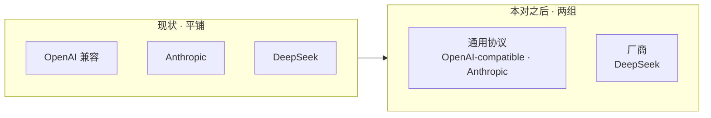

# 设置页「提供商」下拉分组（协议 / 厂商） —— 设计

**Status:** ✅ **已定稿（2026-09-22；随带修复两批 2026-09-23 并入）** —— **待拍清零：D1 甲 / D2 甲 / D5 甲+乙 / D6 用户给定词 / D7 甲 / D8 甲（**已在开工前落地 2026-09-22**）/ D9 甲 / D10 乙 / D11 甲**；**按指令暂不开工**。本对两件事：**① 分组** —— 把**添加模型弹窗**的「提供商」下拉分成两组（**协议组 / 厂商组**），并把 `deepseek` 从"协议那列"挪进厂商组；**② 随带修复两批**（2026-09-23）：**第一批三处**（§1.4 / D5–D7 —— 视图切换不再抖、两处占位文案、三项提供商文案规范化）、**第二批三处**（§1.5 / D9–D11 —— 两个"+"、形状①文案、请求头占位词）。除这些**明示**的文案与布局改动外，**行为零变化**（还是那 3 个 provider id，提交 payload 一字不差）。配套 plan：[2026-09-22-provider-grouping.md](../plans/2026-09-22-provider-grouping.md)（同批成对）。

**相关记录**：

- [2026-09-23-default-model-design.md](2026-09-23-default-model-design.md)（**同文件 ⇒ 串行，且本对先交付**：它加「默认模型」控件，落点也在 `models-settings-page.tsx` + locales 三文件 + `models-settings-page.dom.test.tsx`；它不改本对的任何契约，本对落地后它的引用行号再校准）
- [2026-09-22-reasoning-replay-default-design.md](2026-09-22-reasoning-replay-default-design.md)（**类层**：`openai-compatible` 那格*背后*的类是通用回放类；本对只动**前端呈现 / 文案 / 布局**，与它**零文件重叠** ⇒ 可并行）
- [2026-09-21-model-entry-field-parity-design.md](2026-09-21-model-entry-field-parity-design.md)（同表面、已交付；本对不改它补的任何字段）

## 1. 问题

### 1.0 一眼看懂

**现状**：添加弹窗的「提供商」是一个**平铺的 3 项列表** —— 把"协议级"（OpenAI 兼容）和"厂商级"（DeepSeek）混在同一列里，读起来像"三种协议"，而 DeepSeek 不是协议。

**本对之后**：同一个下拉**分成两组**，`deepseek` 挪进厂商组；三项的 `value` 与提交行为**一个字不改**。



```
改的（前端 6 处）                          不改的
──────────────                          ──────────────
① 分组表（1 个新文件）                   后端全部（provider id / 白名单 / 422 / 反查）
② 弹窗 JSX（Select 分两组 + 1 处占位）     编辑弹窗的**代码**（provider 只读；其文案随 D9–D11 变）
③ i18n 3 文件（3 新 key + 8 处改值）       `customProvider`（行标签）与三项 provider 的 id
④ 切换行 2 处（min-h-9 + 按钮 sm，D5）     `ui/select.tsx`（三件已导出，不用动）
⑤ 用例（node 表 + dom 结构/文案钉子）      能选/写出去的东西（payload 一字不差）
⑥ 真浏览器复核（观感，非门禁）
```

### 1.1 既存事实：DeepSeek 那格本来就不是"协议"

| 层 | 「DeepSeek」那一格的真相 | 出处 |
| --- | --- | --- |
| 线上协议 | OpenAI 形状（chat/completions） | `langchain_deepseek` 内部就是 OpenAI 客户端（`base_url` 从 `api_base` 映射） |
| **客户端类** | `PatchedChatDeepSeek` ← **`ChatDeepSeek`**（厂商原生类，**不是** `ChatOpenAI` 子类） | `models/patched_deepseek.py` |
| 端点键 | **`api_base`**（不是 `base_url`） | `config/models_config.py:45-49` 的 `PROVIDER_ALLOWLIST` 第三项 |

⇒ 这个下拉**从来不是"协议表"**，而是**客户端类白名单**的呈现（id → (类路径, 端点键)，`models_config.py:45-49`）。DeepSeek 出现在"协议那列"里，是**既存的呈现问题**，不是本对引入的 —— 本对只修呈现。

### 1.2 「自定义」这个词已被占用（不能拿来当组名）

`customProvider: "自定义"`（`locales/zh-CN.ts:1640` / `en-US.ts:1734`）**已经在用**：设置页列表**每一行的第二行小字**在"`use:` 反查不出 provider"时显示它（`models-settings-page.tsx:79-89` 的 `default:` 分支，渲染点在 `:196`）。

它的含义是"**这条的类我认不出来**"（未识别 / 兜底），而图里那种"自定义"组名的含义是"**你自己填端点的通用协议**"（正面 / 一种选项）。同名不同义 ⇒ 组名**避开**这个词（D2 的选项里已排除）。

### 1.3 本对明确不做（scope fence）

- **不动** `provider` id、后端、白名单、422 文案、反查；
- **不动**编辑弹窗（那里 provider 是只读的：`models-edit-dialog.tsx:129` 从条目取，没有选择器）；
- **不改**行标签 `customProvider` 的措辞（那是另一口子，另议）；
- **不做**"厂商项预填端点"（那是终态：要把向导那份 22 预设数据搬进界面；本对是它的**第一步/真子集**，见 §6）；
- **不引入**"更多"那种折叠分组（本对厂商组只有 1 项）。

### 1.4 随带修复 · 第一批（三处，2026-09-23 并入）

| # | 现状（原文） | 问题 | 出处 |
| --- | --- | --- | --- |
| ① 切换抖动 | 切换行 = `ToggleGroup size="sm"`（h-8 = 32）+ **仅 chat 视图渲染**的「添加模型」`Button`（default = h-9 = 36） | 这一行的高度由"有没有按钮"决定 ⇒ 每次切视图，下面全部内容上下跳 **4px** | `models-settings-page.tsx:139-169`（条件渲染在 `:163`）；`ui/button.tsx:25` / `ui/toggle-group.tsx`（`size="sm"`） |
| ② 两处占位 | API Key 框**无占位**；Model ID 占位 = 「例如 qwen3.8-max」/ `e.g. qwen3.8-max` | 前者空白读作"没设计"；后者**特指了一个模型**，可该框接受任意服务商的任意模型 id | `models-add-dialog.tsx:329-336`（无 `placeholder`）；`zh-CN.ts:1657` / `en-US.ts:1751` |
| ③ 提供商文案 | zh `providerOpenaiCompatible = "OpenAI 兼容"`（en 已是 `OpenAI-compatible`） | 三项里**只有它含中文**，且与配置文件里的 provider id 拼写不一致 | `zh-CN.ts:1637` / `en-US.ts:1731`；id 见 `backend/packages/harness/deerflow/config/models_config.py:45-49` |

**① 的实测（2026-09-23，真栈 :3000）**：切到功能模型 ⇒ 切换行 **34 → 30**、其下内容顶 **485 → 482**（隐藏窗口的退化布局把两值各缩 2px，**差 4px 一致**；宽度类数字不可信，已作废）。真实窗口下即 36 → 32。

**② 的 in-house 依据**：endpoint 框的占位用保留域名 `example.com`（不假装真值）；RAG 的密钥框（`functional-models-view.tsx:257-266`）**刻意不做格式占位**、改用框内来源徽章 —— 本页占位哲学 = 说明来源 / 明显是占位，**不假装真值、不特指**。

**③ 的连带**：`providerOpenaiCompatible` 同时喂**列表行小字**（`providerLabel`，`models-settings-page.tsx:79-89`）与**能力编辑器的 anthropic 形状标签**（`model-capability-editor.tsx:85`）⇒ 改一处、三处一起变（即"同一词汇一致化"）。

### 1.5 随带修复 · 第二批（三处，2026-09-23 并入）

| # | 现状（原文） | 问题 | 出处 |
| --- | --- | --- | --- |
| ④ 两个加号 | 文案自带 `+`：`addHeader: "+ 添加请求头"` / `addModelId: "+ 添加 Model ID"`（en `"+ Add header"` / `"+ Add Model ID"`），而按钮**同时**渲染 `PlusIcon` | 一个图标 + 文案各一个加号 ⇒ 显示成 `+ + 添加请求头` | `zh-CN.ts:1654/1658`、`en-US.ts:1748/1752`；`models-add-dialog.tsx:284/362`、`models-edit-dialog.tsx:258` |
| ⑤ 形状①文案 | `thinkingShapeGateway: "OpenAI 兼容网关"`（en `"OpenAI-compatible gateway"`） | 与 D8 同一个下拉，② 已改成"键 + 谁懂"的形式，① 还停在"读起来像选厂商" | `zh-CN.ts:1646`、`en-US.ts:1740`；形状①实际写 `extra_body.thinking`（`thinking-shape.ts:58-60`） |
| ⑥ 请求头占位 | `headerNamePlaceholder: "例如 x-opencode-session"`、`headerValuePlaceholder: "值"` | 前者**特指了某个网关的自定义头**（该框接受任意头名）；后者过简 | `zh-CN.ts:1652-1653`、`en-US.ts:1746-1747` |

**第二批的 in-house 依据**：⑤ 的判据 = D8 那条的推广（"描述的是一支**拼写**、不是厂商"）——`extra_body` **不是厂商**，是 **OpenAI 客户端自己的构造参数名**（语义 = 往 OpenAI 形状的请求体里塞非标字段），所以 OpenAI 的关联在 `extra_body` 这个词本身、`thinking` 才是非标那半；⑥ 的参照 = MiniMax 那套「`Header 名称` / `Header 值`」（他给的图）。

**用例面（2026-09-23 扫完）**：四个 key（`addHeader` / `addModelId` / `headerNamePlaceholder` / `headerValuePlaceholder`）的**全部消费点都走 `M.*` 常量**（`getByRole("button", { name: M.addHeader })`、`getByPlaceholderText(M.headerNamePlaceholder)` 等）⇒ 改值**零断言改动**；`thinkingShapeGateway` 在 `frontend/tests` **0 命中**（同 D8）；测试里出现的 `x-opencode-session` 是**数据**（`default_headers` 的值），不是占位文案。

## 2. 决定

### D1 —— 形态（**已裁：甲**，2026-09-22）

| 落法 | 形态 |
| --- | --- |
| **甲 · 组标题 + 分割线**（**已裁**） | 两段 + 两组之间一条 `SelectSeparator`（照参考图） |
| 乙 · 只用组标题 | 更轻；`SelectLabel` 自带小字样式，3 项时也够分 |

| 四件套 | 内容 |
| --- | --- |
| **在问什么** | 两组之间要不要那条**分割线**（还是只靠两个组标题区分） |
| **选项含义** | 甲 = 组标题 + `SelectSeparator`；乙 = 只有组标题 |
| **推荐理由** | 甲 —— 厂商组**将来会变长**（扩类：vLLM / MiniMax / MiMo…），长列表里分割线让分界更清楚；且与参考图一致 |
| **选错后果** | 可逆且代价极低（纯样式 + 一行组件）：乙 在 3 项时更安静；甲 多一条线、视觉稍重 |

### D2 —— 组名用词（**已裁：甲**，2026-09-22）

| 落法 | 协议组 | 厂商组 |
| --- | --- | --- |
| **甲 · 「通用协议」/「厂商」**（**已裁**） | **「通用协议」**（en：`Generic protocol`） | **「厂商」**（en：`Vendors`） |
| 乙 · 「自定义协议」/「厂商」 | 与行标签 `customProvider` 撞词（同页两义） | 「厂商」 |
| 丙 · 「协议」/「厂商」 | 太宽（Anthropic 也是厂商名） | 「厂商」 |

⚠️ 两个 en 对应词（`Generic protocol` / `Vendors`）是**我拟的译法、未单独拍** —— 若要换词，开工前说一声即可（只影响 `en-US.ts` 一行）。

| 四件套 | 内容 |
| --- | --- |
| **在问什么** | 两个组标题各写什么 |
| **选项含义** | 三案只有协议组那半不同；厂商组三案都是「厂商」 |
| **推荐理由** | 甲 —— ① 避开已占用的「自定义」（§1.2）；② 「协议」太宽（Anthropic 本身也是厂商名，用「通用协议」正好表达"说 OpenAI 协议的任意服务"）；③ 「厂商」直白、与 `deepseek` 这类**厂商原生类**的自述一致 |
| **选错后果** | 乙 ⇒ 同一页出现两个「自定义」（一个组名、一个行标签），语义相反，用户会问"为什么这条是自定义、我明明选了自定义协议"；丙 ⇒ 读者会困惑"Anthropic 为什么在协议组"（其实对，但要多想一步） |

### D3 —— 归组规则（本对只 3 项；登记将来的算法）

- 本对：**硬编码两行表**（协议组 2 项 / 厂商组 1 项）。
- 登记：**扩类**（把 `VllmChatModel` / `PatchedChatMiniMax` / `PatchedChatMiMo` 等加进白名单）时，新 id **默认进厂商组**；验收 2 的穷尽性用例会**强制**改表（新 id 不落表 ⇒ 用例红）⇒ 不会静默漏进默认组。

### D4 —— 不动的契约（钉住）

| 面 | 状态 |
| --- | --- |
| `ProviderId`（`core/models/types.ts:29`） | **不动**（还是那 3 个） |
| 下拉三项的 `value` | **不动**（`openai-compatible` / `anthropic` / `deepseek`） |
| 提交 payload（`ManagedModelInput.provider`） | **不动** —— 分组只是 DOM 结构 |
| 后端（白名单 / 422 / 反查 / 端点键） | **不动** |
| 编辑弹窗（provider 只读） | **不动** |
| 行标签（`providerLabel` / `customProvider`） | **不动** |
| `ui/select.tsx` | **不动**（`SelectGroup` / `SelectLabel` / `SelectSeparator` 已导出：`:182` / `:184` / `:187`） |

### D5 —— 切换行不留抖动（**已裁：甲+乙**，2026-09-23）

| 落法 | 做法 | 状态 |
| --- | --- | --- |
| **甲** | 切换行加 `min-h-9`：行高**自持**，不再由"有没有按钮"决定 | **已裁（两条都做）** |
| **乙** | 「添加模型」按钮 `size="sm"`（36→32）：与左侧 ToggleGroup 同高 | **已裁（两条都做）** |

两条**都做**，理由不同（不是各治一半）：**乙**把同排两控件拉齐（今天 36 / 32 本来就不齐），并让两视图的"自然高度"相等；**甲**让行高归行所有 —— 保住 chat 视图今天的 36px 间距不变，且以后这一行再有条件元素进出也不会再抖。⚠️ 只做乙也**能**消抖（两视图都会变成 32），代价是 chat 视图今天的样子整体上移 4px。真几何归真浏览器（§4 验收 11）。

### D6 —— 两处占位文案（**已裁：用户给定词**，2026-09-23）

| 位置 | 原文 | 改成（zh） | en（我拟，待点头） |
| --- | --- | --- | --- |
| API Key（`apiKeyPlaceholder`，**新增 key**） | （无） | **「请输入API Key」** | `Enter API key` |
| Model ID（`modelIdPlaceholder`） | 「例如 qwen3.8-max」 | **「请输入模型ID名称」** | `Enter the model ID` |

- 两处都是**「请输入…」式**（本页首次），不再用「例如 + 具体值」句式 —— 具体值要么特指一个模型（②），要么假装一个形状（`sk-...` 对智谱等非 sk- 前缀的服务商是误导）。
- ⚠️ en 是我拟的译法、**未单独拍**（同 D2 的处理）：要换词，开工前说一声即可（只影响 `en-US.ts` 两行）。
- 编辑弹窗的 key 框预填遮罩哨兵值 ⇒ 占位**永远不可见**，本对只动添加弹窗。

### D7 —— 三项提供商文案（**已裁：甲**，2026-09-23）

| key | 原文（zh） | 改成（zh = en） |
| --- | --- | --- |
| `providerOpenaiCompatible` | 「OpenAI 兼容」 | **`OpenAI-compatible`** |
| `providerAnthropic` | 「Anthropic」 | 不动 |
| `providerDeepseek` | 「DeepSeek」 | 不动 |
| `customProvider`（行标签） | 「自定义」 | **不动**（措辞另议，§6.2） |

- 理由：与 en 同值；与配置文件里的 provider id `openai-compatible` **同拼写**（"正规" = 可对照）。
- **改的是文案，不是契约**：D4 的"三项 `value` 不动"仍然成立（`value` = id，不是标签）。
- 连带见 §1.4 ③：列表行小字与能力编辑器的 anthropic 形状标签一起变成新词 —— 这正是"统一"，不是副作用。
- ⚠️ 本 D **作废了旧验收 6 的"三项 `provider*` 原文一字不动"**（已在 §4 改写）。

### D8 —— 形状② 文案改名（**已裁：甲 · 已在开工前落地**，2026-09-22）

| key | 原文 | 改成 |
| --- | --- | --- |
| `thinkingShapeVllm`（zh） | 「vLLM / SGLang」 | **`chat_template_kwargs（vLLM / SGLang）`** |
| `thinkingShapeVllm`（en） | `vLLM / SGLang` | **`chat_template_kwargs (vLLM / SGLang)`**（半角括号 + 空格） |

- **为什么**：那一项描述的**不是厂商**，是"**这一支拼写**"（`extra_body.chat_template_kwargs.enable_thinking`）；旧名读起来像"选厂商"。**别家对照**：pi 血统的 `thinkingFormat` 把同一支叫 **`qwen-chat-template`**（同一件事、按模板血统命名）⇒ 改名后自述拼写。
- ⚠️ **与 D7 的区分**：D7 改 `providerOpenaiCompatible`（提供商三项 + 其连带），**D8 改 `thinkingShapeVllm`** —— **不同的 key、同一批文件**（`locales/{zh-CN,en-US}.ts`）⇒ 两处改值要对得上、别互相覆盖。
- ✅ **已落地（2026-09-22，本对开工前）**：`locales/zh-CN.ts:1647` / `locales/en-US.ts:1741` 各 1 行（`types.ts` 只声明类型、无值 ⇒ 不动）；**零断言改动**（`grep thinkingShapeVllm frontend/tests` **0 命中**）；门禁 `pnpm check` 净、前端全量 **242 文件 / 2604 例 / 0 失败**（与基线同数）。
- **旧文案逐字引用处（4 处，已列全）**：① field-parity 的 **plan**（验收 2 那句"（选 vLLM / SGLang）"）**已同步并注明旧名** ② field-parity 的 **spec** §3.4 界面 mock **已同步** ③ 同一 spec 的形状表 / 其余框图（**形状代号，未改**；表下补了"界面文案改名"注）④ `thinking-shape.ts:8` 头注释 + `thinking-shape.test.ts:27/:50` 用例名（**散文，未改**）。
- ⇒ **本对开工时不必再做**；验收 12 只做"值仍是新文案"的核对（防被改回或覆盖）。

### D9 —— 两个"+"（**已裁：甲**，2026-09-23）

| key | 原文 | 改成 |
| --- | --- | --- |
| `addHeader` | 「`+ 添加请求头`」/ `+ Add header` | **「添加请求头」/ `Add header`** |
| `addModelId` | 「`+ 添加 Model ID`」/ `+ Add Model ID` | **「添加 Model ID」/ `Add Model ID`** |

- 保留 `PlusIcon`（图标式，与「添加模型」按钮同款：图标 + 无"+"文字）⇒ 修完按钮只出现**一个**加号。
- 这是**缺陷修复**（不是措辞偏好）：两个弹窗的同一处按钮都中招（编辑弹窗共用 `addHeader`）。

### D10 —— 形状①文案（**已裁：乙**，2026-09-23）

| key | 原文 | 改成 |
| --- | --- | --- |
| `thinkingShapeGateway`（zh） | 「OpenAI 兼容网关」 | **`extra_body.thinking（OpenAI 兼容）`** |
| `thinkingShapeGateway`（en） | `OpenAI-compatible gateway` | **`extra_body.thinking (OpenAI-compatible)`** |

- 判据 = D8 那条的推广：**键路径 + 谁懂它**（② 是 `chat_template_kwargs（vLLM / SGLang）`）。三项于是成一套：`不设置` / `extra_body.thinking（OpenAI 兼容）` / `chat_template_kwargs（vLLM / SGLang）`。
- 名词解释（本次定名时他质疑过）：`extra_body` **不是厂商**，是 **OpenAI 客户端的构造参数名**（语义 = 往 OpenAI 形状的请求体里塞非标字段）——OpenAI 的关联在 `extra_body` 里，`thinking` 才是那半非标字段。括注语言照 D7 的口径（zh 括注中文、en 括注英文；D7 管的是提供商**选项值**，这里是描述性括注）。
- ⚠️ **本 D 作废了验收 12 里"`thinkingShapeGateway` 不动"**（已改写）；`thinkingShapeNone` / `thinkingShapeAnthropic` / `thinkingShapeVllm` 仍不动。
- **旧文案逐字引用处（登记，未同步）**：`2026-09-21-model-entry-field-parity-design.md` 的形状表 `:253`、界面 mock `:307`、写出表 `:413/:416`、验收 15 `:465`；其 plan `:138/:165/:168/:247`。**那两份现在带着别线的未提交改动 ⇒ 本对不碰**，开工时（或由那一线）一并同步。
- **不属引用（已核，别再追）**：`parity plan :209` 只是**键名清单**（"i18n 各 +5 key"那串，键名不变）；`parity spec :245`（"OpenAI 兼容网关的约定"）与 `2026-09-10-web-model-provider-config-design.md:32`（"为 OpenAI 兼容网关填 base_url"）是**散文**，说的不是这个界面标签 ⇒ 与改名无关。

### D11 —— 请求头两处占位词（**已裁：甲（照 MiniMax）**，2026-09-23）

| key | 原文 | 改成 |
| --- | --- | --- |
| `headerNamePlaceholder` | 「例如 x-opencode-session」/ `e.g. x-opencode-session` | **「Header 名称」/ `Header name`** |
| `headerValuePlaceholder` | 「值」/ `Value` | **「Header 值」/ `Header value`** |

- 判据：与 D6 的"不特指"同一条 —— 该框接受**任意**头名（`x-opencode-session` 只是某个网关的例子）；参照 = MiniMax 的「`Header 名称` / `Header 值`」。
- **行标签 `defaultHeaders`（「请求头」）不动** —— 这一栏本来就全是用户自己加的，"自定义"三字多余；动它反而要连带界面 mock 与文档引用。

## 3. 接口契约（前端）

### 3.1 新的分组表文件

`frontend/src/core/models/provider-groups.ts`（**新增**，与 `thinking-shape.ts` 同族的"表即契约"写法）：

```ts
export interface ProviderGroup {
  readonly labelKey: "providerGroupGeneric" | "providerGroupVendor";
  readonly ids: readonly ProviderId[];
}
export const PROVIDER_GROUPS: readonly ProviderGroup[] = [
  { labelKey: "providerGroupGeneric", ids: ["openai-compatible", "anthropic"] },
  { labelKey: "providerGroupVendor", ids: ["deepseek"] },
];
```

- 弹窗**按这张表渲染**（不平行硬编码），用例也钉这张表 ⇒ 表与渲染不会分叉。
- `labelKey` 收窄成字面量联合 ⇒ i18n 里**缺 key 时 tsc 当场红**。
- **每项的文案 key 也进这张表**（2026-09-23 起草时补的缺口）：`PROVIDER_LABEL_KEYS: Record<ProviderId, "providerOpenaiCompatible" | "providerAnthropic" | "providerDeepseek">` —— 弹窗渲染 `{M[PROVIDER_LABEL_KEYS[id]]}`，不再平行硬编码三行 `M.provider*`；新增 `ProviderId` 时 `Record` 缺项 ⇒ **tsc 立刻红**（比验收 2 的穷尽性用例更早拦住）。

### 3.2 i18n（**3 文件联动**）

| 文件 | 加什么 |
| --- | --- |
| `locales/types.ts`（`:1655` 一带） | **三个** key 的**类型声明**（`providerGroupGeneric` / `providerGroupVendor` / `apiKeyPlaceholder`；缺它会 tsc 红） |
| `locales/zh-CN.ts`（`:1636` 一带） | 新文案：`providerGroupGeneric` = 「通用协议」、`providerGroupVendor` = 「厂商」、`apiKeyPlaceholder` = 「请输入API Key」；**改值**：`providerOpenaiCompatible` → `OpenAI-compatible`（D7）、`modelIdPlaceholder` → 「请输入模型ID名称」（D6） |
| `locales/en-US.ts`（`:1731` 一带） | 新文案：`Generic protocol` / `Vendors` / `Enter API key`；**改值**：`modelIdPlaceholder` → `Enter the model ID`（`providerOpenaiCompatible` 已是目标拼写、不动） |

### 3.3 JSX 结构（Radix 约束）

- 位置：添加弹窗的「提供商」`Select`（`models-add-dialog.tsx:219-233`，`aria-label={M.provider}` 在 `:223`，`SelectContent` 在 `:226-232`）。
- 形状：`SelectContent` 下按表渲染 `SelectGroup`（内含 `SelectLabel` + 若干 `SelectItem`）；**两组之间放一条 `SelectSeparator`**（D1 甲）。
- ⚠️ Radix 约束：`SelectGroup` 的**直接子节点**必须是 `SelectLabel` / `SelectItem`（不要包 `div`），否则键盘导航与 `data-slot` 断言都会歪。
- **仓内先例**：`artifact-file-detail.tsx:415-421` 已经用 `<SelectGroup>` 包 `SelectItem`（无 `SelectLabel`）⇒ 包装层的用法有例可照；本对是仓内**第一次**用 `SelectLabel` / `SelectSeparator`。
- 数据来源：`PROVIDER_GROUPS.map(...)`，组内再 `group.ids.map(...)` 渲染 `SelectItem value={id}` + `{M[...]}`。

### 3.4 读路径（行标签）不变

`providerLabel()`（`models-settings-page.tsx:79-89`）与列表渲染（`:196`）的**代码一行不动** —— 本对只改"选"的下拉，不改"看"的那行小字的结构（它**显示的词**会随 D7 变，那是同一词汇的一致化）。

### 3.5 切换行（结构，D5）

- 位置：`models-settings-page.tsx:139-169` 的 `div.mb-4.flex.items-center.justify-between`（视图切换 `ToggleGroup` + 条件渲染的「添加模型」`Button`）。
- 改：该行加 **`min-h-9`**；按钮加 **`size="sm"`**。两个视图下这一行都是 36px，且行内两控件同为 32px。
- **不加**占位元素、**不改**按钮的可见性逻辑（`view === "chat" && !adminRequired && !error` 原样保留）。

## 4. 验收

1. **分组表**：`PROVIDER_GROUPS` = 两组、顺序 = 协议组在前、成员如 §3.1（**node** 用例钉）；`PROVIDER_LABEL_KEYS` 覆盖三个 id（`Record` ⇒ 缺项 tsc 红）。
2. **穷尽性**：`ProviderId` 的三个值每个**恰好出现一次**（新增 id 未落表 ⇒ 用例红 ⇒ 强制按 D3 归组）。
3. **渲染**：下拉里**两个组标题都在**（文案 = 「通用协议」/「厂商」）；且两组之间有一条 `SelectSeparator`（**dom** 用例驱动候选钉、结构用 `data-slot` 读）。
4. **归属**：协议组含 `openai-compatible` / `anthropic`；厂商组含 `deepseek`（**dom** 用例驱动候选、读 `[role=option]` 顺序与组标题位置）。
5. **提交不变**：走完添加流程，payload 的 `provider` 仍是原 id（现有 dom 流程 + `addOneModel` helper 钉）。
6. **文案契约**：`customProvider` 的**原文一字不动**（行标签措辞另议，§6.2）；三项 `provider*` = **D7 新值**（`OpenAI-compatible` / `Anthropic` / `DeepSeek`，zh 与 en 同值）—— 用例断言原文。
7. **门禁**：`pnpm check` 净（含 tsc：i18n 三文件缺一即红）；前端全量 0 失败。
8. **观感（真浏览器，非门禁）**：真渲染下组标题/分割线可见、三项可选（文案已按 D7 更新）、顺序如表；**两个视图来回切一次，下方内容不再位移** —— 几何与观感归真浏览器，**用例只钉结构**。
9. **后端零改动**：`git diff` 不含 `backend/`（本对纯前端）。
10. **两处占位（D6）**：添加弹窗的 API Key 框 = 「请输入API Key」、Model ID 框 = 「请输入模型ID名称」（dom 用例 `getByPlaceholderText` 钉；en 镜像）。
11. **切换行不留抖动（D5）**：结构 —— 切换行有 `min-h-9`、「添加模型」按钮 `size="sm"`（dom 用例钉，先例 = 同文件那条"按钮与切换器同一父元素"）；几何 —— 真浏览器下两视图的**行高与内容顶坐标一致**（改动前实测 = 34 / 30、485 / 482）。

12. **形状② 文案（D8，已在开工前落地）**：`M.thinkingShapeVllm` = `chat_template_kwargs（vLLM / SGLang）`（zh）/ `chat_template_kwargs (vLLM / SGLang)`（en）—— **开工时只核对、不改**；`thinkingShapeNone` / `thinkingShapeAnthropic` 与 `customProvider` **不动**（防被改回）。⚠️ **本条原写"`thinkingShapeGateway` 不动"已随 D10 作废**（它现在改）。
13. **两个加号（D9）**：`M.addHeader` / `M.addModelId` 的**文案里不含 `+`**，且按钮仍有图标（结构断言：按钮 `textContent` 无 `+`、内部有 `svg`）—— 两个弹窗各一条。
14. **形状①文案（D10）**：`M.thinkingShapeGateway` = `extra_body.thinking（OpenAI 兼容）`（zh）/ `extra_body.thinking (OpenAI-compatible)`（en）—— 用例断言原文（D8 的 12 照旧只核对）。
15. **请求头占位（D11）**：两个框 = 「Header 名称」/「Header 值」（dom `getByPlaceholderText`，两个弹窗各一条；en 镜像）。

## 5. 影响面

| 文件 | 性质 |
| --- | --- |
| `core/models/provider-groups.ts` | **新增**：分组表 |
| `components/workspace/settings/models-add-dialog.tsx` | 「提供商」Select 改为按表渲染两组（+1 行 import）+ API Key 框加占位（D6） |
| `components/workspace/settings/models-settings-page.tsx` | 切换行 `min-h-9` + 按钮 `size="sm"`（D5，两处） |
| `locales/types.ts` / `locales/zh-CN.ts` / `locales/en-US.ts` | 各 **+3 个 key**（2 组名 + 1 占位）+ **7 处改值**（D6 1 / D7 1 / D9 2 / D10 1 / D11 2）+ **D8 的 1 处已提前落地**（共 8 处，含 D8） |
| `tests/unit/models/provider-groups.test.ts` | **新增**：表 + 穷尽性（node） |
| `tests/unit/components/workspace/settings/models-add-dialog.dom.test.tsx` | +3~4 条（提交回归 / 分组结构：组标题 + 分割线 + 归属 / 文案钉子 / 占位钉子） |
| `tests/unit/settings/models-settings-page.dom.test.tsx` | +1~2 条（切换行 `min-h-9` / 按钮 `sm`，D5） |
| `tests/unit/components/workspace/settings/models-edit-dialog.dom.test.tsx` | +2~3 条（D9 的加号 / D11 的占位 —— **编辑腿**） |

**不动**：后端全部 · `routers/models.py` · `ProviderId` · 编辑弹窗的**代码**（provider 只读；它显示的 `addHeader` / `header*Placeholder` / `thinkingShape*` **文案**随 D9–D11 变）· `providerLabel`/`customProvider` 的**代码**（其显示的 `provider*` 值随 D7 变）· 「添加模型」按钮的可见性逻辑 · endpoint 占位（`example.com` 原样）· 行标签 `defaultHeaders`（D11 明确不动）· `ui/select.tsx` · `thinking-shape.ts` 的**代码**（形状下拉与本下拉是**两个**控件，互不影响；其**文案**：`thinkingShapeVllm` 由 **D8**（已提前落地）、`thinkingShapeGateway` 由 **D10** 改）。

**净行为影响**：

| 谁 | 变化 |
| --- | --- |
| 添加模型的人 | 下拉里多两个组标题 + 一条分割线；三项文案按 D7 规范化；两个输入框有了占位（D6）；能选的东西、写出去的东西**完全一样** |
| 看「思考开关写法」的人 | 形状② → **`chat_template_kwargs（vLLM / SGLang）`**（D8，**已提前落地**）；形状① → **`extra_body.thinking（OpenAI 兼容）`**（D10）—— 三项成"同一把尺子"（值与行为不变） |
| 点「添加请求头 / 添加 Model ID」的人 | 按钮只出现**一个**加号（D9；图标保留） |
| 填自定义请求头的人 | 两个框的占位 = 「Header 名称」/「Header 值」（D11；不再特指某个网关的头） |
| 看模型列表的人 | 每行小字里的「OpenAI 兼容」→「OpenAI-compatible」（D7 连带，含能力编辑器的 anthropic 形状标签） |
| 在两个视图之间切换的人 | 不再有 4px 上下位移（D5）；这一行的高度归行所有 |
| 已有条目 / 编辑 / 保存 / 反查 | **零变化** |
| 扩类那条线 | 新 id 落表时被验收 2 强制归组（D3） |

## 6. 已知缺口

1. **厂商项"预填端点"不在本对** —— 那是终态（厂商组不只是分组，还要把**端点 / 默认模型**预填好，用户只填 key），需要把向导那份预设数据（`scripts/wizard/providers.py`）搬成界面数据 ⇒ 另立一对；**本对是它的第一步**（分组是前置）。
2. **行标签「自定义」的措辞未动** —— 它今天的语义是"未识别"。要不要改成「未识别」/「非内置类」，另议（会动 3 文件既有文案）。
3. **不引入「更多」折叠组** —— 参考图里有「更多」分组（厂商多到要折叠）；本对厂商组只有 1 项，不提前做。
4. **编辑弹窗不分组** —— 因为那里 provider 只读、根本没有下拉（已核 `models-edit-dialog.tsx:129`）；若将来编辑弹窗允许改 provider，本表可直接复用。

**相关记录**：[2026-09-23-default-model-design.md](2026-09-23-default-model-design.md)（同文件 ⇒ 串行、本对先交付）· [2026-09-22-reasoning-replay-default-design.md](2026-09-22-reasoning-replay-default-design.md)（类层）· [2026-09-21-model-entry-field-parity-design.md](2026-09-21-model-entry-field-parity-design.md)（字段层、已交付）