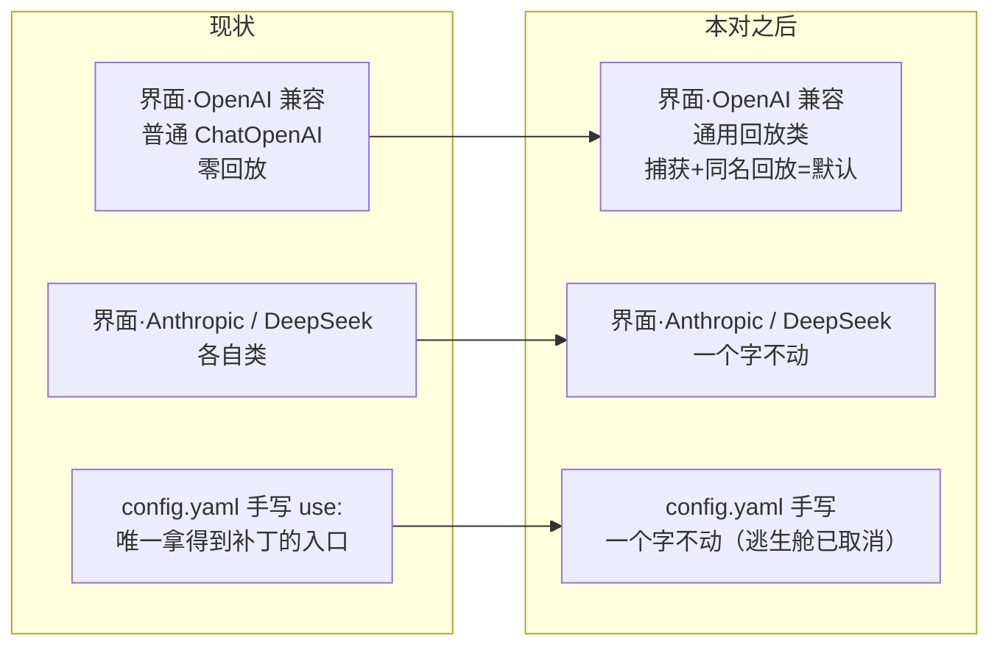

# 界面「OpenAI 兼容」格的默认推理回放 —— 设计

**Status:** 📝 **已定稿（2026-09-22）** —— 未开工；**待拍清零：D5 乙（2026-09-22 三补改判）/ D6 甲 / D8① 甲（且 D8 进本对）**。本 spec 把「捕获 + 回放」做成界面 `openai-compatible` 那格的**默认**行为：**一个通用类 + allowlist 一行**（界面零新增控件）。配套 plan：`../plans/2026-09-22-reasoning-replay-default.md`（同批成对）。**2026-09-22 补证**：§6 缺口 1–5 各加「别家对照」一行；六家 compat 表证据在 [MODEL_PATCH_PLACEMENT_RESEARCH.md](../../MODEL_PATCH_PLACEMENT_RESEARCH.md) 附录。**二补**：pi 通用路径的双名规则（附录 B.6）立为 D8 —— 期次与规则均已裁（进本对、甲）。**三补（2026-09-22，operator 判定）**：**D5 由甲改判乙** —— 通用类只对**界面写入 / 载入归一**的条目生效，**向导一个字不动**（范围收窄；代价与两条替代路径见 D5 节）。**四补（2026-09-22）**：开工前审查 8 条 —— **①–⑤⑦⑧ 已就地改**（引用与口径修正，改动见各处）；**⑥ 已裁：甲** —— 逃生舱**不加界面控件**，兜底留在 `config.yaml`（"兜底在 operator 文件、界面用户够不着"如实登记进缺口 6）。**五补（2026-09-22，operator 判定）**：**逃生舱 `off` 整体取消** —— 外部查证：**「回带被拒」0 条一手实证**（DeepSeek 官方两页无此句、StepFun 官方 API 参考无此句），而「不带回 ⇒ 400」有实证（MiMo 官方公告逐字「必须完整保留 `reasoning_content` 字段」／DeepSeek `must be passed back to the API`）⇒ **类字段 / `ModelConfig` 声明 / 工厂 guard（Task 3）/ 验收 4·6·15 一并取消**，键从未发布 ⇒ 无存量、不需兼容网；真撞上按 D4 / §3.2 原样恢复。全部**留档不删**。

> **2026-09-22 方向记录**：本对**取代**早先的「下拉加 vLLM 一格（扩类）」方向 —— 当日晚间确认改为「通用回放类 + 默认」，vLLM 那格降为可选、不在本对。证据与盘点见 [MODEL_PATCH_PLACEMENT_RESEARCH.md](../../MODEL_PATCH_PLACEMENT_RESEARCH.md)（六家产品：适配在通用路径 + 逐模型数据、自定义 / BYOK 是点名主场景）与 [MODEL_PATCH_INVENTORY.md](../../MODEL_PATCH_INVENTORY.md)（7 个补丁逐条盘点、合并判定 A–D）。

**Parent:**

- [2026-09-10-web-model-provider-config-design.md](2026-09-10-web-model-provider-config-design.md)（界面模型管理与 `PROVIDER_ALLOWLIST` 的出处）
- [2026-09-21-model-entry-field-parity-design.md](2026-09-21-model-entry-field-parity-design.md)（同表面、在飞；本对**不动**它的字段集，唯一接触点是 `backend/AGENTS.md` 同文件 ⇒ 串行落笔）
- 盘点：[MODEL_PATCH_INVENTORY.md](../../MODEL_PATCH_INVENTORY.md) §3（合并判定）/ §4（四个待定点）

## 1. 问题

### 1.0 一眼看懂

**现状**：界面「OpenAI 兼容」那格背后是**普通 `langchain_openai:ChatOpenAI`** —— 厂商补丁一个都拿不到；想要回放只能 `config.yaml` 手写 `use:`。

**本对**：把那格背后换成**一个通用回放类**（捕获非标推理字段 → 下一轮同名带回）。界面零新增控件、provider id 不变、前端零改动。



```
改的（3 处代码；原 ④ 已取消）            不改的
──────────────                          ──────────────
① 通用类（1 个新文件）                   前端全部（provider id 不变）
② allowlist 一行（默认开关）             routers/models.py
③ 存量条目载入归一 + 反查别名            vlm_target / caption 方言
④ 工厂一行 guard（已取消 2026-09-22）    7 个厂商补丁类一个字不动
                                        merge_ui_models / 字段集（在飞那对）
```

### 1.1 「默认」的唯一开关是 allowlist 那一行

三个界面侧入口都落到同一个 allowlist（`backend/packages/harness/deerflow/config/models_config.py:45-49`）：PUT 落盘（`routers/models.py:654`）、**界面添加弹窗的探针校验**（`:505`，即 `validate_models_config`；⚠️ 不是 `scripts/wizard` 那个向导）、反查（`models_config.py:66-68`，`/api/models` 的 `provider` 与 RAG caption 方言都读它）。**换一行 = 换「默认」**；provider id（`openai-compatible` / `anthropic` / `deepseek`）不变 ⇒ 前端、router 描述（`routers/models.py:183`）、422 文案（`:656-657` 运行时拼）全都不用动。

三个写入口 × 现写下的 `use:`：

| 写入口 | 落盘位置 | 现状写什么 | 本对之后 |
| --- | --- | --- | --- |
| 界面 | `models_config.json` | `langchain_openai:ChatOpenAI` | **通用类**（D2） |
| 向导 | `config.yaml` | 8 个预设写普通类（`scripts/wizard/providers.py:182/199/359/378/401/424/441/537`） | **不动**（D5 乙 ⇒ 向导产物与手写同桶；要回放可手改 `use:` 或在界面建同名条目覆盖） |
| 手写 | `config.yaml` | 用户自己写 | 不变（操作者域；新旧类都可用） |

### 1.2 通用类覆盖谁（逐补丁，来自盘点 §3）

| 补丁（厂商） | 通用类覆盖的部分 | 不覆盖、留原处 |
| --- | --- | --- |
| `PatchedChatMiMo`（小米） | 全部：捕获 `reasoning_content` + 同名回放 | — |
| `PatchedChatStepFun`（阶跃） | 捕获（`reasoning_content` / `reasoning` 两个名字都试）+ 同名回放 | 原有「归一成 `reasoning_content`」不复制（缺口 1；专用类原样） |
| `VllmChatModel`（vLLM） | 捕获（原名存原值 + 文本落展示键）+ 回放 `reasoning` | 请求侧 `chat_template_kwargs` 归一、累计 usage（缺口 5） |
| `PatchedChatMiniMax`（MiniMax） | 展示：`reasoning_details` 列表 → 文本 | 请求侧两件（强制 `reasoning_split`、剥 user `name`）、内联标签剥离（缺口 3/4） |
| `PatchedChatOpenAI`（Gemini 经网关） | tool-call 级 `thought_signature` 回放（**已并入本对** —— D7 把 `_restore_tool_call_signatures` 提升到共享助手） | — |
| `PatchedChatDeepSeek`（DeepSeek） | 同轴（`reasoning_content` 回放）；DeepSeek 自己的格不动 | — |
| `MindIEChatModel`（MindIE） | **不覆盖** —— 另一根轴（XML 工具调用 / 流降级） | 整类留特例 |

⚠️ 覆盖的粒度是**方言 / 行为，不是厂商**：通用类不认「你是哪家」，只做「见过这个字段就同名带回」（auto）⇒ 未来任何端点只要说这套方言就自动生效。这正是六家产品的形态（通用路径 + 逐模型数据），也是本仓做不到「逐模型数据」时的最接近形态。

### 1.3 现场核对（2026-09-22）

本机 `models_config.json` **5 条**：4 条是 `openai-compatible` 且写的是**普通类**（`deepseek-flash` / `ZHIPU/GLM-5.3-Flash` / `deepseek-v4.1-flash` / `qwen3.6-flash`），1 条 `anthropic`（`minimax-m3`）。
本机 `config.yaml` **3 条**：`qwen3.8-flash`（普通类）/ `qwen3.7-flash`（普通类）/ `deepseek-v4-flash`（`PatchedChatDeepSeek`）⇒ **手写域不动**，前两条保持原类。

⇒ 归一（D3）的真实样本 = 那 4 条；它们今天**没有任何回放**（思考内容只被普通类丢弃）。

⚠️ 本节是会漂的快照（两份文件都可能被手改）⇒ 只当「当时状态」用。

## 2. 决定

### D1 —— 通用类行为三件：容忍读 + 同名回放 + 展示键固定

| # | 件 | 规则 |
| --- | --- | --- |
| 1 | **容忍读（捕获）** | 在**流式 delta** 与**非流式整包**两条路上，按字段名表 `("reasoning_content", "reasoning")` 逐个探测（dict / Pydantic 属性 / `model_extra` 三处找，沿 `patched_mimo.py:25` / `patched_stepfun.py:28` 的形状）；**原名存原值**，空串也保留（与非 None 判定一致）。另读 `reasoning_details`（列表）→ 文本，**只用于展示、永不回放**（MiniMax 变体，`patched_minimax.py:31`） |
| 2 | **展示键固定** | 无论方言，文本一律落 `additional_kwargs["reasoning_content"]`（DeerFlow 已理解的形状 —— 前端就是读它，`frontend/src/core/messages/utils.ts:591-595`）；wire 名不是它时**两键并存**（原名原值 + `reasoning_content` 文本），与 `VllmChatModel` 现状同形（`vllm_provider.py:120` / `:262`） |
| 3 | **同名回放**（唯一行为；~~标称 `auto`~~ 随逃生舱取消） | `_get_request_payload` 里**回放"见过的名字"**：回放名 = **捕获时记录的实际用过的名字**（D8 甲；逐 chunk「首个非空」，不另造名）；**展示别名（派生副本）永不外发**；没见过的字段什么都不发 ⇒ 对无推理端点**逐字节等价**于普通类。⚠️ **`off` 的范围**：走 early return（§3.1）⇒ **同时关闭 tool-call 签名回放**（D7 那件）—— 这是"出站与普通类逐字节相同"（验收 4 / 15）的必然含义；要"只关思考回放、保留签名" ⇒ **不能用 `off`**：让该条目在 `config.yaml` 手写 `patched_openai:PatchedChatOpenAI`（Gemini 网关用户本来就该这么配）——**随 `off` 取消，本条作废（2026-09-22）** |

**两个钩子的形状：全部「包一层 super()」**（MiMo / StepFun 模式），不重写 chunk 转换：

- `_convert_chunk_to_generation_chunk`：先 `super()`，再读 `chunk["choices"][0]["delta"]` 补写 `additional_kwargs`（累积靠 LangChain 的 chunk 合并语义，与既有两个类一致）；
- `_create_chat_result`：先 `super()`，再按 choice 读 message 侧字段补写。

⚠️ **MiniMax / vLLM 那套自写转换里的"帧修正"不需要搬**（盘点 §4.3 的待定点，已核 langchain-openai **1.2.1** 源码）：

| 当时列为待判的帧处理 | 判定 | 依据 |
| --- | --- | --- |
| 跳过 `content.delta` 帧 | **基类已有，不自写** | `base.py:1327`（`if chunk.get("type") == "content.delta": return None`） |
| `chunk.chunk.choices` 嵌套兜底 | **基类已有，不自写** | `base.py:1333` |
| `model_provider="openai"` 标记 | 不并入（观感元数据，MiniMax 专用） | `patched_minimax.py:196` |
| `output_version=="v1"` 空帧形状 | 不并入（自写转换的副产物；通用类走基类行为） | `patched_minimax.py:156-158` |

### D2 —— 默认开关 = allowlist 一行

```python
PROVIDER_ALLOWLIST: dict[str, tuple[str, str]] = {
    "openai-compatible": ("deerflow.models.reasoning_replay:ReasoningReplayChatOpenAI", "base_url"),
    "anthropic": ("langchain_anthropic:ChatAnthropic", "base_url"),
    "deepseek": ("deerflow.models.patched_deepseek:PatchedChatDeepSeek", "api_base"),
}
```

- **provider id 不变** ⇒ 前端三格、`ManagedModelInput`、422 文案、`/api/models` 的 `provider` 全不动；
- **`use_responses_api: true` 的条目不受影响**（已核）：responses 模式下 payload 走 `_construct_responses_api_payload`（无 `messages` 键，`base.py:1696-1702`）⇒ 回放取 `payload.get("messages", [])` 得空表、else 分支零匹配 = **零改动**；且该模式下 `_create_chat_result` / `_convert_chunk_to_generation_chunk` **根本不被调用**（结果是 `_construct_lc_result_from_responses_api`，`base.py:1643` / `:1911`；流式走 `_stream_responses` → `_convert_responses_chunk_to_generation_chunk`，`base.py:1393` / `:4778`）。

### D3 —— 存量 UI 条目：载入时归一（甲）+ 反查别名

| 落法 | 做什么 | 代价 |
| --- | --- | --- |
| **甲 · 载入归一**（选定） | `ModelsConfig.from_file`（`models_config.py:136-161`）把 `use == "langchain_openai:ChatOpenAI"` 的条目**在内存里改成通用类**（每载入一条 `logger.info` 一次）；盘上文件等下一次 PUT 自然被重写 | 存量条目**升级即生效**（含那 4 条本机样本）——这是"默认"的含义；代价是行为变化是自动的（由 auto 语义 + ~~逃生舱兜底~~ **逃生舱已取消 2026-09-22**） |
| 乙 · 只换 allowlist | 旧条目保持普通类，等下一次界面保存时才升级 | 旧条目**一直拿不到回放**；且 GET 反查落空 ⇒ 列表把它们显示成「自定义」（`models-settings-page.tsx:79-89` 的 default 分支） |

⇒ **选甲**：乙会让「默认」对已有条目永远不生效，且引入一个可见的显示回归。

**反查别名（甲、乙都保留）**：`reverse_lookup_provider`（`models_config.py:66-68`）对旧路径仍返回 `openai-compatible`：

```python
#: The class this cell used before the default swap. Kept so a hand-written entry
#: (config.yaml, or a models_config.json edited by hand) still reports its provider
#: to /api/models and keeps the caption dialect it always had.
_LEGACY_USE_TO_PROVIDER = {"langchain_openai:ChatOpenAI": "openai-compatible"}
```

⇒ `config.yaml` 手写的两条普通类条目**仍显示「OpenAI 兼容」**（不是「自定义」）；RAG caption 方言判定不变（`vlm_target.py:37-38`：旧路径与新路径都落 `openai`）。

### D4 —— ~~逃生舱 `reasoning_replay: auto|off`~~ **已取消（2026-09-22：不做逃生舱）**

> ⛔ **已取消（2026-09-22，operator 判定）**：查证结论 = 「**回带被拒**」**0 条一手实证**（DeepSeek 官方 reasoning / 多轮两页均无此句；StepFun 官方 API 参考只有 `reasoning_format` 与响应字段说明）；而反方向「**不带回 ⇒ 400**」有实证（MiMo 官方公告：工具调用后必须完整保留 `reasoning_content`；DeepSeek：`The "reasoning_content" in the thinking mode must be passed back to the API`）—— 那条由 `auto` 覆盖。⇒ **逃生舱与其三件配套**（类字段 / `ModelConfig` 声明 / 工厂 guard **§3.2**）**一并取消**；验收 4 / 6 / 15 随之作废。**真撞上"回带被拒"时按本节与 §3.2 原样恢复**（键从未发布 ⇒ 无存量、不需要兼容网）。**下方原文留档**。

- **语义**：`auto` = 捕获 + 回放；`off` = 捕获仍做（展示不变）、**回放不做** ⇒ 出站请求与普通类**逐字节相同**。要"连捕获都不要"用旧类（`config.yaml` 手写），不另造第三档。⚠️ **`off` 只作用于出站**：捕获仍在 ⇒ 界面上、以及 IM 通道 / 导出的正文里**仍能看到思考内容**（预期别错位：`off` 不是"把思考藏起来"）。**（本条整条随 `off` 取消 —— 2026-09-22，留档）**
- **落点**：通用类声明为 Pydantic 字段（`VllmChatModel.cumulative_stream_usage` 同款，`vllm_provider.py:185`）；`ModelConfig` 也加一条声明（`config/model_config.py`，`extra="allow"` 下不声明也能流过去，但声明才有加载期校验与文档）。（**本条随逃生舱取消 —— 2026-09-22**）
- **工厂 guard**：`reasoning_replay` 落到**不声明它的类**（`ChatAnthropic` / `ChatDeepSeek` 等）时，进 `model_kwargs` 会在请求期炸 ⇒ 工厂在构造前 pop + 一条 warning（新函数，紧挨 `_apply_stream_chunk_timeout_default` 的调用点 `factory.py:379-380`，与 `_warn_unknown_model_settings`（`:431`）的"先处理再警告"同一姿势）。⚠️ **频率**：`create_chat_model` 每轮 run 都会构造一次 ⇒ 同一进程里这条 warning 会重复出现；"同类只警告一次"（模块级 seen 集）是实现自由度、非必须。（**本条随逃生舱取消 —— 2026-09-22**）

### D5 —— 向导 8 个预设（**已裁：乙**，2026-09-22 三补改判）

| 落法 | 范围 | 说明 |
| --- | --- | --- |
| 甲 · 一并换 | `scripts/wizard/providers.py` 8 处（openai / openai_responses / novita / minimax / minimax_cn / openrouter / orcarouter / other） | 「默认」对**所有一方写入路径**统一；类是行为超集 + auto 语义 ⇒ 无推理端点零差异；`other`（任意网关）正是 BYOK 主场景 |
| **乙 · 只在界面**（已裁） | 向导不动 | 本对只对**界面写入 / 载入归一**的条目生效（新建的 + 存量 UI 条目都自动带上）；代价 = 向导建的 OpenAI 兼容条目**没有回放** |

**改判理由（operator 判定，2026-09-22 三补）**：本对的承诺是"**界面**那格默认带回放"；向导是**另一条写入路径**（装机期、`config.yaml` 属 operator 域）⇒ 把 `use=` 一并换会把范围从"界面默认"扩到"装机默认"，面太大。**收窄后 `scripts/wizard/providers.py` 与 `backend/tests/test_setup_wizard.py` 都不进本对**（原甲方案的核实点见 plan Task 0 第 5 项，已随之取消、留档）。

**乙下想要回放的替代路径**（两条都是既有机制，本对不加代码）：

1. **手改 `config.yaml`** 那条的 `use:` → `deerflow.models.reasoning_replay:ReasoningReplayChatOpenAI`（operator 域，本来就是逃生舱）；
2. **在界面建一条同名条目** —— `merge_ui_models` 里 UI 赢且**整条替换** ⇒ 会盖住 `config.yaml` 那条，而界面条目按 D2/D3 自动是通用类；⚠️ 注意是**整条替换**：界面那册要填全（模型 id / 端点 / key / 能力位 …），不是只改一个字段。

### D6 —— 类名与模块（**已裁：甲**，改名成本 = 一行 allowlist + 文档）

| 落法 | `use:` 串 |
| --- | --- |
| **甲 · 行为命名**（推荐） | `deerflow.models.reasoning_replay:ReasoningReplayChatOpenAI` —— 自述"回放"，与 `vllm_provider` / `mindie_provider` 的「模块 = 机制」一致 |
| 乙 · 位置命名 | `deerflow.models.openai_compatible:OpenAICompatibleChatModel` —— 与 provider id 同名；但"OpenAI 兼容"容易被读成"就是普通 ChatOpenAI" |

**已裁（2026-09-22）：甲 —— `deerflow.models.reasoning_replay:ReasoningReplayChatOpenAI`。**

### D7 —— 并入与不并入（其余项一次定完）

**并入**：Gemini tool-call 级 `thought_signature` 回放（盘点 §3 D 当初标为"可选位"，**2026-09-22 已裁并入本对**）—— 把 `patched_openai.py:85-123` 的 `_restore_tool_call_signatures` **提升到共享助手** `assistant_payload_replay.py`（`PatchedChatOpenAI` 改为 import，行为零变化），通用类在同一次匹配里多跑一个 tool-call 级 restore。auto 语义下天然安全（只有真收到过签名才写）。

**不并入**（留专用类 / 已裁不加）：

| 项 | 为什么 |
| --- | --- |
| `MindIEChatModel` 整类 | 另一根轴（引擎兼容），与推理字段无关 |
| MiniMax 请求侧两件（强制 `reasoning_split`、剥 user `name`） | 请求侧方言，属 `PatchedChatMiniMax` |
| vLLM `chat_template_kwargs` 归一、累计 usage 换算 | 同上（请求侧 / 账务） |
| 内联 ` thinking` 标签剥离 | **前端已在做**（`frontend/src/core/messages/utils.ts:487-531` 的 `splitInlineReasoning`，含流式安全与反引号守卫）；后端再剥只影响非流式且会改写正文 ⇒ v1 不做（缺口 3） |
| `CodexChatModel` / `ClaudeChatModel` | 订阅凭据通道，装不进"端点 + 密钥"的格子（已裁不加） |
| `ChatOllama` / `ChatGoogleGenerativeAI` | 已裁不加（Ollama 走 `/v1` 已兼容；Google 原生自述 no thinking） |
| vLLM 的简版匹配统一到共享助手 | 顺带项，不在本对（盘点 §5） |

### D8 —— 回放名规则（**已裁：甲 · 进本对**，2026-09-22 二补）

D1 第 3 件里「回哪个名 / 双名同现怎么办」这一半，从"未实测的未知"升级为**有双先例可抄**：

| 落法 | 规则 | 出处 |
| --- | --- | --- |
| **现写法**（D1 第 3 件） | 有 `reasoning` 回 `reasoning`（展示别名不外发） | 本 spec |
| **甲 · 按用过的名字回放**（推荐） | 捕获时记录**实际命中过**的字段名（逐 chunk「首个非空」），回放按记录的名字；派生别名与 wire 真收要分开记 | pi 通用读取：名字表 `("reasoning_content", "reasoning", "reasoning_text")`、注释逐字 "Use the first non-empty reasoning field to avoid duplication (e.g., chutes.ai returns both reasoning_content and reasoning with same content)"、记录 `thinkingSignature`（`openai-completions.ts:316-337`）→ 同名回放（`:862-868`）；WorkBuddy 同语义（§1.1） |
| **乙 · 一律归一回 `reasoning_content`** | 回放名固定为 `reasoning_content`（StepFun 专用类现状） | `patched_stepfun.py`；pi 有按 provider 的一行改名先例（`opencode-go`，`:335-336`） |

**已裁（2026-09-22）**：期次 = **进本对**（原话「能放入通用类的…一起入本期」）；规则 = **甲**（按捕获时记录的实际用过的名字回放；派生别名与 wire 真收靠**捕获时记来源**分开 —— 实现细节，落地即此）。⇒ 相应验收：双名同现时**回放名 = 捕获时记录的名字**（且「展示别名不外发」不变）；D1 第 3 件与 §3.1 的回放规则按此收窄。

## 3. 接口契约

### 3.1 通用类（草案，`deerflow/models/reasoning_replay.py`）

```python
_WIRE_REASONING_FIELDS: tuple[str, ...] = ("reasoning_content", "reasoning")
"""Wire field names captured and echoed back same-name. The display text always
lands in `additional_kwargs["reasoning_content"]` — two keys coexist when the
wire name differs (the shape `VllmChatModel` already produces)."""

class ReasoningReplayChatOpenAI(ChatOpenAI):
    # ⚠️ 已取消（2026-09-22）：本字段随"不做逃生舱"一并取消，留档备查（见 D4）。
    reasoning_replay: Literal["auto", "off"] = Field(
        default="auto",
        description="'auto' captures non-standard reasoning fields and echoes them back "
                    "same-name on later turns; 'off' keeps capture (display) but sends "
                    "requests byte-for-byte like langchain_openai:ChatOpenAI.",
    )

    # 1) replay ------------------------------------------------------------
    def _get_request_payload(self, input_, *, stop=None, **kwargs) -> dict:
        original_messages = self._convert_input(input_).to_messages()
        payload = super()._get_request_payload(input_, stop=stop, **kwargs)
        # ⚠️ 已取消（2026-09-22）：逃生舱不做 ⇒ 回放无条件执行；下面两行留档（见 D4）。
        if self.reasoning_replay == "off":
            return payload          # early return ⇒ tool-call 签名回放也一并关掉（"逐字节"的必然含义，见 D1 第 3 件）
        restore_assistant_payloads(payload.get("messages", []), original_messages,
                                   _restore_assistant_fields)   # 见 D7：推理字段 + tool-call 签名
        return payload

    # 2) streaming capture --------------------------------------------------
    def _convert_chunk_to_generation_chunk(self, chunk, default_chunk_class, base_generation_info):
        generation_chunk = super()._convert_chunk_to_generation_chunk(...)
        # None → None；choices 空 → 原样返回；delta 里有字段才 model_copy 补 additional_kwargs
        ...

    # 3) non-streaming capture ---------------------------------------------
    def _create_chat_result(self, response, generation_info=None):
        result = super()._create_chat_result(response, generation_info)
        # 逐 choice：dict / Pydantic / model_extra 三处找；reasoning_details → 文本（展示）
        ...
```

**回放规则（同名，D1 第 3 件 + D8 甲）**：

```python
#: 捕获时把「实际用过的 wire 名」记在消息上（派生别名与 wire 真收靠它分开）
_WIRE_FIELD_KEY = "_wire_reasoning_field"

def _restore_assistant_fields(payload_msg, orig_msg):
    wire_name = orig_msg.additional_kwargs.get(_WIRE_FIELD_KEY)   # 逐 chunk「首个非空」的决议
    if wire_name in _WIRE_REASONING_FIELDS:
        value = orig_msg.additional_kwargs.get(wire_name)
        if value is not None:
            payload_msg[wire_name] = value            # 按用过的名字同名回放
    restore_tool_call_signatures(payload_msg, orig_msg)   # D7：tool-call 级签名（已并入本对）
```

- **不覆写** `is_lc_serializable` / `lc_secrets`（继承 `ChatOpenAI` 的声明；库存的不一致不在本对清理）。
- 三个钩子对普通聊天路径之外的形态（responses、content-array 输出）**天然零改动**（D2 的两条已核事实 + 单元用例钉住）。

### 3.2 ~~工厂 guard（`models/factory.py`）~~ **已取消（2026-09-22：不做逃生舱）**

> ⛔ **已取消**：`reasoning_replay` 键本身不存在了 ⇒ **没有键需要 guard**（见 D4 四补）；工厂 `factory.py` 回到**零改动**。**下方代码与插入点留档**，真撞上"回带被拒"时原样恢复。

```python
def _normalize_reasoning_replay(model_class: type, model_name: str, model_settings_from_config: dict) -> None:
    """Drop `reasoning_replay` for clients that do not declare it.

    An undeclared constructor kwarg is moved into `model_kwargs` and rejected by the
    provider SDK at request time; the key is only meaningful for the default
    OpenAI-compatible client, so anything else gets it dropped here with a warning
    rather than a request-time failure.
    """
```

调用点：`:379-380`（两个 normalizer 之后、`_warn_unknown_model_settings`（`:431`）之前，避免同一条键被警告两次）。

### 3.3 `models_config.py` 变更

三处：allowlist 换行（D2）· `_LEGACY_USE_TO_PROVIDER` 别名（D3）· `from_file` 载入归一（D3）；模块 docstring 里「provider id → 类路径」那句跟着改。

⚠️ **不动**：`resolve_provider_use` / `endpoint_key_for` 的签名与行为、`merge_ui_models`（`config.yaml` 的条目不经归一）、`ModelsConfig.resolve_config_path` 与原子写。

## 4. 验收

**后端（单元）**（~~4~~ / ~~6~~ 已取消 —— 2026-09-22；编号不重排）

1. **捕获两条路**：流式 delta 与非流式 message，`reasoning_content` 与 `reasoning` 各被捕获（原名存原值；文本落 `additional_kwargs["reasoning_content"]`；空串保留）。
2. **同名回放（D8 甲）**：wire=`reasoning_content` ⇒ 出站 payload 是 `reasoning_content`；wire=`reasoning` ⇒ 是 `reasoning`，且**不多出** `reasoning_content`（展示别名不外发）；**双名同现**（同 chunk 两名都非空）⇒ 回放名 = 捕获记录的名字（首个非空）。
3. **没见过的字段不发**：端点没回推理字段 ⇒ 出站 payload 与普通 `ChatOpenAI` **逐字节相同**（对照组用例）。
4. ~~**`off` 生效**：`reasoning_replay="off"` ⇒ 出站与普通类逐字节相同；而捕获仍在（ak 里仍有 `reasoning_content`）。~~ **已取消（2026-09-22：不做逃生舱）**
5. **responses 腿零改动**：`use_responses_api=True` 的 payload（无 `messages`）过 `_get_request_payload` 后**逐字节不变**；且该模式下 `_create_chat_result` / `_convert_chunk_to_generation_chunk` **不被调用**（桩钉住）。
6. ~~**工厂 guard**：`reasoning_replay` 落到不声明它的类 ⇒ 构造 kwargs 里被 pop + 一条 warning；落到通用类 ⇒ 原样进构造参数。~~ **已取消（2026-09-22：不做逃生舱）**
7. **allowlist 断言**：`resolve_provider_use("openai-compatible")` == 新类；`reverse_lookup_provider(新类)` == `"openai-compatible"`；**旧路径反查仍 == `"openai-compatible"`**（别名）。更新 `test_models_config.py:221-230` / `:250-260`。
8. **载入归一**：含普通类的 `models_config.json` 经 `ModelsConfig.from_file` ⇒ `use` 变新类；**未知类不动**；`config.yaml` 的条目不经此路（`merge_ui_models` 直通）。
9. **PUT 落盘**：界面建条 ⇒ 文件里 `use:` == 新类（更新 `test_models_config_api.py:194` 的既有断言）。
10. **`reasoning_details` 展示变体**：非流式响应里的列表 → `ak["reasoning_content"]` 文本（列表项以空行拼接），且**不被回放**。
11. **tool-call 级签名**：`thought_signature` 从 `ak["tool_calls"]` 回到 payload 的 tool-call 对象（沿用 `patched_openai` 既有用例，提升为共享助手后行为不变）。

**前端**：无改动（provider id 不变；`models-settings-page.tsx:42` / `models-edit-dialog.tsx:129` 的 `?? "openai-compatible"` 兜底照旧把"认不出的 use"往新类收敛）。

**真栈（隔离实例：三个 `DEER_FLOW_*` 指向仓外 scratch 根 + 本机 recorder，零出网、假 key、配置 md5 对照）**

12. 假端点回 `reasoning_content`（流式 + 非流式各一遍）⇒ 第二轮请求体里**同名字段原样出现**（recorder 抓两次请求比对）。
13. 假端点回 `reasoning` ⇒ 第二轮回放 `reasoning`、**无** `reasoning_content`。
14. **对照组**：假端点从不回推理字段 ⇒ 请求体与「普通类基线」逐字节相同。
15. ~~**`off` 组**：带 `reasoning_replay: off` 的条目 ⇒ 与基线逐字节相同。~~ **已取消（2026-09-22：不做逃生舱）**
16. **迁移与落盘**：预置一条普通类的旧 `models_config.json` 条目 ⇒ 载入后 GET `provider` 仍 `openai-compatible`（**归一后的新类命中 allowlist**；"别名"只兜手写旧类那一格）、行为已切到通用类（recorder 可见捕获/回放）；新条目 PUT 后文件里是新类。
17. **两格回归**：`anthropic` / `deepseek` 条目请求体不变。

**门禁**

18. `ruff check` + `ruff format --check` 干净；窄面（`test_models_config.py` + `test_models_config_api.py` + 新 `test_reasoning_replay.py`）绿；全量对 HEAD 双向 diff 为空。（~~`test_model_factory.py`~~ **随 Task 3 取消一并出列** —— 工厂回到零改动。）

## 5. 影响面

**改动**（源文件 4 个 —— 含 1 个新文件 + 测试 3 + 文档 2；向导与逃生舱**均不在内**）：

| 文件 | 性质 |
| --- | --- |
| `models/reasoning_replay.py` | **新增**：通用类 + 三个钩子 + 展示/回放规则 |
| `models/assistant_payload_replay.py` | `_restore_tool_call_signatures` 提升进来（D7） |
| `config/models_config.py` | allowlist 换行 + 别名 + 载入归一 + docstring |
| ~~`config/model_config.py`~~ | ~~+1 声明字段 `reasoning_replay`~~ **已取消（2026-09-22：不做逃生舱）** |
| ~~`models/factory.py`~~ | ~~+1 guard 函数 + 1 行调用~~ **已取消（同上）** |
| `models/patched_openai.py` | 改为 import 共享助手（行为零变化） |
| 测试 | `test_models_config.py` / `test_models_config_api.py` / 新 `test_reasoning_replay.py` / ~~`test_model_factory.py`~~（随 Task 3 取消出列） |
| 文档 | `backend/AGENTS.md`（模型工厂 / 适配器段 + allowlist 段）、`backend/docs/CONFIGURATION.md`（OpenAI 兼容段：新类为界面默认、旧类保留） |

**不动**：前端全部 · `routers/models.py` · `vlm_target.py`（新路径 → `openai-compatible` → 不在 `_DIALECT_BY_PROVIDER`（`:34`）→ `openai`，已核）· 7 个厂商补丁类 · `merge_ui_models` · `thinking-shape.ts` 的 D3 口径（"`openai-compatible` 推不出形状"仍成立）· field-parity 那对的字段集。

**净行为影响**（"这改了什么"）：

| 谁 | 变化 |
| --- | --- |
| 界面 `openai-compatible` 条目（含 4 条本机存量） | 端点在响应里发出推理字段时：多一次捕获（展示受益）+ 下一轮同名回放；**没发出 ⇒ 逐字节不变** |
| 界面 `anthropic` / `deepseek` 条目 | 不变（~~`reasoning_replay` 落到它们会被 guard pop + warning~~ —— 逃生舱与 guard 已取消 2026-09-22，该键不存在） |
| `config.yaml` 手写条目（含**向导产物** —— D5 乙） | 不变（类由操作者写死；可换新类；~~用 `off`~~ **逃生舱已取消 2026-09-22**） |
| responses 腿（`use_responses_api: true`） | 不变（已核两条路径都不碰） |
| RAG extract / judge / caption | extract / judge 走工厂 ⇒ 同受益；caption 是裸 HTTP、只读 4 键 ⇒ 不变 |
| **删除 / 改名** | **无** —— 既有类一个都不删不改名，旧路径在反查里保留 |

## 6. 已知缺口

1. **StepFun 回放名未实测**：通用类同名回放（wire=`reasoning` 就回 `reasoning`），而专用类把两个名字都归一成 `reasoning_content`。界面条目今天本来零回放 ⇒ 不是回归；真撞 400 时旧类/归一策略再调（端点实测属开工后任务）。**别家对照**：表无「归一名」件 —— 差异按端点声明（`thinkingFormat` / `requiresReasoningContentOnAssistantMessages`）；pi 通用路径**按实际用过的名字回放**（改名也有 `opencode-go` 一行先例）—— 落法见 D8（进本对）。
2. **双名同时出现**（WorkBuddy 注释里 step-3.7-flash 那种 BYOK 情形）：v1 只回 `reasoning`（优先级规则），两个都回还是只回一个未验证。**别家对照**：**两家通用路径各有一条同语义规则** —— WorkBuddy 逐 chunk 优先 `reasoning_content`（研究档 §1.1）；pi 逐 chunk 取首个非空、**记录用过的名字同名回放**（`openai-completions.ts:316-337`，注释点名 chutes.ai）⇒ 收进本仓通用类的落法见 D8（进本对）。
3. **内联标签不进后端**：`content` 里的 ` thinking…` 标签 v1 不剥（前端展示层已处理，`utils.ts:487-531`）；IM 通道与导出的正文仍见原文。**别家对照**：pi-ai `requiresThinkingAsText` 管的是**回放时**转 `<thinking>` 文本块（反方向）；剥离侧仍靠读取路径的容忍。
4. **MiniMax 请求侧两件不并**：不强制 `reasoning_split` ⇒ 不保证拿得到 `reasoning_details`；拿不到时该端点在通用类上只有 content 侧（前端内联拆分兜底）。**别家对照**：compat 表内无 `reasoning_split`（两克隆 0 命中）；同族键 `requiresToolResultName` 针对 **tool** 结果的 name（非 user），`interleaved` 把「存哪个字段」做成数据 ⇒ 端点私有件留在专用类。
5. **vLLM 请求侧归一不并**：`thinking` → `enable_thinking` 的兼容归一仍只在 `VllmChatModel`（`vllm_provider.py:47`）；累计 usage 同理。**别家对照**：同一件在别家 = 三个表键（`chatTemplateKwargs` / `chatTemplateArgs` / `vllmPriority`；usage 账 = `supportsUsageInStreaming`）⇒ 二期数据化有现成参照。⚠️ **后果**：早期文档写法 `extra_body.chat_template_kwargs.thinking` 在通用类上**不再被归一**（归一函数只在 `VllmChatModel._get_request_payload` 里被调，`vllm_provider.py:230`）⇒ **原样外发、开关静默失效、不报错**；开工时若顺手并进（两行），本条降级为已并。
6. **界面条目没有任何"退出回放"的出口（逃生舱已整体取消 —— 2026-09-22 五补）**：`ManagedModelInput` 是 `extra="forbid"`（`routers/models.py:172-178`）⚠️ **本节机制分析为"逃生舱取消前"的口径（留档）** —— 键取消后，任何手写 `reasoning_replay` 都属**未知键**（行为回到 `_warn_unknown_model_settings` 的 warn + 请求期炸，见 D4 横幅）。⇒ 界面**写不进** `reasoning_replay`；**手改界面文件的两种写法寿命不同**：写 `reasoning_replay: off` ⇒ 活到**下一次界面保存**（field-parity D6「保存即抹」）；写**旧类** `langchain_openai:ChatOpenAI` ⇒ **载入即被归一变回新类**（D3 甲，一次都不生效）⇒ **界面条目没有任何半稳定出口**；`config.yaml` 的同名条目又会被界面条目盖掉（`merge_ui_models` UI 赢）⇒ **界面条目要彻底退出回放，只能迁到 `config.yaml` 手写旧类**（是迁移，不是开关）。**已裁（2026-09-22 四补 + 五补）：甲 —— 不加界面控件，且逃生舱（键 + 工厂 guard）整体取消**（判据见 D4：回带被拒 0 实证）。**出口的唯一形态 = 迁移**（删界面那条 + 在 `config.yaml` 建同名条目写旧类）。依据（六家对照，见 [MODEL_PATCH_PLACEMENT_RESEARCH.md](../../MODEL_PATCH_PLACEMENT_RESEARCH.md) §1.5 / 附录 B）：**没有一家**把"要不要回放"做成界面控件 —— 它们的默认来自**随包目录 / 指纹推导**，兜底只到**用户配置文件**（BYOK 的 compat 覆盖层，如 `requiresReasoningContentOnAssistantMessages`）；而 `auto`（"见过才回放"）不需要任何目录就成立 ⇒ 已经做到了"不用管"。**残留差异（如实登记）**：六家的兜底写在**用户层**；取消逃生舱后**连 operator 层的兜底也没有**（只剩"换旧类"这条迁移路）—— 真需要时按 D4 / §3.2 原样恢复。
7. **不在本对**：MindIE（另一轴）、Codex / Claude（装不进）、Ollama / Google 原生（已裁不加）。
8. **结构化（非字符串）原值在流式增量上的累积**沿用 LangChain 的 chunk 合并语义（与 `VllmChatModel` 现状一致）；若真撞上结构化增量，再登记。
9. **「扩类 vLLM 一格」降为可选**、不在本对（方向记录见文首）。

**相关记录**：[MODEL_PATCH_INVENTORY.md](../../MODEL_PATCH_INVENTORY.md)（7 补丁盘点与合并判定）· [MODEL_PATCH_PLACEMENT_RESEARCH.md](../../MODEL_PATCH_PLACEMENT_RESEARCH.md)（六家产品取证）。