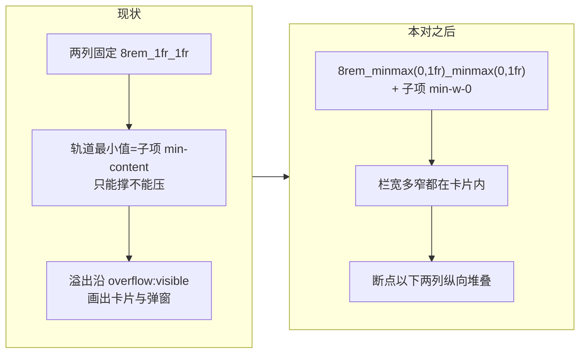

# 设置弹窗表单行响应式布局 + 知识库页随带修复 —— 设计

**Status:** 🟡 **草案（2026-09-24 立）—— spec+plan 已成对（plan：[2026-09-24-settings-responsive-layout.md](../plans/2026-09-24-settings-responsive-layout.md)，2026-09-25 立，未开工）** —— **待拍清零：D1 甲 / D2 甲（**阈值 `lg`=1024，2026-09-25 审查修订 md→lg**）/ D3 甲 / D4 甲（顶部行 `flex-wrap`）/ D5 乙（两处轻症只登记不修）**。**2026-09-25 并入随带修复五处（§7，落法已裁乙 = 进本对 plan）：7.2 甲 / 7.3 乙 / 7.4 照默认修（min(300px 级, 可用高)）/ 7.5 甲**；**7.5 附带裁定：重排文案（TEI 收窄）不进本对、已在他线**；仍待裁 = 7.1 的两个附加小点（plan 按默认做，见其 Status）。**2026-09-25 审查修正已落**：D2 前提与阈值重写、行号 3 处（`:583/:589/:617/:635/:663` 等）、§4 补 9–13、§5 补 §7 文件。本对三件事：**① 轨道可压缩**（`1fr` → `minmax(0,1fr)` + 网格子项 `min-w-0`）——治"输入框不随栏宽压缩、挤同行、越出卡片"；**② 窄屏两列堆叠**（D1 甲）——治"两列不换行、连带顶部切换栏被顶出"；**③ 顶部切换行兜底**（D4）——极窄下换行而非被压扁。除这些**明示**的布局类改动外，**零字段 / 零文案 / 零 API 变化**（宽屏信息结构"一行 label 管两列"不变）。

**相关记录**：

- [2026-09-23-default-model-design.md](2026-09-23-default-model-design.md)（**同文件** `models-settings-page.tsx` ⇒ 串行；开工时行号再校准）
- [2026-09-22-provider-grouping-design.md](2026-09-22-provider-grouping-design.md)（同表面、已交付；它动的是**添加弹窗**，本对动的是**功能模型面板**与弹窗壳，零契约重叠）

## 1. 问题

### 1.0 一眼看懂

**现状**：功能模型面板（检索：向量模型 / 重排模型 两列）在栏宽变窄时——输入框容器不压缩、反而把同行另一个挤扁；两列不换行、越出「检索」卡片与弹窗外框；同列顶部的「对话模型 / 功能模型」切换栏被连带顶出外框。对话模型面板（单列）一切正常。

**本对之后**：任意栏宽下内容不越出卡片（列轨道可压缩到 0）；窄到断点以下两列纵向堆叠、每个输入框满宽；顶部切换栏不再被子内容顶出。



```
改的（纯布局 + 少量 DOM）                      不改的
──────────────────────                    ──────────────
① ROW / ROW_PAIR 轨道写法（:160-161）        字段 / 提交 payload / API（零变化）
② 网格子项 wrapper 补 min-w-0（3 处）         宽屏信息结构（一行 label 管两列）
③ ROW_PAIR 窄屏堆叠（D1/D3）                文案（i18n 零改值；D3 若裁甲只复用现有词）
④ 顶部切换行 flex-wrap（D4）                 ui/ 生成件（select.tsx / input.tsx 不动）
⑤ 用例（dom 结构钉）+ 真浏览器手验几何        对话模型面板 / 高级设置单列区的形态
```

### 1.1 根因（四条，按权重）

| # | 根因 | 证据（file:line） |
| --- | --- | --- |
| ① | **轨道不可压缩**：任意值 `1fr` 等价 `minmax(auto,1fr)`，轨道最小值 = 子项 min-content；两列的 min-content 之和超过卡片宽就溢出，同行另一列被挤扁 | `functional-models-view.tsx:160-161`：`ROW = grid grid-cols-[8rem_1fr]`、`ROW_PAIR = grid grid-cols-[8rem_1fr_1fr]`（双值行在 `:583/:589/:617/:635/:663`，即表头 / 提供商 / Model ID / API Key / 接口地址） |
| ② | **网格子项 min-width:auto**：wrapper 不加 `min-w-0` 时，即便轨道改 `minmax(0,1fr)`，子项仍按 min-content 画出轨道 | SecretInput 外层 `div.relative`（`functional-models-view.tsx:270` 起、双值行用点 `:641/:653`）；稀疏地址 wrapper `<div className="relative">`（`:807`）；Select 调用点只 override `w-full`（`OptionSelect` `:128`），无 `min-w-0` |
| ③ | **SelectTrigger 整串不折行**（放大器）：`w-fit whitespace-nowrap` ⇒ 长选项文本（「通用重排 (Cohere / Jina / TEI 形状)」）的 min-content = 整串宽 | `ui/select.tsx:40`（**生成件、不动**；调用点 override 即可） |
| ④ | **两列无换行断点** + 溢出沿 `overflow:visible` 一路画出卡片/弹窗，同列顶部切换栏视觉上被顶出 | ROW_PAIR 无任何断点；顶部行 `models-settings-page.tsx:141` 无 `flex-wrap`（行内 ToggleGroupItem `shrink-0` 在 `toggle-group.tsx:72`）；弹窗壳 `settings-dialog.tsx:213/:223/:248/:249` |

**一处更正（对前一轮口径）**：弹窗分栏层**不**缺 `min-w-0` —— `settings-dialog.tsx:223` 的右栏轨道**已经**是 `md:grid-cols-[220px_minmax(0,1fr)]`。真正的溢出源是**面板自己的行网格**（①②），溢出只是"画过"弹窗各层，不需要修弹窗壳（除非验收实测仍外溢，见 §6）。

**对话模型面板正常的原因**：单列 `flex-col + w-full`（`models-settings-page.tsx:182` 一带），没有多列 min-content 拼接。

### 1.2 全仓同类扫描（任意值 / max-content 网格轨道，2026-09-24）

| 位置 | 界面 / 部件 | 内容 | 判定 |
| --- | --- | --- | --- |
| `functional-models-view.tsx:160-161` | 设置 → 模型 → **功能模型** → 检索等组 | **输入框**（Select / Input / SecretInput） | **本对主修点** |
| `account-settings-page.tsx:76` | 设置 → **账号** → 个人资料区块 | **只读文本对**（邮箱 / 角色 / SSO 提供商），`max-content_max-content` | 非输入框；极长 email 可溢出 ⇒ **D5 已裁乙（登记不修）** |
| `appearance-settings-page.tsx:173` | 设置 → **外观** → 主题预览卡内部 | **装饰骨架色块**（假 UI 预览），`1fr_240px` | 非输入框；外层 `:155` 已有 `overflow-hidden` ⇒ 自愈、无可见病症 ⇒ **D5 已裁乙（登记不修）** |
| `ui/alert.tsx:7` / `ui/card.tsx:23` | Alert / CardHeader 内部组合 | 生成件自带的 `0_1fr` / `1fr_auto` | 安全（首轨 0/auto），**不动** |

⇒ **除功能模型面板外，全仓没有第二个带输入框的同类隐患**；另两处都在设置弹窗内（账号 / 外观页）、都不含输入框。

### 1.3 scope fence（明确不做）

- **不动** `ui/` 生成件（`select.tsx` / `input.tsx` / `toggle-group.tsx`）——收缩能力全部在**调用点** override（`input.tsx` 自带 `min-w-0`，Select 侧补在调用点）；
- **不动**对话模型面板、高级设置单列区的**形态**（单列行只换轨道写法，视觉不变）；
- **不动**宽屏信息结构："一行 label 管两列、label 只写一次"（`AGENTS.md` 既有裁定）——**窄屏的 label 复用是 D1 已裁文本的一部分**，宽屏不受影响；
- **不动**字段 / 文案 / payload / API；不做横向滚动兜底（D1 乙已被否）。

## 2. 决定

### D1 —— 窄屏形态（**已裁：甲**，2026-09-24）

| 落法 | 形态 |
| --- | --- |
| **甲 · 断点堆叠**（**已裁**） | 断点以下每行变为「label + 向量值」和「label + 重排值」**上下两行**（label 复用同一文案，靠列首粗体角色标题区分） |
| 乙 · 整体横向滚动 | 不换行、卡片内 `overflow-x-auto` |
| 丙 · 拆成两张卡 | 向量 / 重排各成一卡（推翻宽屏信息结构，dom 用例大面积重写） |

（四件套已于 2026-09-24 会话给出并由他裁定甲；此处留档：选错后果 = 乙 变成"拖着看"、丙 动最大且推翻既有裁定。）

### D2 —— 断点判据（**已裁：甲**，2026-09-25；同日审查修订阈值 `md` → `lg`）

| 落法 | 做法 |
| --- | --- |
| **甲 · 视口断点**（**已裁**） | Tailwind **`max-lg:`（1024px）**。**阈值修订（2026-09-25 审查）**：原拟 `max-md:`（768px）依据"弹窗宽 ≈ 视口宽"——该前提**不成立**：`settings-dialog.tsx:214` = `sm:max-w-5xl md:max-w-6xl` ⇒ 弹窗宽 = `min(视口−2rem, 1152px)`、功能模型面板（右栏）宽 = `min(视口−316, 868)px`；`md` 阈值下 768–1084 视口带两列值格各只 138–296px 却不堆叠。改 `lg` 后：堆叠区（视口 <1024）覆盖右栏 <708px 的全部情形，两列区的值格恒 ≥266px |
| 乙 · 容器查询 | `[container-type:inline-size]` + `@container`（仓内先例：`SidebarInset` 的 pet 规则）——按右栏实际宽触发、最准，但多一层容器标注 |

| 四件套 | 内容 |
| --- | --- |
| **在问什么** | "窄屏堆叠"以什么为判据、阈值定在哪 |
| **选项含义** | 甲 = 视口宽度断点（`lg`=1024）；乙 = 右栏宽度断点（容器查询） |
| **推荐理由** | 甲（修订后）—— `lg` 阈值与右栏宽实算对齐（值格 ≥266px 才出两列），一行类名即达；仓内容器查询只用过一次 |
| **选错后果** | 甲 在 1024 阈值两侧各有"早一步/晚一步堆叠"的过渡带（嫌不准就调阈值一行）；乙 最准但结构多一层标注，且显隐类要换 variant 语法 |

### D3 —— 堆叠落法细则（**已裁：甲**，2026-09-25）

D1 甲的文本定了"两行、label 复用、靠列首粗体角色标题区分"；落到 DOM 还差一个细则——**窄屏下"列首角色标题"如何随列走**：

| 落法 | 做法 |
| --- | --- |
| **甲 · 行首角色短名**（**已裁**） | 每条堆叠行以**粗体角色短名**（「向量模型」/「重排模型」，即宽屏列首的粗体角色标题）开头，后接 label + 值；宽屏的表头行（`:583` RoleHeading×2）在窄屏**隐藏**（其职责下移）；muted 药丸（`Embedding` / `Rerank`）窄屏随表头一起收起 |
| 乙 · 只靠顺序 | 不加短名；上 = 向量、下 = 重排，靠固定顺序 + 宽屏表头的词汇记忆 |

| 四件套 | 内容 |
| --- | --- |
| **在问什么** | 堆叠后每行怎么区分"这是向量的还是重排的" |
| **选项含义** | 甲 = 行首粗体角色短名（复用列首现有词）+ 窄屏藏表头；乙 = 纯靠上下顺序 |
| **推荐理由** | 甲 —— 五行 × 2 条堆叠行只靠顺序极易读串（尤其 API Key 两行都是密文点）；且复用列首现有词汇、**零新文案**（符合"新控件复用页面已有词汇"的既有准则） |
| **选错后果** | 乙 省一行字但可读性差、用户要在同一页反复回看表头；甲 的代价是每行多一个短名、视觉略密（真浏览器验收时若嫌密可退乙） |

### D4 —— 顶部切换行兜底（**已裁：甲**，2026-09-25）

| 落法 | 做法 |
| --- | --- |
| **甲 · 加 `flex-wrap`**（**已裁**） | `models-settings-page.tsx:141` 的行加 `flex-wrap`——极窄下「添加模型」按钮换到第二行，不被压扁 |
| 乙 · 不加 | ①②修好后溢出已断，该行不再被顶出；但按钮与切换器在极窄下互相挤压 |

| 四件套 | 内容 |
| --- | --- |
| **在问什么** | 修完①②之后，顶部行要不要额外加换行兜底 |
| **选项含义** | 甲 = 元素装不下就换行；乙 = 维持单行、允许挤压 |
| **推荐理由** | 甲 —— 一行类名、零风险；该行有"行高自持"裁定（`min-h-9`，grouping D5），换行不破坏它 |
| **选错后果** | 甲 在极窄下按钮占两行（观感变化、可逆）；乙 在极窄下按钮被压窄/文字截断 |

### D5 —— 两处轻症（账号 / 外观）是否顺带修（**已裁：乙**，2026-09-24）

| 落法 | 做法 |
| --- | --- |
| 甲 · 一并同修 | 账号 `:76` 改 `minmax(max-content,1fr)` + 值格 `min-w-0`；外观 `:173` 改 `minmax(0,1fr)_240px`（各一行） |
| **乙 · 只登记不修**（**已裁**） | 外观那处已被 `overflow-hidden` 自愈、无可见病症；账号那处是纯文本对、风险极低——不动就没有回归面 |

| 四件套 | 内容 |
| --- | --- |
| **在问什么** | §1.2 那两处轻症要不要进本对 |
| **选项含义** | 甲 = 顺手改两行类名；乙 = 只在本 spec 登记 |
| **推荐理由** | 乙 —— 两处都**不含输入框**（他问的"其他输入框同类隐患"实际为零），修它们是纯美化、给本对平添回归面 |
| **选错后果** | 乙 留两条理论隐患（极长 email / 装饰块）；甲 改动极小但要多两条验收 |

## 3. 落点与结构（前端）

### 3.1 轨道与子项（根因①②，无争议部分）

| 落点 | 改什么 |
| --- | --- |
| `functional-models-view.tsx:160-161` | `ROW` → `grid grid-cols-[8rem_minmax(0,1fr)]`；`ROW_PAIR` → `grid grid-cols-[8rem_minmax(0,1fr)_minmax(0,1fr)]`（断点类随 D2/D3 加） |
| SecretInput 外层（`:270` 起的 `div.relative`） | 补 `min-w-0 w-full`（组件基类或调用点 className 皆可，择一） |
| 稀疏地址 wrapper（`:807` 的 `div.relative`） | 同上 |
| Select 调用点（`OptionSelect` `:128` 一带 + `:876/:903/:932/:1084` 裸 SelectTrigger） | `w-full` 之外补 `min-w-0`（长选项文本由既有 `line-clamp-1` 截断） |

### 3.2 窄屏堆叠（D1 甲 + D3）

- ROW_PAIR 行在断点以下退化为**两条「角色短名（D3 甲）+ label + 值」**；label 文案复用（每条一次）。实现形态由 plan 定（推荐：值格内嵌 `max-lg:` 可见的 label 副本 + 共享 RowLabel `max-lg:hidden`，或等价结构；断点 = D2 修订后的 `lg`=1024）；**宽屏 DOM 与视觉一字不变**。
- 表头行（`:583` RoleHeading×2）随 D3 甲：**窄屏隐藏**（职责下移行首短名；muted 药丸随表头一起收起）。
- `NESTED_GUTTER`（稀疏嵌套区，`:173`）跟随同一断点堆叠；单值行（`ROW`）窄屏 = label 在上、值在下。

### 3.3 顶部切换行（D4）

`models-settings-page.tsx:141` 行加 `flex-wrap`（D4 甲时）；**不改** `min-h-9` 与按钮可见性逻辑（grouping D5 裁定原样保留）。

## 4. 验收

1. **轨道（结构）**：ROW / ROW_PAIR 的 DOM 类含 `minmax(0,1fr)`（node/dom 断言钉；防被改回裸 `1fr`）。
2. **子项（结构）**：SecretInput 外层、稀疏地址 wrapper、Select 调用点均有 `min-w-0`。
3. **堆叠（结构）**：断点类存在；label 副本 / 共享 label 的显隐类成对（宽屏视觉不变由 8 钉）；行首角色短名（D3 甲）用**现有 i18n 词**（`M.*` 引用断言，零新 key）。
4. **提交零变化**：现有功能模型保存流程用例原样全绿（payload 一字不差）。
5. **切换行（D4 甲时）**：`models-settings-page.tsx:141` 行含 `flex-wrap`（结构钉）。
6. **门禁**：`pnpm check` 净；前端全量 0 失败。
7. **后端零改动**：`git diff` 不含 `backend/`。
8. **几何（真浏览器手验，非门禁）**：拖窄视口/窗口下——(a) 输入框随栏宽压缩、同行不被挤扁；(b) 「检索」卡与弹窗内无横向溢出；(c) 断点以下（视口 <1024）两列堆叠、每框满宽；(d) 顶部切换栏不出外框；(e) 来回拖动断点两侧，行高不抖。**用例只钉结构，几何只归真浏览器**（既有共识）。
9. **7.1 删箭头**：两组标题 button 内无 `ChevronDown`（结构断言）；折叠行为（`aria-expanded` 整行 button）原样 ⇒ 既有 `kb-list-panel.dom.test.tsx` 零改全绿。
10. **7.2 统计行**：两段结构（右段 `ml-auto`）+ **0 值不出现在 textContent** + 状态计数圆点 = 列表同款 `STATUS_DOT_CLASS` 类（dom 钉）。
11. **7.3 徽章**：tier 0 徽章在（原文断言 `回退阈值 -3%` 保留）/ tier 1 不渲染；`eval-trend-chart.utils.ts` **零 diff**（图内虚线不动）。
12. **7.4 下拉封顶**：历史下拉 ScrollArea 的 max-h 类含**固定封顶**（结构钉，不钉像素几何）。
13. **7.5 文案**：`providerOpenAIChat` zh = `OpenAI-compatible`（与 en 同值）；`providerGenericRerank` **一字未动**（防越界到他线）。

## 5. 影响面

| 文件 | 性质 |
| --- | --- |
| `components/workspace/settings/functional-models-view.tsx` | ROW/ROW_PAIR 轨道 + 断点堆叠 + 3 处 wrapper `min-w-0` + Select 调用点 override |
| `components/workspace/settings/models-settings-page.tsx` | 顶部行 `flex-wrap`（D4 甲时，1 行） |
| `tests/unit/components/workspace/settings/functional-models-view.dom.test.tsx`（既有文件，+2~3 条） | 轨道 / wrapper / 堆叠结构钉 |
| `tests/unit/settings/models-settings-page.dom.test.tsx`（既有，+0~1 条） | D4 甲时钉 `flex-wrap` |
| `components/workspace/knowledge/kb-list-panel.tsx` | §7.1：删两处 `ChevronDown`（`:108` / `:234`）+ 标题 `whitespace-nowrap`（待裁小点 b） |
| `components/workspace/knowledge/document-panel.tsx` | §7.2：统计行重写（`:1182-1190` 一带） |
| `components/workspace/knowledge/eval-tab.tsx` | §7.3：徽章按 tier 条件渲染（`:729-737`） |
| `components/workspace/knowledge/chat-panel.tsx` | §7.4：ScrollArea max-h 封顶（`:545-546`） |
| `core/i18n/locales/zh-CN.ts` | §7.5：`providerOpenAIChat` 改值（`:1704`，1 行） |
| `tests/unit/knowledge/{kb-list-panel,document-panel,eval-tab,chat-panel}.dom.test.tsx` | §7 各处结构钉（零几何） |

**不动**：后端全部 · i18n（D3 甲只复用现有词；若裁出新词另记）· 字段 / payload / API · `ui/` 生成件 · 对话模型面板 · 高级设置单列区的形态 · 宽屏"一行 label 管两列"信息结构 · `min-h-9` 与按钮可见性逻辑。

**净行为影响**：配置功能模型的人 —— 窄窗下从"挤扁 + 越界"变为"压缩 + 堆叠"；能填、能存的东西完全一样。

## 6. 已知缺口 / 开放点

1. **弹窗壳不做预防性改动**（§1.1 更正）——若验收 8(b) 实测仍外溢，再回到 `settings-dialog.tsx:249` 一层补 `min-w-0`（登记为逃生口，不是本对默认动作）。
2. **Select 长文本只截断、不折行**（`line-clamp-1` 是 `ui/select.tsx` 既有行为）——本对不改；若要"选项文本两行显示"另议。
3. **账号 / 外观两处轻症**：**D5 已裁乙**——只在 §1.2 登记，不进改动面；若将来要修，甲案（两行类名）留档可直接用。
4. **断点阈值**：`lg` = 1024px（D2 甲、2026-09-25 审查修订后拍定）——仍是可调旋钮，验收 8 若嫌换行太早/太晚，调阈值一行即可。
5. **7.3 裁乙的已知代价**：窄档隐藏阈值徽章后，阈值在窄栏**不可见**（图内红色虚线无数值标注，`eval-trend-chart.utils.ts:397-398` 的标签已退役）——已知信息降级、他拍板接受；若将来给虚线恢复数值标签，7.3 可改甲（收进 ⋯）而无需回炉。

## 7. 随带修复 · 五处（知识库页四处 + 功能模型提供商文案一处，2026-09-25 并入，落法**已裁：乙**=进本对 plan）

来源：他 2026-09-25 两批截图报的样式问题。知识库页四处与本对**零文件重叠**，提供商文案在 `functional-models-view.tsx` 同文件；按他的裁定全部并进本对 plan 一起做、一起过门禁（不另立一对）。**7.2/7.3/7.5 各带四件套留档**；**7.1 的删箭头、7.4 的修法默认值是他原话裁定**；7.1 的两个附加小点仍待裁。

### 7.1 列表组标题删 chevron（**已裁：删**，他 2026-09-25 原话）

- 现状：`kb-list-panel.tsx:97-114`（个人组）与 `:225-240`（共享组）折叠开关绑在**整行标题 button**（`aria-expanded` + `onClick`），`ChevronDown`（**`:108` / `:234`**）纯视觉；共享组同款。行内两图标 `shrink-0` + 文字无 `whitespace-nowrap` ⇒ 「个人知识库」被挤折行。
- 动作：删两处 `ChevronDown`（`:108` 个人 + `:234` 共享）；折叠功能零损失、既有用例**零红**（`kb-list-panel.dom.test.tsx:163-194` 断的 svg 由 UserRound/Users 图标提供、断的折叠是整行 button）。
- **待裁的两个附加小点**：(a) 共享组同步删（我默认一起删，保持两组同形）；(b) 标题文字补 `whitespace-nowrap`（防英文/长文案再折）。副作用登记：折叠态少了箭头朝向这层暗示（收起后唯一信号 = 列表消失）。

### 7.2 文档 tab 底部统计行（**已裁：甲**，2026-09-25）

| 落法 | 形态 |
| --- | --- |
| **甲 · 分段 + 零值隐藏**（**已裁**） | 左段「文档 n · 切片 n · 大小」；右段（`ml-auto`）状态计数用**列表同款圆点 + 词汇**（复用 `STATUS_DOT_CLASS` 与 `status.*`），**计数 0 不显示**；两段各自 `whitespace-nowrap`、外层 `flex flex-wrap` ⇒ 窄栏整段换行、段内不断 |
| 乙 · 只修换行 | 分段但 0 照显 |
| 丙 · 状态收进 hover | 底部只留体量段（信息降级） |

- 现状：`document-panel.tsx:1182-1190` 纯内联文本流、`·` 字面分隔、无 wrap 控制；状态计数与列表状态列是两套 i18n key（`stats*` vs `status.*`）。
- 甲 的连带：`statsReady/statsIndexing/statsFailed` 三个 key 的消费点改走 `status.*`（或保留 key 但视觉对齐状态列，落 plan 时定其一）；`document-panel.dom.test.tsx:601-619` 的 textContent 断言按新形态改。

### 7.3 趋势卡「回退阈值 -n%」徽章（**已裁：乙**，2026-09-25）

| 落法 | 形态 |
| --- | --- |
| 甲 · 窄档收进 ⋯ | 复用 `useToolbarTier` 的既有折叠路径（日/周/月已如此），宽档内联 |
| **乙 · 窄档隐藏**（**已裁**） | tier 1 时徽章不渲染；宽档照旧 |
| 丙 · 标题截断 | 表名被省略号吃掉 |

- 现状：`eval-tab.tsx:729-737` 徽章恒渲染 `shrink-0`；表头行 `:713-716` 无 wrap、`overflow-hidden` ⇒ 窄栏把「指标趋势」压住/裁掉。
- ⚠️ **乙 的代价已明示并接受**：图内红色虚线无标注 ⇒ 窄栏下阈值信息不可见（登记 §6.5；补救路 = 将来给虚线恢复数值标签）。
- 用例：`eval-tab.dom.test.tsx:285-292` 按"宽档可见 / 窄档不渲染"两态改钉（happy-dom 无溢出恒 tier 0 ⇒ 宽态断言可保）。

### 7.4 知识库对话栏「历史」下拉高度封顶（**已裁：照默认修**，2026-09-25）

- 现状：`chat-panel.tsx:536-546` 的下拉列表高度约束是**相对量**——ScrollArea `max-h` = `--radix-dropdown-menu-content-available-height - 0.5rem`，而触发钮在右栏最顶的 h-12 头条里 ⇒ 可用高 ≈ 整个界面高 ⇒ 上限 = 全屏。能滚（滚动条 2s 淡出）但视觉上"拉满全屏"；条目无上限、无虚拟化。
- **动作（他裁照默认）**：ScrollArea 的 max-h 改 **`min(300px 级, 可用高)`**（仓内先例 `ui/command.tsx:90` 的 `max-h-[300px]`）——正常屏幕封顶约 10 条、其余滚动；低视口仍自适应不溢出屏幕（保留原注释意图）。封顶值是小旋钮（300px / 24rem 可调）。
- 用例：`chat-panel.dom.test.tsx:210-224` 初核**不钉高度** ⇒ 加一条结构钉（ScrollArea 的 max-h 类含固定封顶），不钉具体像素几何。

### 7.5 向量提供商「OpenAI 兼容」→ `OpenAI-compatible`（**已裁：甲**，2026-09-25）

| 落法 | 形态 |
| --- | --- |
| **甲 · 改 `OpenAI-compatible`**（**已裁**） | zh 与 en 同值、与配置 id `openai-compatible` 同拼写（grouping D7 裁定理由的直接推广）；前两条厂商名不动 |
| 乙 · 「通用协议 (OpenAI-compatible)」 | 为凑「中文名 (英文)」格式引入新中文词 |
| 丙 · 分组呈现（通用协议 / 厂商） | 只 3 项，收益不相称 |

- 现状：标签来自前端 i18n 字面量（`functional-models-view.tsx:501-510` `PROVIDER_LABELS`）；zh `providerOpenAIChat` = 「OpenAI 兼容」（`zh-CN.ts:1704`）/ en = `OpenAI-compatible`（`en-US.ts:1798`）——同 key 两语不齐、与对话模型「添加模型」弹窗的 D7 词汇不一致。
- **动作**：zh 值改 **`OpenAI-compatible`**（en 不动）；`providerDashscope` / `providerVolcengineArk` **不动**。
- **重排文案不进本对（他 2026-09-25 裁定）**：「通用重排 (Cohere / Jina / TEI 形状)」的收窄（去 TEI）**已在他线 plan**（`2026-09-24-rag-retrieval-followups`）登记 ⇒ 本对对 `providerGenericRerank` **零触碰**。
- 用例：无原文断言（用例只钉 key 名；Radix 选项列表 happy-dom 打不开）⇒ 改值**零断言改动**。
