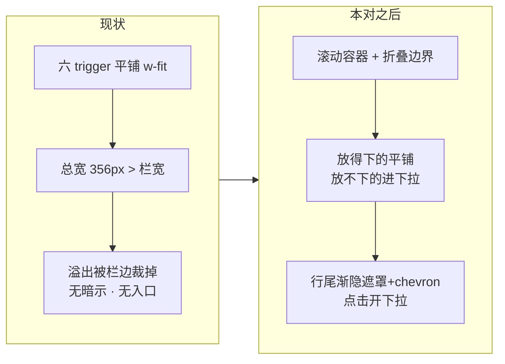

# 知识库详情 tab 行窄栏溢出（渐隐遮罩 + 点击下拉）—— 设计

**Status:** 📝 **Task 0–1 已交付（2026-09-28）——Task 2 起待开工**。已裁（均他 2026-09-28）：**D1 乙（固定折叠边界）/ D2 甲（保留滚动双通道）/ D4 甲 · D5 · D6 照默认冻结**；同日审查 ①–⑧ 全改 + 不变式（§3 结构要点 4）。Task 1 落地提交 **`8a8a834d`**（纯函数 + node 用例；进度记账见 plan）。

**相关记录**：

- [2026-09-24-settings-responsive-layout-design.md](2026-09-24-settings-responsive-layout-design.md)（同页相邻问题：它治设置弹窗表单行，本对治知识库中栏 tab 行；零文件重叠）
- 会话决议链（2026-09-27/28）：三档溢出方案（滚动 / ⋯ 下拉 / Priority+）→ 他追问更优解 → 他提案**渐隐遮罩 + 遮罩点击开下拉** → 他指出"滚动 + 下拉"的成员判定坑 → 下拉内容裁定**固定折叠边界**（D1 乙）。

## 1. 问题

### 1.0 一眼看懂

**现状**：知识库详情中栏的 tab 行（文档 / 百科 / 检索测试 / 向量空间 / 知识图谱 / 评测）是六个 trigger 平铺、无溢出处理；栏变窄时右侧 tab 被栏边裁掉（实测 ~530px 时「评测」消失），没有滚动、没有收纳、没有任何"还有更多"的暗示。

**本对之后**：任意栏宽下六个 tab 都可达——放得下的平铺、放不下的进"折叠边界"之后的下拉；行尾渐隐遮罩（含 chevron）既是"右边还有"的暗示也是下拉入口；宽栏（全放得下）与现状一字不变。



```
改的                                    不改的
──────────────────────────────        ──────────────────────
① tab 行装进滚动容器（新 TabStrip）      六个 tab 的内容 / forceMount keep-alive
② 渐隐遮罩 + chevron + 点击下拉          onTabChange 切换路径与值域
③ 折叠边界判定（纯函数）                ui/tabs.tsx 生成件（一行不动）
④ i18n +1 key（遮罩 aria-label）        后端全部 · panels-shell 布局
⑤ 用例（纯函数 + dom 结构钉）           宽栏（全放得下）视觉一字不变
```

### 1.1 根因（两条）

| # | 根因 | 证据（file:line） |
| --- | --- | --- |
| ① | **tab 行无溢出处理**：`TabsList` 基类 `inline-flex w-fit`（`ui/tabs.tsx:29`）平铺六个 `TabsTrigger`（`middle-tabs.tsx:203-208`），总宽超过栏宽即画出可见区、被栏边裁掉 | `middle-tabs.tsx:202`（`<TabsList className="mx-4 mt-2" variant="line">`）；裁它的层 = react-resizable-panels **库内联 `overflow:"hidden"`**（dist 两处命中；经 `panels-shell.tsx:342` 的 `ResizablePanel` 渲染——`ui/resizable.tsx` 是纯透传、无 overflow 类，审查 ④ 更正） |
| ② | **栏宽可以远窄于 tab 行**：中栏 `minSize={320}`px（`panels-shell.tsx:342`），而六 tab 总宽 **356px**（实测 2026-09-28：45/45/73/73/73/45 + gap；原估算 480 偏大，审查 ⑧ 回填）⇒ 最窄处只容 2~3 个，"拖窄必吞"是布局允许的，tab 行必须自己降级 | `panels-shell.tsx:342`；实测截图（~530px 时「评测」被裁） |

**同栏不一致的对照**：文档表格的列（时间 / 大小 / 切片）窄了会自动丢列降级，tab 行却是硬裁——同一屏两种降级行为，这是他报这个问题的直接观感来源。

### 1.2 同类扫描（全仓 tab 形态）

| 位置 | 部件 | 溢出行为 | 判定 |
| --- | --- | --- | --- |
| `middle-tabs.tsx:202` | 知识库中栏 tab 行 | **硬裁** | **本对主修点** |
| `eval-tab.tsx` / `vector-tab.tsx` 工具栏 | 各 tab 内工具栏 | 窄栏收进 ⋯ 菜单（`useToolbarTier`） | 已有降级，不动；**本对的"下拉收纳"沿用同一交互词汇** |
| 设置弹窗视图切换（`models-settings-page.tsx:141`） | 对话模型 / 功能模型 | `flex-wrap` 换行（settings 对 D4） | 只有 2 项、永不溢出，不动 |

⇒ 全仓只有这一处 tab 形态硬裁；无第二处要同修。

### 1.3 scope fence（明确不做）

- **不动** `ui/tabs.tsx` 生成件——滚动容器 / 遮罩 / 下拉全部包在**调用点**（新 `tab-strip.tsx`）；
- **不动**六个 tab 的内容组件、`forceMount` keep-alive、`onTabChange` 值域；
- **不动** `panels-shell.tsx` 的三栏布局与 `minSize` 体系（不靠抬 min-width 躲问题）；
- **不做** tab 换行（两行 tab 条）、不做 Priority+ 逐个收（丙案）、不做 IA 合并（向量/图谱/评测归并）——三者都已在他轮询中出局；
- **不做**下拉项的排序/置顶/记住使用频率——固定顺序 = 现有 tab 顺序。

## 2. 决定

### D1 —— 下拉内容判定（**已裁：乙 · 固定折叠边界**，2026-09-28 他裁）

| 落法 | 判定依据 | 随滚动变吗 |
| --- | --- | --- |
| 甲 · 全量列表 | 下拉永远列 6 项、当前项打勾 | 不变（我原推荐，留档） |
| **乙 · 固定折叠边界**（**已裁**） | 按**未滚动态**量一次："完整放得下前 N 个"，下拉 = 第 N+1 个起 | **不变**（边界只随宽度重算） |
| 丙 · 实时被遮集合 | 当前视口没露全的 | 会变（他指出的病灶，否决） |

**边界规则（乙的细则，无争议部分）**：

- **有效宽 = 栏宽 − 遮罩宽**（仅当溢出时扣；遮罩骑在行尾会盖住内容，被盖的不算"放得下"）；
- **"完整放得下"才留平铺侧**——半露的、被遮罩盖住的，一律归下拉侧（宁可多收，不截断）；
- 边界在**未滚动态**（scrollLeft = 0）的布局坐标下判定（`offsetLeft + offsetWidth ≤ 有效宽`），与当前滚到哪无关 ⇒ 滚动永不改下拉内容，**只有宽度变化才改**；
- 全放得下（无溢出）⇒ 遮罩与下拉**都不出现**，宽栏与现状一字不变。

| 四件套 | 内容 |
| --- | --- |
| **在问什么** | 下拉里装"哪些 tab"，成员判定以什么为准 |
| **选项含义** | 甲 = 永远全量 6 项；乙 = 边界之后的尾巴（N+1…6）；丙 = 当前被遮的（实时） |
| **推荐理由**（当时） | 甲 判定只剩"当前项打勾"，与滚动/遮挡全解耦 |
| **选错后果** | 乙 的内容**只随宽度变**（他选的，代价 = 拖动分隔条时下拉项数变化，见 §6.3）；丙 随滚动抖、半遮挡要拍阈值——已否决 |

### D2 —— 滚动去留（**已裁：甲 · 保留双通道**，2026-09-28 他裁）

| 落法 | 做法 |
| --- | --- |
| **甲 · 保留滚轮 + 拖拽滚动**（**默认**） | 滚动容器照常滚（滚 = 顺手浏览），遮罩点击 = 直达某项；滚出边界外的项既可滚到、也在下拉里（双通道有意重叠） |
| 乙 · 去滚动、下拉独占 | 边界内平铺、边界外**只**在下拉（antd「更多」形态）；渐隐遮罩退化为纯 chevron 按钮 |

| 四件套 | 内容 |
| --- | --- |
| **在问什么** | 窄了之后，被折叠的 tab 还能不能滚出来看 |
| **选项含义** | 甲 = 滚动 + 下拉两条路都通；乙 = 只有下拉一条路 |
| **推荐理由** | 甲 —— 他的原始提案就是"渐隐遮罩 + 点击下拉"，遮罩（渐隐）的存在前提就是可滚；且 Windows 鼠标滚轮/触控板横滑是本页用户的主要浏览手势 |
| **选错后果** | 甲 的下拉项与可见 tab 有重叠（语义 = 快速切换，非"藏起来的"，勾标记消歧）；乙 最干净但"渐隐遮罩"没了存在前提，等于推翻他的提案 |

### D3 —— 遮罩形态与几何（**形态他提案已定；细则默认**）

- **形态**：行尾**渐隐遮罩**整块可点（点 = 开下拉）——渐隐区本身就是入口，不另放 ⋯ 按钮；**箭头只在悬停/聚焦时显现、朝下 ⌄**（2026-09-28 他裁，覆盖审查⑤"chevron 常驻"细则——常驻箭头观感重）；
- **几何**：固定 **40px** 宽骑行尾（不随内容变——拖分隔条时行尾不抖），渐隐 = 向左的背景色渐变；
- **出现条件**：**有 tab 放不完整**（未滚动态端点越出容器宽）一个布尔，无逐 tab 判定；等价于「遮罩出现 ⟺ 下拉非空」。判据已从 `scrollWidth > clientWidth` 改为此（2026-09-28 真浏览器验收）：滚动内容尾垫会撑大 scrollWidth，旧判据会迟消 40px、出现空下拉；
- **点击归属**：遮罩是按钮，盖住的 tab 不可直接点（那 40px 里的 tab 本来也不完整）——先滚出来或走下拉，见 §6.2；
- **下拉**：复用本页既有 `DropdownMenu`（与库级 ⋯ 菜单同一组件词汇）；项 = 边界尾（D1 乙），当前项带 `Check` 图标 + `aria-current`；选中走原 `onTabChange`。

### D4 —— 激活项可见性（**已裁：甲 · 自动滚入**，2026-09-28 照默认冻结）

| 落法 | 做法 |
| --- | --- |
| **甲 · 自动滚入**（**已裁**） | 激活项变化（含从下拉切回）时把它滚进**有效可见区**（= 栏宽 − 遮罩宽）；下拉里的勾照旧 |
| 乙 · 不滚 | 只靠下拉里的勾标记指示当前项 |

**滚入目标 = 有效可见区**（审查 ③）：激活项滚入后须完整落在遮罩左侧——`scrollIntoView({ inline: "nearest" })` 直接用可能把项停在右缘、被 40px 遮罩盖住半截，实现要按"扣除遮罩宽"判落点。**落点可达性靠滚动内容尾垫 40px**（2026-09-28 真浏览器 (d) 实测抓出：无尾垫时滚动被内容末端 clamp，激活项留在遮罩下）。

| 四件套 | 内容 |
| --- | --- |
| **在问什么** | 当前 tab 在折叠侧/视野外时，要不要自动滚到可见 |
| **选项含义** | 甲 = 激活即可见；乙 = 可能停在看不见的位置 |
| **推荐理由** | 甲 —— 激活下划线（`variant="line"` 的 `after:` 条）是唯一"你在哪"的信号，看不见下划线 = 迷路 |
| **选错后果** | 甲 在从下拉选远端项时 tab 行会滚一下（一次性位移，非抖动）；乙 极窄下"下划线消失" |

### D5 —— 测量与重算时机（**已定：每 render 量 + ResizeObserver**，2026-09-28 照默认冻结）

- 判定收口成**纯函数** `computeFoldCount(containerWidth, itemEnds[], maskWidth)`（返回 N），钉 node 用例——像素判定不进组件；`itemEnds[i]` = 第 i 个 trigger 的 `offsetLeft + offsetWidth`（与 D1 判定**同一口径**，天然含 `gap-1` 与列表 `p-[3px]`——按"宽度累加"的 `itemWidths` 签名会漏 gap、N 偏大，审查 ① 修正）；
- 组件每次 render 后 `useLayoutEffect` 量一次（i18n 切语言会改标签宽，只靠 ResizeObserver 会漏，见 §6.1）+ 容器 `ResizeObserver`（拖分隔条）兜宽度变化；
- happy-dom 无布局（offsetWidth 恒 0）⇒ dom 用例照 `eval-tab.dom.test.tsx` 钉 `scrollWidth` 的先例，`Object.defineProperty` 注入测量值（Task 0 复核配方）。

### D6 —— i18n（**已定：+1 key**，2026-09-28 照默认冻结）

- 新 key `knowledge.tabs.more`：zh「更多标签页」/ en "More tabs"——只作遮罩按钮的 `aria-label`（可见文案 = chevron 图标本身）；
- 下拉项**复用** `knowledge.tabs.*` 现有六词，零新值；
- 三文件同步：`zh-CN.ts` / `en-US.ts` / `types.ts`。

## 3. 落点与结构（前端）

| 落点 | 改什么 |
| --- | --- |
| `components/workspace/knowledge/tab-strip.tsx`（**新**） | 滚动容器 + `TabsList`/`TabsTrigger`（从 `middle-tabs.tsx` 迁入）+ 渐隐遮罩 + `DropdownMenu`；溢出判定（`scrollWidth > clientWidth`）与 N 的测量收在这里 |
| `components/workspace/knowledge/tab-strip.utils.ts`（**新**） | 纯函数 `computeFoldCount`（D5） |
| `components/workspace/knowledge/middle-tabs.tsx` | 六个 `TabsTrigger` 改由 `TabStrip` 渲染（传标签/值/onTabChange）；`TabsList` 的 `mx-4 mt-2` 边距移到滚动容器上（margin 在滚动容器外，不产生滚动条内空隙） |
| `core/i18n/locales/{zh-CN,en-US,types}.ts` | `tabs.more` 三处（D6） |
| `tests/unit/knowledge/tab-strip.unit.test.ts`（**新**，node；命名照 `eval-trend-chart.unit.test.ts` 先例，审查 ⑤） | 纯函数边界用例（全放得下 / 半露归尾 / 扣遮罩宽 / 单 tab / 空表） |
| `tests/unit/knowledge/tab-strip.dom.test.tsx`（**新**，happy-dom） | 遮罩出现条件 / 下拉内容 = 边界尾 / 点遮罩开下拉 / 选中回调值 / 宽栏无遮罩无下拉 |

**结构要点**（实现时守）：

1. 滚动容器需**底部内边距**垫高——`variant="line"` 的激活下划线画在 `bottom: -5px`（`ui/tabs.tsx:70`），`overflow-x-auto` 会连带裁掉 overflow-y，不垫就吞下划线；
2. 滚动条隐藏（`scrollbar-width: none` / `::-webkit-scrollbar { display: none }`）——遮罩 + 渐隐是唯一溢出暗示，滚动条只在拖拽时短暂出现会打架；
3. 遮罩是 `absolute` 骑在滚动容器右端的 `<button>`（`type="button"`），渐变从 `bg-background` 到透明——与面板底色同源（`bg-background`，对照文档失败卡当年否掉它做卡片、只适合做遮罩）；
4. **六 trigger 永不移出 DOM**（不变式，审查补）：Radix Tabs 的方向键循环与 D1"滚动不改成员"都靠它——折叠只是呈现层，任何"窄了就把 trigger 从 DOM 摘掉"的改法都越界（那是 antd 裁乙形态的改法）。

## 4. 验收

1. **纯函数**：`computeFoldCount`（`itemEnds[]` 签名，防 gap 漏算）用例覆盖——全放得下（N=全部、无遮罩宽扣除）/ 溢出（扣遮罩宽）/ 半露 tab 归尾 / 仅 1 个放得下 / 空表 0；
2. **遮罩出现条件**（dom 钉）：注入溢出（scrollWidth 配方）⇒ 遮罩渲染；不溢出 ⇒ 遮罩**不渲染**、下拉触发器不存在；
3. **下拉内容**（dom 钉）：注入宽度使 N=4 ⇒ 下拉项恰为第 5、6 项（**不含**前 4 项），项文案 = `tabs.*` 现有值；
4. **点击与切换**：点遮罩开下拉；选中项回调 `onTabChange` 的值 = 该项的 tab 值（走原路径，零新值域）；
5. **宽栏零变化**：全放得下时 DOM 无遮罩无下拉、六个 `TabsTrigger` 类名与现状一致（`TabsList` 自身边距类移到容器属**预期变化**、不钉——审查 ⑦ 收窄措辞）；
6. **激活滚入（D4 甲）**：激活值切到视野外的项 ⇒ 滚入被调（mock 断言；**落点 = 有效可见区即扣除遮罩宽**，不得停在遮罩下——几何归 10(d)）；
7. **i18n**：`tabs.more` 三文件同在、值断言 zh/en 各一条；
8. **门禁**：`pnpm check` 净 + 前端全量 0 失败；
9. **后端零改动**：`git diff` 不含 `backend/`；
10. **几何（真浏览器手验，非门禁）**：拖窄/拖宽来回——(a) 遮罩恒 40px、行尾不抖；(b) N 随宽度单调（窄只减、宽只增）；(c) 半露 tab 不被截断在平铺侧；(d) 点遮罩选折叠项后激活下划线滚入可见；(e) 全放得下时与现状肉眼一致。**用例只钉结构，几何只归真浏览器**（既有共识）。

## 5. 影响面

| 文件 | 性质 |
| --- | --- |
| `components/workspace/knowledge/tab-strip.tsx` | 新组件（滚动容器 + 遮罩 + 下拉 + 测量） |
| `components/workspace/knowledge/tab-strip.utils.ts` | 新纯函数（折叠边界） |
| `components/workspace/knowledge/middle-tabs.tsx` | 六 trigger 迁入 `TabStrip`（TabsContent 零动） |
| `core/i18n/locales/{zh-CN,en-US,types}.ts` | `tabs.more` ×3 |
| `tests/unit/knowledge/tab-strip.utils.test.ts` | 新 node 用例（纯函数） |
| `tests/unit/knowledge/tab-strip.dom.test.tsx` | 新 dom 用例 |
| `frontend/AGENTS.md` | 知识库页一句（tab 行溢出降级），同变更集内 |

**不动**：`ui/tabs.tsx` 生成件 · `panels-shell.tsx` · 六个 tab 内容组件 · 后端全部 · 字段 / API / payload。

**净行为影响**：看知识库详情的人——窄栏下 tab 从"被吞"变为"可滚 + 可从下拉直达"；宽栏零变化；能看的东西完全一样。

## 6. 已知缺口 / 开放点

1. **i18n 切语言会改标签宽** ⇒ 测量必须每 render 跑（D5 已含），只挂 ResizeObserver 会漏（容器宽没变）——实现里用 `useLayoutEffect` 无依赖数组兜住。
2. **遮罩盖住的 tab 不可直接点**（D3 明示）：那 40px 内的 tab 本来不完整，先滚或走下拉——若验收 10 观感不佳，逃生口 = 遮罩宽 40→28px（一行常量）。
3. **D1 乙的已知代价**：拖动分隔条时下拉项数随宽度变化（N 重算）——这是"固定边界"定义的固有产物，只随宽度、不随滚动；验收 10(b) 的单调性保证它不来回跳。
4. **Windows 鼠标滚轮默认纵向**：横滚靠拖拽 / 触控板横滑 / Shift+滚轮——遮罩点击下拉正是给鼠标用户的直达通道（D2 甲保留双通道的动机之一）。
5. **中栏外层已有一个横向 `ScrollArea`**（`panels-shell.tsx:275`，窄视口整组横滚）：内层 tab 滚动容器与其嵌套，wheel 事件归属内层（在其可见区内）——Task 0 复核嵌套滚动手感，若打架再议（逃生口 = 内层只留拖拽 + 下拉）。
